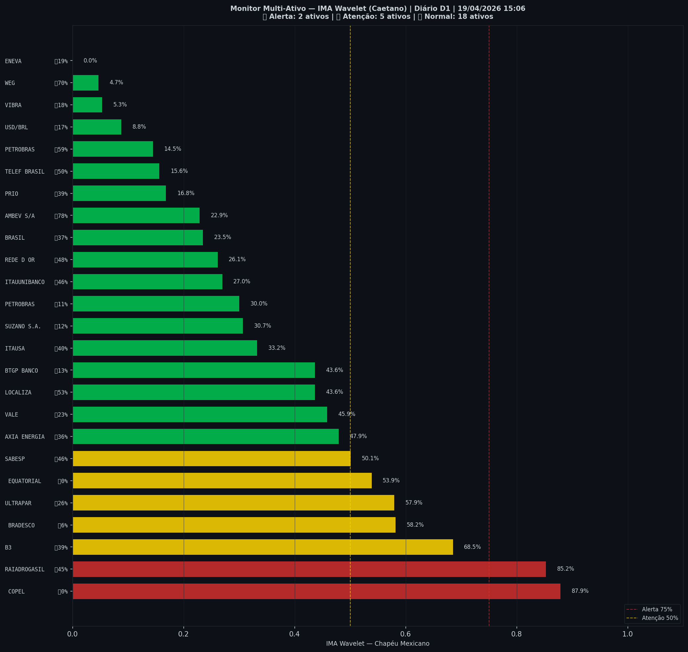

# 🟢 Sinal de Crise B3 — 19/04/2026

> **Gerado em:** 22:27 BRT | **Método:** IMA Wavelet Chapéu Mexicano (Caetano/ITA) + LPPL (Sornette/ETH-Zurich)

---

## Resumo do Dia

| Indicador | Valor | Interpretação |
|---|---|---|
| **Zona** | 🟢 **VERDE** | Normal |
| **Risco Combinado** | **31.0%** | IMA + LPPL combinados |
| 🔴 IMA Crash | 19.9% | Alta frequência espectral |
| 🔵 IMA Entrada | 57.2% | Oportunidade de compra |
| 📐 LPPL Sornette | 42.0% | Estrutura de bolha |
| Ibovespa | 198,657 pts | Fechamento |

> ✅ Sem sinal de crise detectado no momento.

---

## Gráfico do Sinal

---

## Monitor Multi-Ativo (27 ativos)

**Índice de Confiança:** 28% dos ativos em tensão
(✅ Mercado tranquilo)

🔴 Alerta: **2** | 🟡 Atenção: **5** | 🟢 Normal: **20**

| Zona | Ativo | Setor | 🔴 IMA Crash | 🔵 IMA Entrada |
|---|---|---|---|---|
| 🔴 | **COPEL** | Energia | 🔴 87.9% |  0.0% |
| 🔴 | **RAIADROGASIL** | Outros | 🔴 85.2% |  45.3% |
| 🟡 | **B3** | Financeiro | 🔴 68.5% |  38.6% |
| 🟡 | **BRADESCO** | Financeiro | 🔴 58.2% |  5.5% |
| 🟡 | **ULTRAPAR** | Outros | 🔴 57.9% |  25.6% |
| 🟡 | **EQUATORIAL** | Energia | 🔴 53.9% |  0.0% |
| 🟡 | **SABESP** | Saneamento | 🔴 50.1% |  46.4% |
| 🟢 | **AXIA ENERGIA** | Energia | 🔴 47.9% |  36.2% |
| 🟢 | **VALE** | Mineração | 🔴 45.9% |  22.6% |
| 🟢 | **LOCALIZA** | Aluguel | 🔴 43.6% |  53.3% |
| 🟢 | **BTGP BANCO** | Financeiro | 🔴 43.6% |  13.2% |
| 🟢 | **ITAUSA** | Financeiro | 🔴 33.2% |  39.5% |
| 🟢 | **SUZANO S.A.** | Papel/Celulose | 🔴 30.7% |  11.9% |
| 🟢 | **PETROBRAS** | Petróleo | 🔴 30.0% |  11.0% |
| 🟢 | **ITAUUNIBANCO** | Financeiro | 🔴 27.0% |  46.5% |
| 🟢 | **REDE D OR** | Saúde | 🔴 26.1% |  47.9% |
| 🟢 | **BRASIL** | Financeiro | 🔴 23.5% |  37.0% |
| 🟢 | **AMBEV S/A** | Consumo | 🔴 22.9% | 🔵 77.7% |
| 🟢 | **PRIO** | Petróleo | 🔴 16.8% |  39.2% |
| 🟢 | **TELEF BRASIL** | Outros | 🔴 15.6% |  49.9% |
| 🟢 | **PETROBRAS** | Petróleo | 🔴 14.5% |  59.5% |
| 🟢 | **USD/BRL** | Câmbio | 🔴 8.8% |  17.4% |
| 🟢 | **VIBRA** | Energia | 🔴 5.3% |  17.9% |
| 🟢 | **WEG** | Industrial | 🔴 4.7% | 🔵 69.8% |
| 🟢 | **ENEVA** | Energia | 🔴 0.0% |  18.6% |

---

## Histórico Recente (últimas 10 leituras)

| Data | Zona | Risco |
|---|---|---|
| 2025-09-25 | 🟢 VERDE | 32.9% |
| 2025-10-16 | 🟢 VERDE | 48.7% |
| 2025-11-06 | 🟡 AMARELO | 72.8% |
| 2025-11-28 | 🟢 VERDE | 38.2% |
| 2025-12-19 | 🔴 VERMELHO | 77.4% |
| 2026-01-15 | 🟡 AMARELO | 52.2% |
| 2026-02-05 | 🟢 VERDE | 33.1% |
| 2026-03-02 | 🟢 VERDE | 35.0% |
| 2026-03-23 | 🟢 VERDE | 33.3% |
| 2026-04-14 | 🟢 VERDE | 31.0% |

---

## Como interpretar

| Indicador | O que significa |
|---|---|
| 🔴 **IMA Crash alto** | Alta frequência espectral — mercado nervoso, pré-crise |
| 🔵 **IMA Entrada alto** | Baixa frequência estável — possível oportunidade de compra |
| 📐 **LPPL alto** | Estrutura de bolha detectada — risco de crash acelerado |
| **Índice Multi-Ativo** | % de ativos em tensão — quanto maior, mais confiável o sinal |

> Sinal mais confiável quando **múltiplos ativos** disparam simultaneamente.

---

## Metodologia

O **IMA Wavelet** (Índice de Mudanças Abruptas) é baseado no método do Prof. Marco Antonio Leonel Caetano (ITA/INSPER), publicado na revista Physica-A (Elsevier). Usa a **Transformada Wavelet Contínua com Chapéu Mexicano** para detectar regimes de alta frequência com baixa volatilidade — padrão que antecede mudanças abruptas no mercado.

O **LPPL** (Log-Periodic Power Law) é baseado no modelo do Prof. Didier Sornette (ETH-Zurich), que detecta estruturas de bolha especulativa com oscilações aceleradas.

> **Aviso:** Este é um estudo acadêmico e não constitui recomendação de investimento. Use com análise própria.

---
*Gerado automaticamente pelo Sistema Sinal de Crise B3 | [Metodologia](../metodologia) | [Histórico](../historico)*
