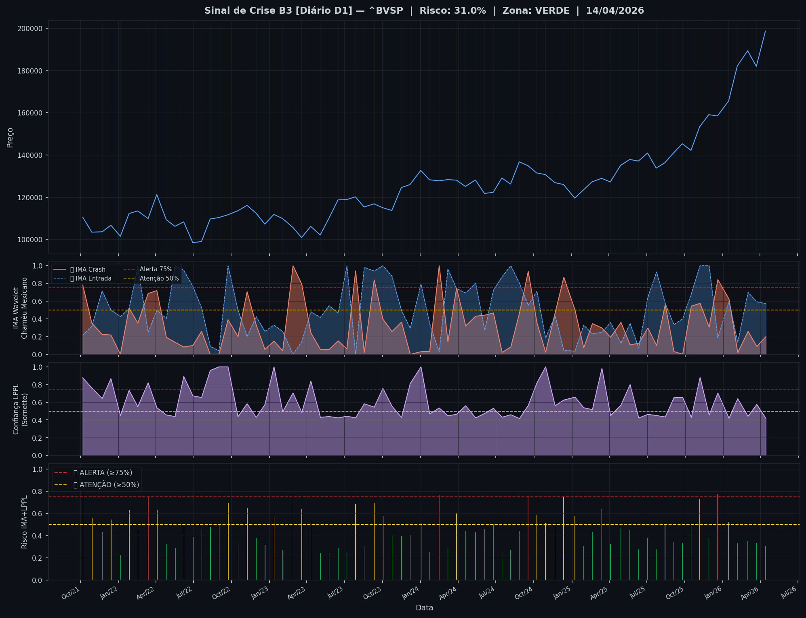
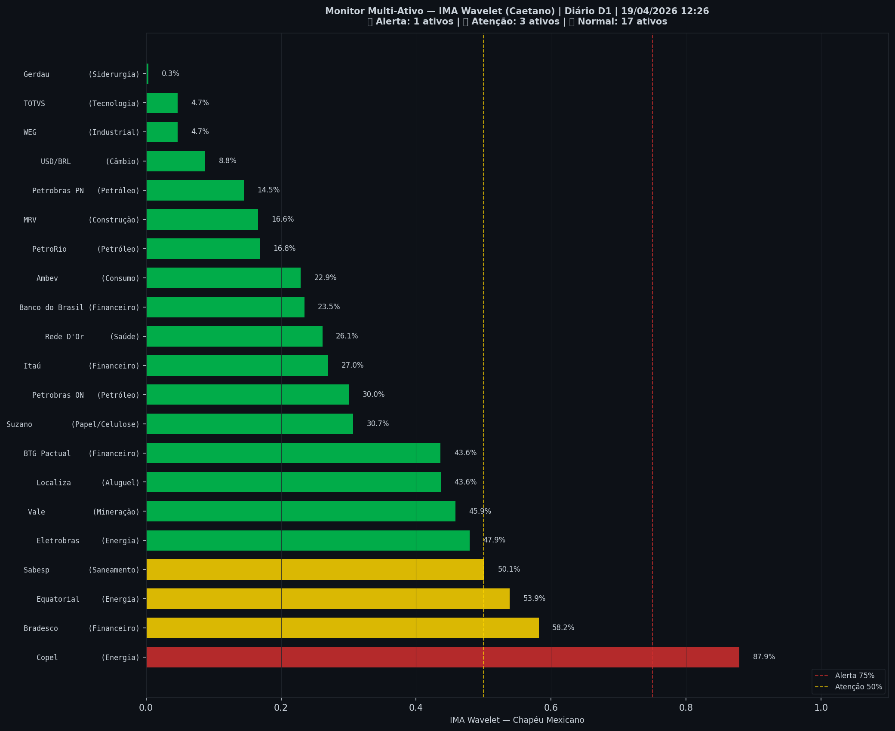

# 🟡 Sinal de Crise B3 — 19/04/2026

> **Gerado em:** 12:58 BRT | **Método:** IMA Wavelet Chapéu Mexicano (Caetano/ITA) + LPPL (Sornette/ETH-Zurich)

---

## Resumo do Dia

| Indicador | Valor | Interpretação |
|---|---|---|
| **Zona** | 🟡 **AMARELO** | Atenção |
| **Risco Combinado** | **50.6%** | IMA + LPPL combinados |
| 🔴 IMA Crash | 50.6% | Alta frequência espectral |
| 🔵 IMA Entrada | 45.1% | Oportunidade de compra |
| 📐 LPPL Sornette | N/A | Estrutura de bolha |
| Ibovespa | 195,595 pts | Fechamento |

> ⚡ **ATENÇÃO**: Tensão espectral crescente. Monitore nas próximas sessões.

---

## Gráfico do Sinal

---

## Monitor Multi-Ativo (0 ativos)

**Índice de Confiança:** 0% dos ativos em tensão
(✅ Mercado tranquilo)

🔴 Alerta: **0** | 🟡 Atenção: **0** | 🟢 Normal: **0**

| Zona | Ativo | IMA | Status |
|---|---|---|---|

---

## Histórico Recente (últimas 10 leituras)

| Data | Zona | Risco |
|---|---|---|
| 2026-04-17 | 🔴 VERMELHO | 100.0% |
| 2026-04-17 | 🔴 VERMELHO | 100.0% |
| 2026-04-17 | 🔴 VERMELHO | 99.9% |
| 2026-04-17 | 🔴 VERMELHO | 93.0% |
| 2026-04-17 | 🟡 AMARELO | 57.2% |
| 2026-04-17 | 🟡 AMARELO | 56.1% |
| 2026-04-17 | 🟡 AMARELO | 58.6% |
| 2026-04-17 | 🟢 VERDE | 49.2% |
| 2026-04-17 | 🟢 VERDE | 45.4% |
| 2026-04-17 | 🟡 AMARELO | 50.6% |

---

## Metodologia

O **IMA Wavelet** (Índice de Mudanças Abruptas) é baseado no método do Prof. Marco Antonio Leonel Caetano (ITA/INSPER), publicado na revista Physica-A (Elsevier). Usa a **Transformada Wavelet Contínua com Chapéu Mexicano** para detectar regimes de alta frequência com baixa volatilidade — padrão que antecede mudanças abruptas no mercado.

O **LPPL** (Log-Periodic Power Law) é baseado no modelo do Prof. Didier Sornette (ETH-Zurich), que detecta estruturas de bolha especulativa com oscilações aceleradas.

> **Aviso:** Este é um estudo acadêmico e não constitui recomendação de investimento. Use com análise própria.

---
*Gerado automaticamente pelo Sistema Sinal de Crise B3 | [Metodologia](../metodologia) | [Histórico](../historico)*
