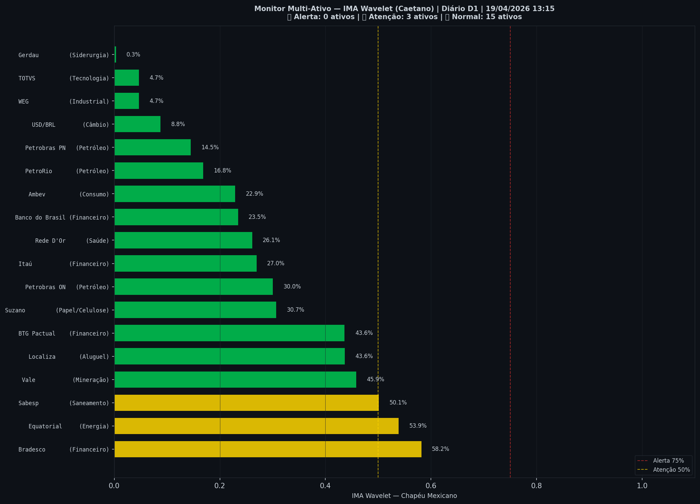

# 🟢 Sinal de Crise B3 — 19/04/2026

> **Gerado em:** 13:15 BRT | **Método:** IMA Wavelet Chapéu Mexicano (Caetano/ITA) + LPPL (Sornette/ETH-Zurich)

---

## Resumo do Dia

| Indicador | Valor | Interpretação |
|---|---|---|
| **Zona** | 🟢 **VERDE** | Normal |
| **Risco Combinado** | **31.0%** | IMA + LPPL combinados |
| 🔴 IMA Crash | 19.9% | Alta frequência espectral |
| 🔵 IMA Entrada | 57.2% | Oportunidade de compra |
| 📐 LPPL Sornette | 42.0% | Estrutura de bolha |
| Ibovespa | 198,657 pts | Fechamento |

> ✅ Sem sinal de crise detectado no momento.

---

## Gráfico do Sinal

---

## Monitor Multi-Ativo (21 ativos)

**Índice de Confiança:** 17% dos ativos em tensão
(✅ Mercado tranquilo)

🔴 Alerta: **0** | 🟡 Atenção: **3** | 🟢 Normal: **18**

| Zona | Ativo | Setor | IMA |
|---|---|---|---|
| 🟡 | **Bradesco** | Financeiro | 58.2% |
| 🟡 | **Equatorial** | Energia | 53.9% |
| 🟡 | **Sabesp** | Saneamento | 50.1% |
| 🟢 | **Vale** | Mineração | 45.9% |
| 🟢 | **Localiza** | Aluguel | 43.6% |
| 🟢 | **BTG Pactual** | Financeiro | 43.6% |
| 🟢 | **Suzano** | Papel/Celulose | 30.7% |
| 🟢 | **Petrobras ON** | Petróleo | 30.0% |
| 🟢 | **Itaú** | Financeiro | 27.0% |
| 🟢 | **Rede D'Or** | Saúde | 26.1% |
| 🟢 | **Banco do Brasil** | Financeiro | 23.5% |
| 🟢 | **Ambev** | Consumo | 22.9% |
| 🟢 | **PetroRio** | Petróleo | 16.8% |
| 🟢 | **Petrobras PN** | Petróleo | 14.5% |
| 🟢 | **USD/BRL** | Câmbio | 8.8% |
| 🟢 | **WEG** | Industrial | 4.7% |
| 🟢 | **TOTVS** | Tecnologia | 4.7% |
| 🟢 | **Gerdau** | Siderurgia | 0.3% |

---

## Histórico Recente (últimas 10 leituras)

| Data | Zona | Risco |
|---|---|---|
| 2025-09-25 | 🟢 VERDE | 32.9% |
| 2025-10-16 | 🟢 VERDE | 48.7% |
| 2025-11-06 | 🟡 AMARELO | 72.8% |
| 2025-11-28 | 🟢 VERDE | 38.2% |
| 2025-12-19 | 🔴 VERMELHO | 77.4% |
| 2026-01-15 | 🟡 AMARELO | 52.2% |
| 2026-02-05 | 🟢 VERDE | 33.1% |
| 2026-03-02 | 🟢 VERDE | 35.0% |
| 2026-03-23 | 🟢 VERDE | 33.3% |
| 2026-04-14 | 🟢 VERDE | 31.0% |

---

## Como interpretar

| Indicador | O que significa |
|---|---|
| 🔴 **IMA Crash alto** | Alta frequência espectral — mercado nervoso, pré-crise |
| 🔵 **IMA Entrada alto** | Baixa frequência estável — possível oportunidade de compra |
| 📐 **LPPL alto** | Estrutura de bolha detectada — risco de crash acelerado |
| **Índice Multi-Ativo** | % de ativos em tensão — quanto maior, mais confiável o sinal |

> Sinal mais confiável quando **múltiplos ativos** disparam simultaneamente.

---

## Metodologia

O **IMA Wavelet** (Índice de Mudanças Abruptas) é baseado no método do Prof. Marco Antonio Leonel Caetano (ITA/INSPER), publicado na revista Physica-A (Elsevier). Usa a **Transformada Wavelet Contínua com Chapéu Mexicano** para detectar regimes de alta frequência com baixa volatilidade — padrão que antecede mudanças abruptas no mercado.

O **LPPL** (Log-Periodic Power Law) é baseado no modelo do Prof. Didier Sornette (ETH-Zurich), que detecta estruturas de bolha especulativa com oscilações aceleradas.

> **Aviso:** Este é um estudo acadêmico e não constitui recomendação de investimento. Use com análise própria.

---
*Gerado automaticamente pelo Sistema Sinal de Crise B3 | [Metodologia](../metodologia) | [Histórico](../historico)*
