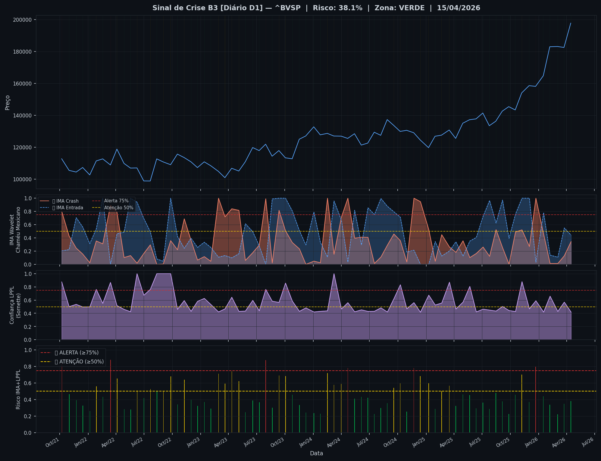
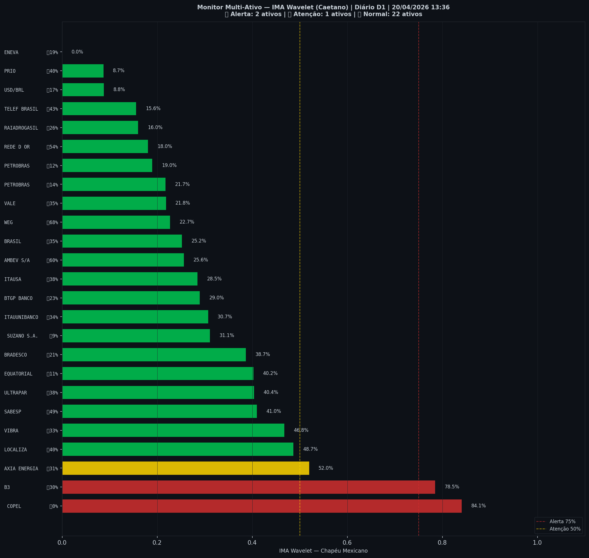

# 🔴 Sinal de Crise B3 — 20/04/2026

> **Gerado em:** 13:50 BRT | **Método:** IMA Wavelet Chapéu Mexicano (Caetano/ITA) + LPPL (Sornette/ETH-Zurich)

---

## Resumo do Dia

| Indicador | Valor | Interpretação |
|---|---|---|
| **Zona** | 🔴 **VERMELHO** | Alerta |
| **Risco Combinado** | **76.8%** | IMA + LPPL combinados |
| 🔴 IMA Crash | 76.8% | Alta frequência espectral |
| 🔵 IMA Entrada | 17.1% | Oportunidade de compra |
| 📐 LPPL Sornette | 41.9% | Estrutura de bolha |
| Ibovespa | 196,610 pts | Fechamento |

> ⚠️ **ALERTA**: Padrão pré-crise detectado. Revise exposição e confirme com price action.

---

## Gráfico do Sinal

---

## Monitor Multi-Ativo (27 ativos)

**Índice de Confiança:** 22% dos ativos em tensão
(✅ Mercado tranquilo)

🔴 Alerta: **2** | 🟡 Atenção: **4** | 🟢 Normal: **21**

| Zona | Ativo | Setor | 🔴 IMA Crash | 🔵 IMA Entrada |
|---|---|---|---|---|
| 🔴 | **B3** | Financeiro | 🔴 78.5% |  19.8% |
| 🔴 | **ITAUUNIBANCO** | Financeiro | 🔴 78.5% |  17.1% |
| 🟡 | **REDE D OR** | Saúde | 🔴 67.9% |  23.3% |
| 🟡 | **BTGP BANCO** | Financeiro | 🔴 61.3% |  39.5% |
| 🟡 | **BRASIL** | Financeiro | 🔴 52.0% |  37.2% |
| 🟡 | **EQUATORIAL** | Energia | 🔴 51.7% |  30.4% |
| 🟢 | **ITAUSA** | Financeiro | 🔴 44.7% |  38.4% |
| 🟢 | **VIBRA** | Energia | 🔴 42.9% | 🔵 100.0% |
| 🟢 | **TELEF BRASIL** | Outros | 🔴 39.9% | 🔵 87.7% |
| 🟢 | **SUZANO S.A.** | Papel/Celulose | 🔴 39.7% |  18.9% |
| 🟢 | **LOCALIZA** | Aluguel | 🔴 37.2% | 🔵 62.7% |
| 🟢 | **AMBEV S/A** | Consumo | 🔴 36.6% |  47.2% |
| 🟢 | **WEG** | Industrial | 🔴 27.0% | 🔵 71.6% |
| 🟢 | **PETROBRAS** | Petróleo | 🔴 25.7% |  35.6% |
| 🟢 | **BRADESCO** | Financeiro | 🔴 21.7% | 🔵 66.3% |
| 🟢 | **ENEVA** | Energia | 🔴 20.9% | 🔵 61.2% |
| 🟢 | **PRIO** | Petróleo | 🔴 18.5% |  38.4% |
| 🟢 | **PETROBRAS** | Petróleo | 🔴 18.3% |  47.2% |
| 🟢 | **VALE** | Mineração | 🔴 17.0% | 🔵 100.0% |
| 🟢 | **EMBRAER** | Outros | 🔴 16.9% |  57.8% |
| 🟢 | **COPEL** | Energia | 🔴 13.2% |  40.8% |
| 🟢 | **RAIADROGASIL** | Outros | 🔴 11.7% |  42.6% |
| 🟢 | **AXIA ENERGIA** | Energia | 🔴 6.5% |  47.4% |
| 🟢 | **USD/BRL** | Câmbio | 🔴 5.2% |  56.4% |
| 🟢 | **AXIA ENERGIA** | Outros | 🔴 3.3% | 🔵 68.9% |
| 🟢 | **SABESP** | Saneamento | 🔴 1.6% |  30.7% |
| 🟢 | **ULTRAPAR** | Outros | 🔴 0.0% |  27.9% |

---

## Histórico Recente (últimas 10 leituras)

| Data | Zona | Risco | 🔴 IMA Crash | 🔵 IMA Entrada |
|---|---|---|---|---|
| 2026-04-20 | 🔴 VERMELHO | 81.2% | — | — |
| 2026-04-20 | 🔴 VERMELHO | 90.0% | — | — |
| 2026-04-20 | 🔴 VERMELHO | 99.9% | — | — |
| 2026-04-20 | 🔴 VERMELHO | 100.0% | — | — |
| 2026-04-20 | 🔴 VERMELHO | 90.6% | — | — |
| 2026-04-20 | 🟡 AMARELO | 73.1% | — | — |
| 2026-04-20 | 🟡 AMARELO | 63.9% | — | — |
| 2026-04-20 | 🟡 AMARELO | 64.5% | — | — |
| 2026-04-20 | 🔴 VERMELHO | 91.2% | — | — |
| 2026-04-20 | 🔴 VERMELHO | 76.8% | — | — |

---

## Como interpretar

| Indicador | O que significa |
|---|---|
| 🔴 **IMA Crash alto** | Alta frequência espectral — mercado nervoso, pré-crise |
| 🔵 **IMA Entrada alto** | Baixa frequência estável — possível oportunidade de compra |
| 📐 **LPPL alto** | Estrutura de bolha detectada — risco de crash acelerado |
| **Índice Multi-Ativo** | % de ativos em tensão — quanto maior, mais confiável o sinal |

> Sinal mais confiável quando **múltiplos ativos** disparam simultaneamente.

---

## Metodologia

O **IMA Wavelet** (Índice de Mudanças Abruptas) é baseado no método do Prof. Marco Antonio Leonel Caetano (ITA/INSPER), publicado na revista Physica-A (Elsevier). Usa a **Transformada Wavelet Contínua com Chapéu Mexicano** para detectar regimes de alta frequência com baixa volatilidade — padrão que antecede mudanças abruptas no mercado.

O **LPPL** (Log-Periodic Power Law) é baseado no modelo do Prof. Didier Sornette (ETH-Zurich), que detecta estruturas de bolha especulativa com oscilações aceleradas.

> **Aviso:** Este é um estudo acadêmico e não constitui recomendação de investimento. Use com análise própria.

---
*Gerado automaticamente pelo Sistema Sinal de Crise B3 | [Metodologia](../metodologia) | [Histórico](../historico)*
