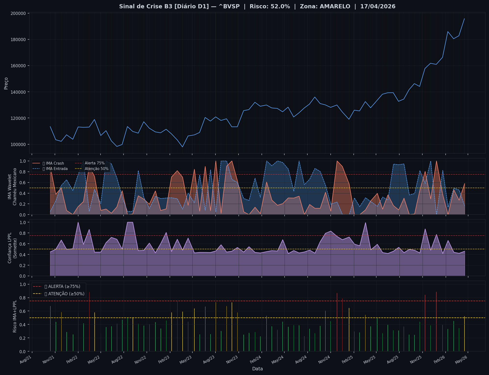
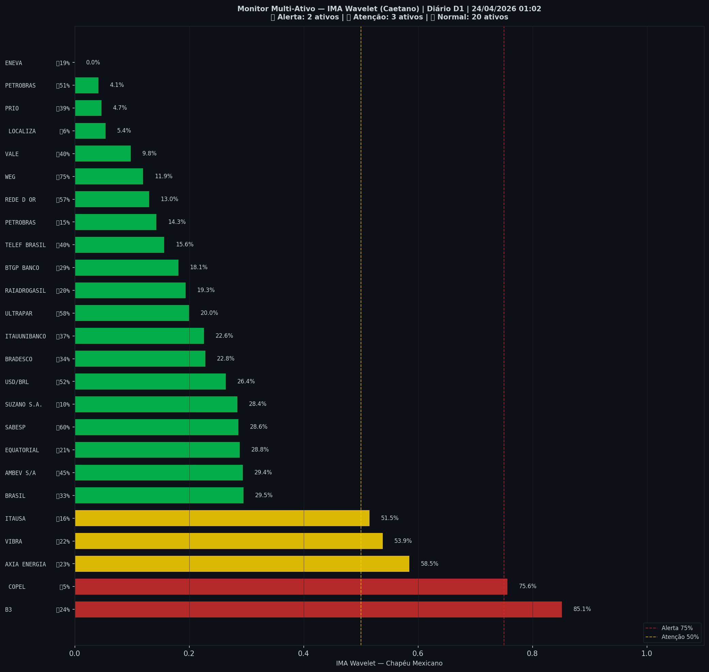

# 🟡 Sinal de Crise B3 — 24/04/2026

> **Gerado em:** 01:10 BRT | **Método:** IMA Wavelet Chapéu Mexicano (Caetano/ITA) + LPPL (Sornette/ETH-Zurich)

---

## Resumo do Dia

| Indicador | Valor | Interpretação |
|---|---|---|
| **Zona** | 🟡 **AMARELO** | Atenção |
| **Risco Combinado** | **52.0%** | IMA + LPPL combinados |
| 🔴 IMA Crash | 57.9% | Alta frequência espectral |
| 🔵 IMA Entrada | 16.4% | Oportunidade de compra |
| 📐 LPPL Sornette | 46.1% | Estrutura de bolha |
| Ibovespa | 195,734 pts | Fechamento |

> ⚡ **ATENÇÃO**: Tensão espectral crescente. Monitore nas próximas sessões.

---

## Gráfico do Sinal

---

## Monitor Multi-Ativo (27 ativos)

**Índice de Confiança:** 20% dos ativos em tensão
(✅ Mercado tranquilo)

🔴 Alerta: **2** | 🟡 Atenção: **3** | 🟢 Normal: **22**

| Zona | Ativo | Setor | 🔴 IMA Crash | 🔵 IMA Entrada |
|---|---|---|---|---|
| 🔴 | **B3** | Financeiro | 🔴 85.1% |  23.6% |
| 🔴 | **COPEL** | Energia | 🔴 75.6% |  5.2% |
| 🟡 | **AXIA ENERGIA** | Energia | 🔴 58.5% |  23.5% |
| 🟡 | **VIBRA** | Energia | 🔴 53.9% |  22.0% |
| 🟡 | **ITAUSA** | Financeiro | 🔴 51.5% |  16.2% |
| 🟢 | **BRASIL** | Financeiro | 🔴 29.5% |  32.7% |
| 🟢 | **AMBEV S/A** | Consumo | 🔴 29.4% |  45.1% |
| 🟢 | **EQUATORIAL** | Energia | 🔴 28.8% |  21.5% |
| 🟢 | **SABESP** | Saneamento | 🔴 28.6% |  59.6% |
| 🟢 | **SUZANO S.A.** | Papel/Celulose | 🔴 28.4% |  9.8% |
| 🟢 | **USD/BRL** | Câmbio | 🔴 26.4% |  52.4% |
| 🟢 | **BRADESCO** | Financeiro | 🔴 22.8% |  33.9% |
| 🟢 | **ITAUUNIBANCO** | Financeiro | 🔴 22.6% |  37.1% |
| 🟢 | **ULTRAPAR** | Outros | 🔴 20.0% |  57.9% |
| 🟢 | **RAIADROGASIL** | Outros | 🔴 19.3% |  20.4% |
| 🟢 | **BTGP BANCO** | Financeiro | 🔴 18.1% |  29.0% |
| 🟢 | **TELEF BRASIL** | Outros | 🔴 15.6% |  40.0% |
| 🟢 | **PETROBRAS** | Petróleo | 🔴 14.3% |  15.0% |
| 🟢 | **REDE D OR** | Saúde | 🔴 13.0% |  56.9% |
| 🟢 | **WEG** | Industrial | 🔴 11.9% | 🔵 75.3% |
| 🟢 | **VALE** | Mineração | 🔴 9.8% |  40.0% |
| 🟢 | **LOCALIZA** | Aluguel | 🔴 5.4% |  6.2% |
| 🟢 | **PRIO** | Petróleo | 🔴 4.7% |  39.3% |
| 🟢 | **PETROBRAS** | Petróleo | 🔴 4.1% |  50.8% |
| 🟢 | **ENEVA** | Energia | 🔴 0.0% |  19.4% |

---

## Histórico Recente (últimas 10 leituras)

| Data | Zona | Risco | 🔴 IMA Crash | 🔵 IMA Entrada |
|---|---|---|---|---|
| 2025-09-30 | 🟢 VERDE | 24.6% | — | — |
| 2025-10-21 | 🟢 VERDE | 44.3% | — | — |
| 2025-11-11 | 🔴 VERMELHO | 84.0% | — | — |
| 2025-12-03 | 🟢 VERDE | 38.6% | — | — |
| 2025-12-26 | 🔴 VERMELHO | 88.6% | — | — |
| 2026-01-20 | 🟢 VERDE | 39.3% | — | — |
| 2026-02-10 | 🟢 VERDE | 33.1% | — | — |
| 2026-03-05 | 🟢 VERDE | 45.1% | — | — |
| 2026-03-26 | 🟢 VERDE | 34.6% | — | — |
| 2026-04-17 | 🟡 AMARELO | 52.0% | — | — |

---

## Como interpretar

| Indicador | O que significa |
|---|---|
| 🔴 **IMA Crash alto** | Alta frequência espectral — mercado nervoso, pré-crise |
| 🔵 **IMA Entrada alto** | Baixa frequência estável — possível oportunidade de compra |
| 📐 **LPPL alto** | Estrutura de bolha detectada — risco de crash acelerado |
| **Índice Multi-Ativo** | % de ativos em tensão — quanto maior, mais confiável o sinal |

> Sinal mais confiável quando **múltiplos ativos** disparam simultaneamente.

---

## Metodologia

O **IMA Wavelet** (Índice de Mudanças Abruptas) é baseado no método do Prof. Marco Antonio Leonel Caetano (ITA/INSPER), publicado na revista Physica-A (Elsevier). Usa a **Transformada Wavelet Contínua com Chapéu Mexicano** para detectar regimes de alta frequência com baixa volatilidade — padrão que antecede mudanças abruptas no mercado.

O **LPPL** (Log-Periodic Power Law) é baseado no modelo do Prof. Didier Sornette (ETH-Zurich), que detecta estruturas de bolha especulativa com oscilações aceleradas.

> **Aviso:** Este é um estudo acadêmico e não constitui recomendação de investimento. Use com análise própria.

---
*Gerado automaticamente pelo Sistema Sinal de Crise B3 | [Metodologia](../metodologia) | [Histórico](../historico)*
