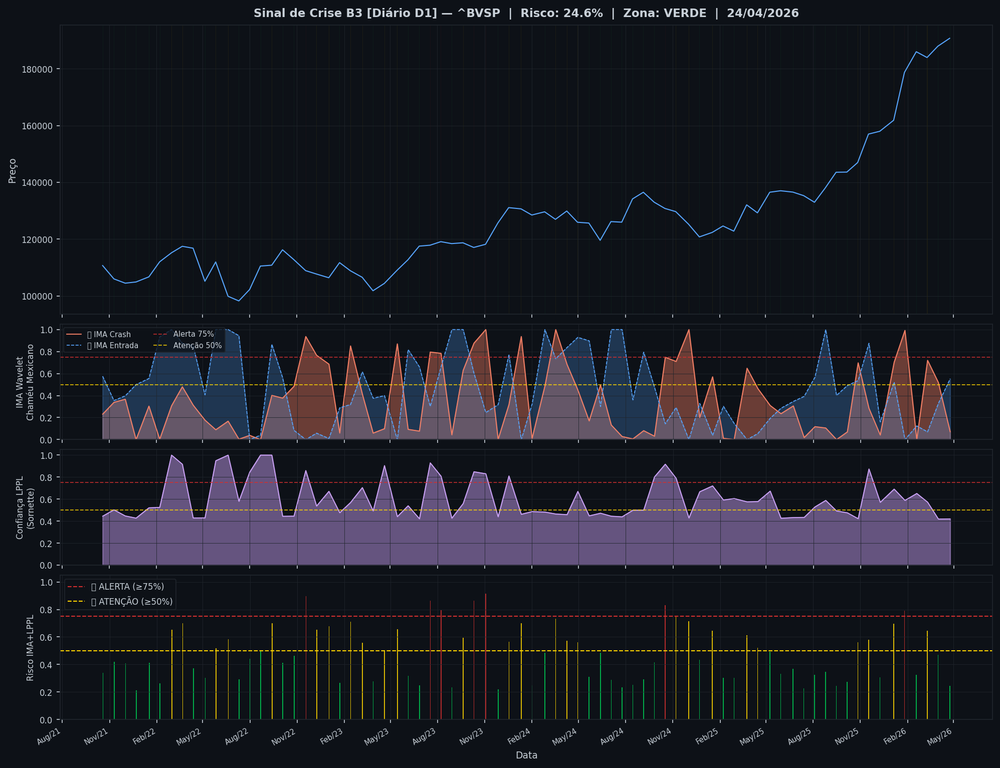
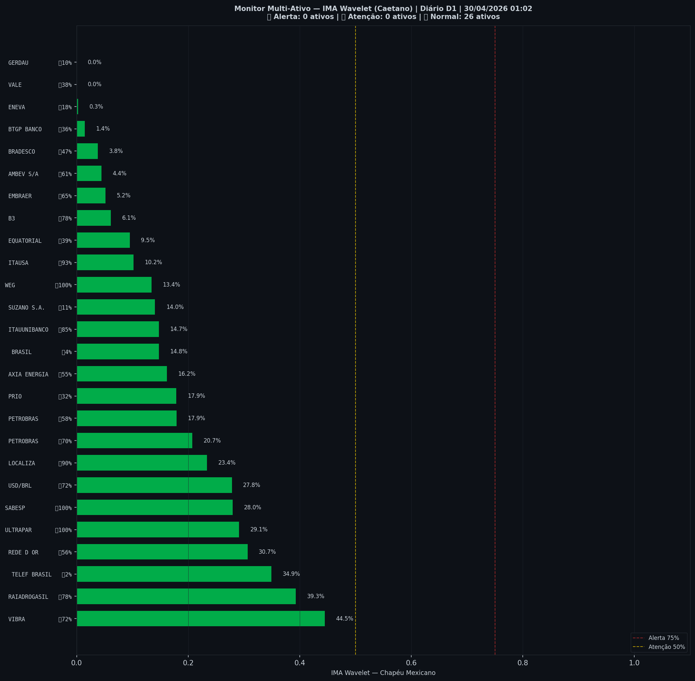

# 🟢 Sinal de Crise B3 — 30/04/2026

> **Gerado em:** 01:10 BRT | **Método:** IMA Wavelet Chapéu Mexicano (Caetano/ITA) + LPPL (Sornette/ETH-Zurich)

---

## Resumo do Dia

| Indicador | Valor | Interpretação |
|---|---|---|
| **Zona** | 🟢 **VERDE** | Normal |
| **Risco Combinado** | **24.6%** | IMA + LPPL combinados |
| 🔴 IMA Crash | 7.1% | Alta frequência espectral |
| 🔵 IMA Entrada | 55.3% | Oportunidade de compra |
| 📐 LPPL Sornette | 42.0% | Estrutura de bolha |
| Ibovespa | 190,745 pts | Fechamento |

> ✅ Sem sinal de crise detectado no momento.

---

## Gráfico do Sinal

---

## Monitor Multi-Ativo (27 ativos)

**Índice de Confiança:** 0% dos ativos em tensão
(✅ Mercado tranquilo)

🔴 Alerta: **0** | 🟡 Atenção: **0** | 🟢 Normal: **27**

| Zona | Ativo | Setor | 🔴 IMA Crash | 🔵 IMA Entrada |
|---|---|---|---|---|
| 🟢 | **VIBRA** | Energia | 🔴 44.5% | 🔵 72.3% |
| 🟢 | **RAIADROGASIL** | Outros | 🔴 39.3% | 🔵 77.6% |
| 🟢 | **TELEF BRASIL** | Outros | 🔴 34.9% |  2.0% |
| 🟢 | **REDE D OR** | Saúde | 🔴 30.6% |  56.3% |
| 🟢 | **ULTRAPAR** | Outros | 🔴 29.1% | 🔵 100.0% |
| 🟢 | **SABESP** | Saneamento | 🔴 28.0% | 🔵 100.0% |
| 🟢 | **USD/BRL** | Câmbio | 🔴 27.8% | 🔵 72.2% |
| 🟢 | **LOCALIZA** | Aluguel | 🔴 23.4% | 🔵 89.6% |
| 🟢 | **PETROBRAS** | Petróleo | 🔴 20.7% | 🔵 69.6% |
| 🟢 | **PETROBRAS** | Petróleo | 🔴 17.9% |  58.0% |
| 🟢 | **PRIO** | Petróleo | 🔴 17.9% |  32.0% |
| 🟢 | **AXIA ENERGIA** | Energia | 🔴 16.2% |  55.0% |
| 🟢 | **BRASIL** | Financeiro | 🔴 14.8% |  3.7% |
| 🟢 | **ITAUUNIBANCO** | Financeiro | 🔴 14.7% | 🔵 85.0% |
| 🟢 | **SUZANO S.A.** | Papel/Celulose | 🔴 14.1% |  11.3% |
| 🟢 | **WEG** | Industrial | 🔴 13.4% | 🔵 99.9% |
| 🟢 | **ITAUSA** | Financeiro | 🔴 10.2% | 🔵 93.2% |
| 🟢 | **EQUATORIAL** | Energia | 🔴 9.5% |  39.0% |
| 🟢 | **B3** | Financeiro | 🔴 6.1% | 🔵 78.0% |
| 🟢 | **EMBRAER** | Outros | 🔴 5.2% | 🔵 64.9% |
| 🟢 | **AMBEV S/A** | Consumo | 🔴 4.4% | 🔵 60.8% |
| 🟢 | **BRADESCO** | Financeiro | 🔴 3.8% |  46.9% |
| 🟢 | **BTGP BANCO** | Financeiro | 🔴 1.4% |  36.1% |
| 🟢 | **ENEVA** | Energia | 🔴 0.3% |  17.7% |
| 🟢 | **VALE** | Mineração | 🔴 0.0% |  37.7% |
| 🟢 | **GERDAU** | Siderurgia | 🔴 0.0% |  9.6% |

---

## Histórico Recente (últimas 10 leituras)

| Data | Zona | Risco | 🔴 IMA Crash | 🔵 IMA Entrada |
|---|---|---|---|---|
| 2025-10-06 | 🟢 VERDE | 27.3% | — | — |
| 2025-10-27 | 🟡 AMARELO | 56.0% | — | — |
| 2025-11-17 | 🟡 AMARELO | 57.9% | — | — |
| 2025-12-09 | 🟢 VERDE | 30.6% | — | — |
| 2026-01-05 | 🟡 AMARELO | 69.7% | — | — |
| 2026-01-26 | 🔴 VERMELHO | 79.0% | — | — |
| 2026-02-18 | 🟢 VERDE | 32.6% | — | — |
| 2026-03-11 | 🟡 AMARELO | 64.6% | — | — |
| 2026-04-01 | 🟢 VERDE | 46.9% | — | — |
| 2026-04-24 | 🟢 VERDE | 24.6% | — | — |

---

## Como interpretar

| Indicador | O que significa |
|---|---|
| 🔴 **IMA Crash alto** | Alta frequência espectral — mercado nervoso, pré-crise |
| 🔵 **IMA Entrada alto** | Baixa frequência estável — possível oportunidade de compra |
| 📐 **LPPL alto** | Estrutura de bolha detectada — risco de crash acelerado |
| **Índice Multi-Ativo** | % de ativos em tensão — quanto maior, mais confiável o sinal |

> Sinal mais confiável quando **múltiplos ativos** disparam simultaneamente.

---

## Metodologia

O **IMA Wavelet** (Índice de Mudanças Abruptas) é baseado no método do Prof. Marco Antonio Leonel Caetano (ITA/INSPER), publicado na revista Physica-A (Elsevier). Usa a **Transformada Wavelet Contínua com Chapéu Mexicano** para detectar regimes de alta frequência com baixa volatilidade — padrão que antecede mudanças abruptas no mercado.

O **LPPL** (Log-Periodic Power Law) é baseado no modelo do Prof. Didier Sornette (ETH-Zurich), que detecta estruturas de bolha especulativa com oscilações aceleradas.

> **Aviso:** Este é um estudo acadêmico e não constitui recomendação de investimento. Use com análise própria.

---
*Gerado automaticamente pelo Sistema Sinal de Crise B3 | [Metodologia](../metodologia) | [Histórico](../historico)*
