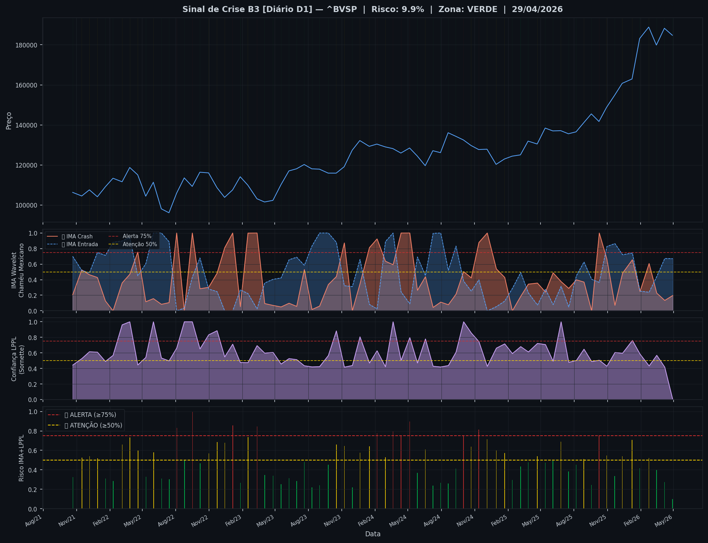
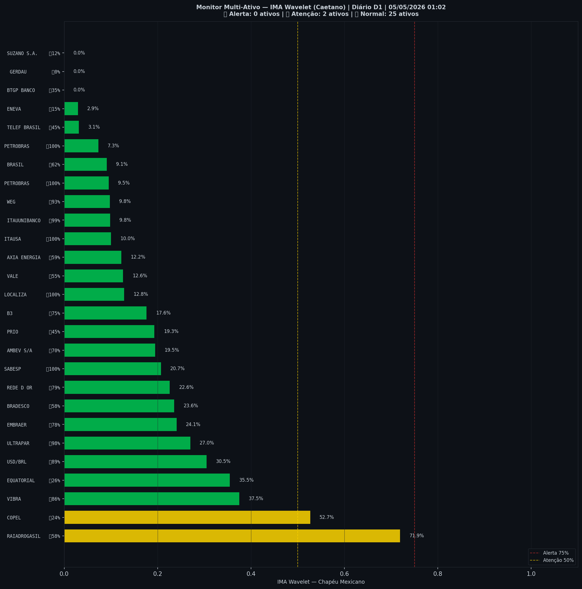

# 🟢 Sinal de Crise B3 — 05/05/2026

> **Gerado em:** 01:10 BRT | **Método:** IMA Wavelet Chapéu Mexicano (Caetano/ITA) + LPPL (Sornette/ETH-Zurich)

---

## Resumo do Dia

| Indicador | Valor | Interpretação |
|---|---|---|
| **Zona** | 🟢 **VERDE** | Normal |
| **Risco Combinado** | **9.8%** | IMA + LPPL combinados |
| 🔴 IMA Crash | 19.7% | Alta frequência espectral |
| 🔵 IMA Entrada | 67.0% | Oportunidade de compra |
| 📐 LPPL Sornette | 0.0% | Estrutura de bolha |
| Ibovespa | 184,750 pts | Fechamento |

> ✅ Sem sinal de crise detectado no momento.

---

## Gráfico do Sinal

---

## Monitor Multi-Ativo (27 ativos)

**Índice de Confiança:** 7% dos ativos em tensão
(✅ Mercado tranquilo)

🔴 Alerta: **0** | 🟡 Atenção: **2** | 🟢 Normal: **25**

| Zona | Ativo | Setor | 🔴 IMA Crash | 🔵 IMA Entrada |
|---|---|---|---|---|
| 🟡 | **RAIADROGASIL** | Outros | 🔴 71.9% |  58.2% |
| 🟡 | **COPEL** | Energia | 🔴 52.7% |  24.2% |
| 🟢 | **VIBRA** | Energia | 🔴 37.5% | 🔵 85.6% |
| 🟢 | **EQUATORIAL** | Energia | 🔴 35.4% |  26.3% |
| 🟢 | **USD/BRL** | Câmbio | 🔴 30.5% | 🔵 88.7% |
| 🟢 | **ULTRAPAR** | Outros | 🔴 27.0% | 🔵 98.1% |
| 🟢 | **EMBRAER** | Outros | 🔴 24.1% | 🔵 77.6% |
| 🟢 | **BRADESCO** | Financeiro | 🔴 23.6% |  58.0% |
| 🟢 | **REDE D OR** | Saúde | 🔴 22.6% | 🔵 79.3% |
| 🟢 | **SABESP** | Saneamento | 🔴 20.7% | 🔵 100.0% |
| 🟢 | **AMBEV S/A** | Consumo | 🔴 19.5% | 🔵 70.1% |
| 🟢 | **PRIO** | Petróleo | 🔴 19.3% |  45.4% |
| 🟢 | **B3** | Financeiro | 🔴 17.6% | 🔵 74.8% |
| 🟢 | **LOCALIZA** | Aluguel | 🔴 12.8% | 🔵 100.0% |
| 🟢 | **VALE** | Mineração | 🔴 12.6% |  54.7% |
| 🟢 | **AXIA ENERGIA** | Energia | 🔴 12.2% |  59.4% |
| 🟢 | **ITAUSA** | Financeiro | 🔴 10.0% | 🔵 100.0% |
| 🟢 | **ITAUUNIBANCO** | Financeiro | 🔴 9.8% | 🔵 98.7% |
| 🟢 | **WEG** | Industrial | 🔴 9.8% | 🔵 93.3% |
| 🟢 | **PETROBRAS** | Petróleo | 🔴 9.5% | 🔵 100.0% |
| 🟢 | **BRASIL** | Financeiro | 🔴 9.1% | 🔵 62.1% |
| 🟢 | **PETROBRAS** | Petróleo | 🔴 7.3% | 🔵 100.0% |
| 🟢 | **TELEF BRASIL** | Outros | 🔴 3.1% |  44.5% |
| 🟢 | **ENEVA** | Energia | 🔴 2.9% |  15.3% |
| 🟢 | **BTGP BANCO** | Financeiro | 🔴 0.0% |  35.3% |
| 🟢 | **GERDAU** | Siderurgia | 🔴 0.0% |  0.0% |
| 🟢 | **SUZANO S.A.** | Papel/Celulose | 🔴 0.0% |  12.4% |

---

## Histórico Recente (últimas 10 leituras)

| Data | Zona | Risco | 🔴 IMA Crash | 🔵 IMA Entrada |
|---|---|---|---|---|
| 2025-10-09 | 🔴 VERMELHO | 75.3% | — | — |
| 2025-10-30 | 🟡 AMARELO | 54.6% | — | — |
| 2025-11-21 | 🟢 VERDE | 33.8% | — | — |
| 2025-12-12 | 🟡 AMARELO | 54.0% | — | — |
| 2026-01-08 | 🟡 AMARELO | 70.8% | — | — |
| 2026-01-29 | 🟢 VERDE | 41.6% | — | — |
| 2026-02-23 | 🟡 AMARELO | 52.0% | — | — |
| 2026-03-16 | 🟢 VERDE | 39.9% | — | — |
| 2026-04-07 | 🟢 VERDE | 27.5% | — | — |
| 2026-04-29 | 🟢 VERDE | 9.8% | — | — |

---

## Como interpretar

| Indicador | O que significa |
|---|---|
| 🔴 **IMA Crash alto** | Alta frequência espectral — mercado nervoso, pré-crise |
| 🔵 **IMA Entrada alto** | Baixa frequência estável — possível oportunidade de compra |
| 📐 **LPPL alto** | Estrutura de bolha detectada — risco de crash acelerado |
| **Índice Multi-Ativo** | % de ativos em tensão — quanto maior, mais confiável o sinal |

> Sinal mais confiável quando **múltiplos ativos** disparam simultaneamente.

---

## Metodologia

O **IMA Wavelet** (Índice de Mudanças Abruptas) é baseado no método do Prof. Marco Antonio Leonel Caetano (ITA/INSPER), publicado na revista Physica-A (Elsevier). Usa a **Transformada Wavelet Contínua com Chapéu Mexicano** para detectar regimes de alta frequência com baixa volatilidade — padrão que antecede mudanças abruptas no mercado.

O **LPPL** (Log-Periodic Power Law) é baseado no modelo do Prof. Didier Sornette (ETH-Zurich), que detecta estruturas de bolha especulativa com oscilações aceleradas.

> **Aviso:** Este é um estudo acadêmico e não constitui recomendação de investimento. Use com análise própria.

---
*Gerado automaticamente pelo Sistema Sinal de Crise B3 | [Metodologia](../metodologia) | [Histórico](../historico)*
