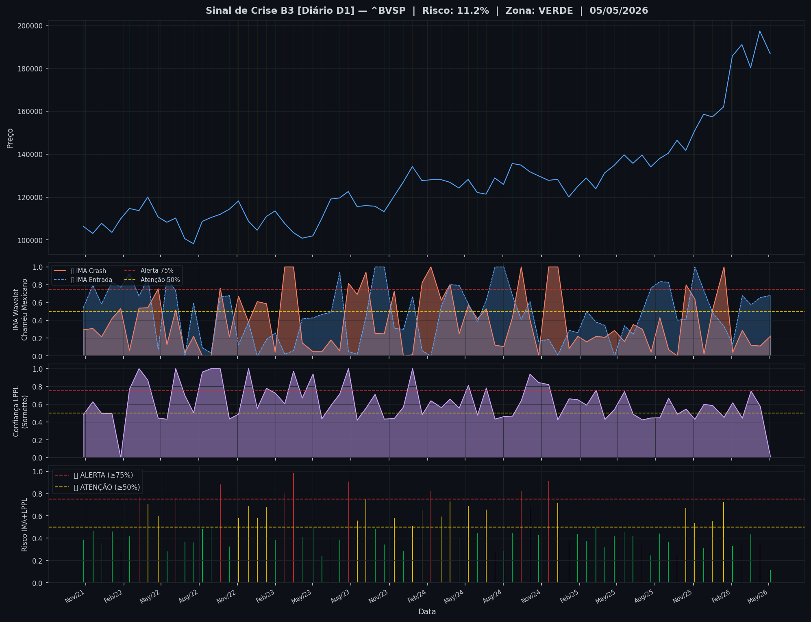
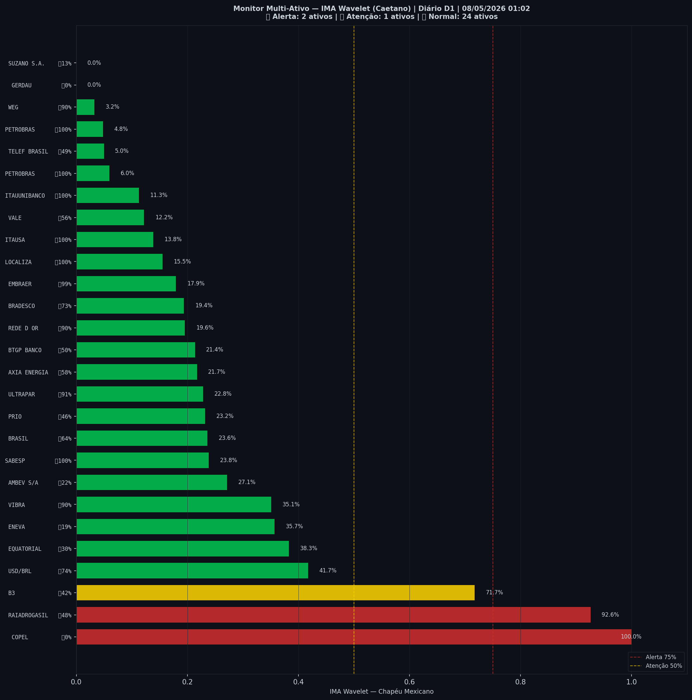

# 🟢 Sinal de Crise B3 — 08/05/2026

> **Gerado em:** 01:10 BRT | **Método:** IMA Wavelet Chapéu Mexicano (Caetano/ITA) + LPPL (Sornette/ETH-Zurich)

---

## Resumo do Dia

| Indicador | Valor | Interpretação |
|---|---|---|
| **Zona** | 🟢 **VERDE** | Normal |
| **Risco Combinado** | **11.2%** | IMA + LPPL combinados |
| 🔴 IMA Crash | 22.4% | Alta frequência espectral |
| 🔵 IMA Entrada | 68.0% | Oportunidade de compra |
| 📐 LPPL Sornette | 0.0% | Estrutura de bolha |
| Ibovespa | 186,754 pts | Fechamento |

> ✅ Sem sinal de crise detectado no momento.

---

## Gráfico do Sinal

---

## Monitor Multi-Ativo (27 ativos)

**Índice de Confiança:** 11% dos ativos em tensão
(✅ Mercado tranquilo)

🔴 Alerta: **2** | 🟡 Atenção: **1** | 🟢 Normal: **24**

| Zona | Ativo | Setor | 🔴 IMA Crash | 🔵 IMA Entrada |
|---|---|---|---|---|
| 🔴 | **COPEL** | Energia | 🔴 100.0% |  0.0% |
| 🔴 | **RAIADROGASIL** | Outros | 🔴 92.6% |  47.8% |
| 🟡 | **B3** | Financeiro | 🔴 71.7% |  42.2% |
| 🟢 | **USD/BRL** | Câmbio | 🔴 41.7% | 🔵 74.1% |
| 🟢 | **EQUATORIAL** | Energia | 🔴 38.3% |  29.7% |
| 🟢 | **ENEVA** | Energia | 🔴 35.7% |  18.6% |
| 🟢 | **VIBRA** | Energia | 🔴 35.1% | 🔵 89.8% |
| 🟢 | **AMBEV S/A** | Consumo | 🔴 27.1% |  21.9% |
| 🟢 | **SABESP** | Saneamento | 🔴 23.8% | 🔵 100.0% |
| 🟢 | **BRASIL** | Financeiro | 🔴 23.6% | 🔵 63.9% |
| 🟢 | **PRIO** | Petróleo | 🔴 23.2% |  46.0% |
| 🟢 | **ULTRAPAR** | Outros | 🔴 22.8% | 🔵 91.1% |
| 🟢 | **AXIA ENERGIA** | Energia | 🔴 21.7% |  57.8% |
| 🟢 | **BTGP BANCO** | Financeiro | 🔴 21.4% |  50.4% |
| 🟢 | **REDE D OR** | Saúde | 🔴 19.6% | 🔵 89.6% |
| 🟢 | **BRADESCO** | Financeiro | 🔴 19.4% | 🔵 73.0% |
| 🟢 | **EMBRAER** | Outros | 🔴 17.9% | 🔵 98.7% |
| 🟢 | **LOCALIZA** | Aluguel | 🔴 15.5% | 🔵 100.0% |
| 🟢 | **ITAUSA** | Financeiro | 🔴 13.8% | 🔵 100.0% |
| 🟢 | **VALE** | Mineração | 🔴 12.2% |  55.9% |
| 🟢 | **ITAUUNIBANCO** | Financeiro | 🔴 11.2% | 🔵 100.0% |
| 🟢 | **PETROBRAS** | Petróleo | 🔴 6.0% | 🔵 100.0% |
| 🟢 | **TELEF BRASIL** | Outros | 🔴 5.0% |  49.4% |
| 🟢 | **PETROBRAS** | Petróleo | 🔴 4.8% | 🔵 100.0% |
| 🟢 | **WEG** | Industrial | 🔴 3.2% | 🔵 89.6% |
| 🟢 | **GERDAU** | Siderurgia | 🔴 0.0% |  0.0% |
| 🟢 | **SUZANO S.A.** | Papel/Celulose | 🔴 0.0% |  13.5% |

---

## Histórico Recente (últimas 10 leituras)

| Data | Zona | Risco | 🔴 IMA Crash | 🔵 IMA Entrada |
|---|---|---|---|---|
| 2025-10-14 | 🟡 AMARELO | 67.2% | — | — |
| 2025-11-04 | 🟡 AMARELO | 53.5% | — | — |
| 2025-11-26 | 🟢 VERDE | 31.2% | — | — |
| 2025-12-17 | 🟡 AMARELO | 55.5% | — | — |
| 2026-01-13 | 🟡 AMARELO | 72.7% | — | — |
| 2026-02-03 | 🟢 VERDE | 32.9% | — | — |
| 2026-02-26 | 🟢 VERDE | 36.6% | — | — |
| 2026-03-19 | 🟢 VERDE | 43.4% | — | — |
| 2026-04-10 | 🟢 VERDE | 34.5% | — | — |
| 2026-05-05 | 🟢 VERDE | 11.2% | — | — |

---

## Como interpretar

| Indicador | O que significa |
|---|---|
| 🔴 **IMA Crash alto** | Alta frequência espectral — mercado nervoso, pré-crise |
| 🔵 **IMA Entrada alto** | Baixa frequência estável — possível oportunidade de compra |
| 📐 **LPPL alto** | Estrutura de bolha detectada — risco de crash acelerado |
| **Índice Multi-Ativo** | % de ativos em tensão — quanto maior, mais confiável o sinal |

> Sinal mais confiável quando **múltiplos ativos** disparam simultaneamente.

---

## Metodologia

O **IMA Wavelet** (Índice de Mudanças Abruptas) é baseado no método do Prof. Marco Antonio Leonel Caetano (ITA/INSPER), publicado na revista Physica-A (Elsevier). Usa a **Transformada Wavelet Contínua com Chapéu Mexicano** para detectar regimes de alta frequência com baixa volatilidade — padrão que antecede mudanças abruptas no mercado.

O **LPPL** (Log-Periodic Power Law) é baseado no modelo do Prof. Didier Sornette (ETH-Zurich), que detecta estruturas de bolha especulativa com oscilações aceleradas.

> **Aviso:** Este é um estudo acadêmico e não constitui recomendação de investimento. Use com análise própria.

---
*Gerado automaticamente pelo Sistema Sinal de Crise B3 | [Metodologia](../metodologia) | [Histórico](../historico)*
