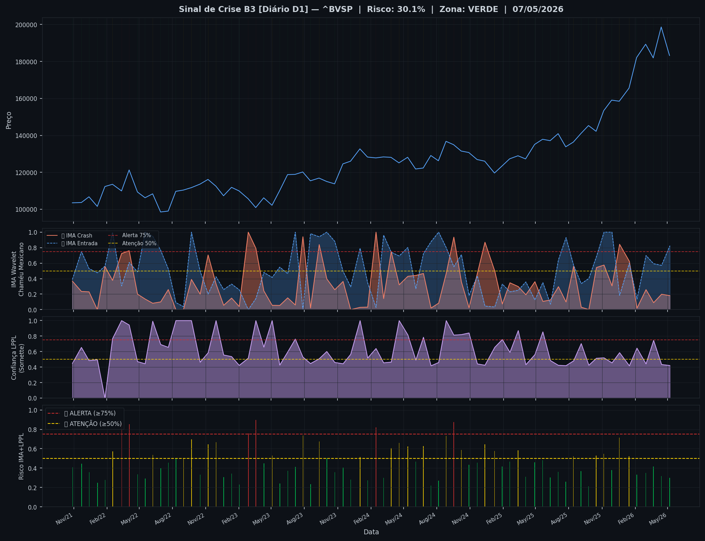
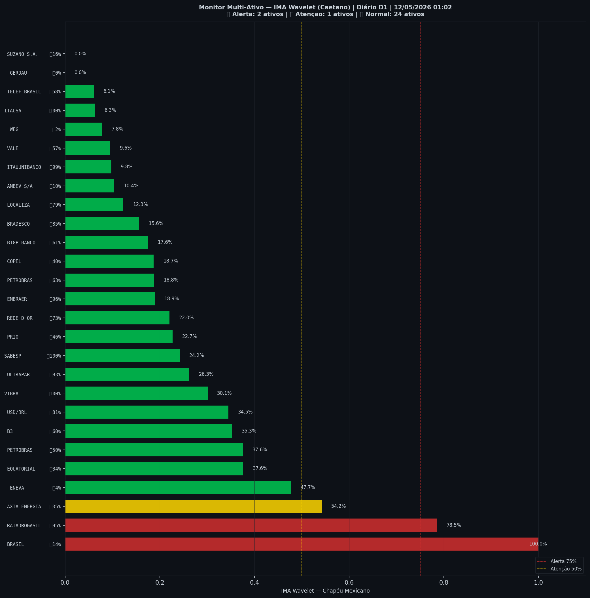

# 🟢 Sinal de Crise B3 — 12/05/2026

> **Gerado em:** 01:10 BRT | **Método:** IMA Wavelet Chapéu Mexicano (Caetano/ITA) + LPPL (Sornette/ETH-Zurich)

---

## Resumo do Dia

| Indicador | Valor | Interpretação |
|---|---|---|
| **Zona** | 🟢 **VERDE** | Normal |
| **Risco Combinado** | **30.1%** | IMA + LPPL combinados |
| 🔴 IMA Crash | 18.1% | Alta frequência espectral |
| 🔵 IMA Entrada | 82.5% | Oportunidade de compra |
| 📐 LPPL Sornette | 42.0% | Estrutura de bolha |
| Ibovespa | 183,218 pts | Fechamento |

> ✅ Sem sinal de crise detectado no momento.

---

## Gráfico do Sinal

---

## Monitor Multi-Ativo (27 ativos)

**Índice de Confiança:** 11% dos ativos em tensão
(✅ Mercado tranquilo)

🔴 Alerta: **2** | 🟡 Atenção: **1** | 🟢 Normal: **24**

| Zona | Ativo | Setor | 🔴 IMA Crash | 🔵 IMA Entrada |
|---|---|---|---|---|
| 🔴 | **BRASIL** | Financeiro | 🔴 100.0% |  13.7% |
| 🔴 | **RAIADROGASIL** | Outros | 🔴 78.5% | 🔵 95.2% |
| 🟡 | **AXIA ENERGIA** | Energia | 🔴 54.2% |  34.8% |
| 🟢 | **ENEVA** | Energia | 🔴 47.7% |  3.9% |
| 🟢 | **EQUATORIAL** | Energia | 🔴 37.6% |  34.2% |
| 🟢 | **PETROBRAS** | Petróleo | 🔴 37.6% |  50.5% |
| 🟢 | **B3** | Financeiro | 🔴 35.3% | 🔵 60.2% |
| 🟢 | **USD/BRL** | Câmbio | 🔴 34.5% | 🔵 80.5% |
| 🟢 | **VIBRA** | Energia | 🔴 30.1% | 🔵 100.0% |
| 🟢 | **ULTRAPAR** | Outros | 🔴 26.3% | 🔵 82.8% |
| 🟢 | **SABESP** | Saneamento | 🔴 24.2% | 🔵 100.0% |
| 🟢 | **PRIO** | Petróleo | 🔴 22.7% |  46.0% |
| 🟢 | **REDE D OR** | Saúde | 🔴 22.0% | 🔵 72.8% |
| 🟢 | **EMBRAER** | Outros | 🔴 18.9% | 🔵 96.0% |
| 🟢 | **PETROBRAS** | Petróleo | 🔴 18.8% | 🔵 63.4% |
| 🟢 | **COPEL** | Energia | 🔴 18.7% |  39.9% |
| 🟢 | **BTGP BANCO** | Financeiro | 🔴 17.6% | 🔵 60.8% |
| 🟢 | **BRADESCO** | Financeiro | 🔴 15.6% | 🔵 85.4% |
| 🟢 | **LOCALIZA** | Aluguel | 🔴 12.3% | 🔵 78.7% |
| 🟢 | **AMBEV S/A** | Consumo | 🔴 10.4% |  9.9% |
| 🟢 | **ITAUUNIBANCO** | Financeiro | 🔴 9.8% | 🔵 99.2% |
| 🟢 | **VALE** | Mineração | 🔴 9.6% |  57.4% |
| 🟢 | **WEG** | Industrial | 🔴 7.8% |  2.4% |
| 🟢 | **ITAUSA** | Financeiro | 🔴 6.3% | 🔵 99.6% |
| 🟢 | **TELEF BRASIL** | Outros | 🔴 6.1% |  57.8% |
| 🟢 | **GERDAU** | Siderurgia | 🔴 0.0% |  0.0% |
| 🟢 | **SUZANO S.A.** | Papel/Celulose | 🔴 0.0% |  15.8% |

---

## Histórico Recente (últimas 10 leituras)

| Data | Zona | Risco | 🔴 IMA Crash | 🔵 IMA Entrada |
|---|---|---|---|---|
| 2025-10-16 | 🟡 AMARELO | 52.9% | — | — |
| 2025-11-06 | 🟡 AMARELO | 54.8% | — | — |
| 2025-11-28 | 🟢 VERDE | 38.1% | — | — |
| 2025-12-19 | 🟡 AMARELO | 71.5% | — | — |
| 2026-01-15 | 🟡 AMARELO | 52.0% | — | — |
| 2026-02-05 | 🟢 VERDE | 33.2% | — | — |
| 2026-03-02 | 🟢 VERDE | 35.0% | — | — |
| 2026-03-23 | 🟢 VERDE | 41.7% | — | — |
| 2026-04-14 | 🟢 VERDE | 31.6% | — | — |
| 2026-05-07 | 🟢 VERDE | 30.1% | — | — |

---

## Como interpretar

| Indicador | O que significa |
|---|---|
| 🔴 **IMA Crash alto** | Alta frequência espectral — mercado nervoso, pré-crise |
| 🔵 **IMA Entrada alto** | Baixa frequência estável — possível oportunidade de compra |
| 📐 **LPPL alto** | Estrutura de bolha detectada — risco de crash acelerado |
| **Índice Multi-Ativo** | % de ativos em tensão — quanto maior, mais confiável o sinal |

> Sinal mais confiável quando **múltiplos ativos** disparam simultaneamente.

---

## Metodologia

O **IMA Wavelet** (Índice de Mudanças Abruptas) é baseado no método do Prof. Marco Antonio Leonel Caetano (ITA/INSPER), publicado na revista Physica-A (Elsevier). Usa a **Transformada Wavelet Contínua com Chapéu Mexicano** para detectar regimes de alta frequência com baixa volatilidade — padrão que antecede mudanças abruptas no mercado.

O **LPPL** (Log-Periodic Power Law) é baseado no modelo do Prof. Didier Sornette (ETH-Zurich), que detecta estruturas de bolha especulativa com oscilações aceleradas.

> **Aviso:** Este é um estudo acadêmico e não constitui recomendação de investimento. Use com análise própria.

---
*Gerado automaticamente pelo Sistema Sinal de Crise B3 | [Metodologia](../metodologia) | [Histórico](../historico)*
