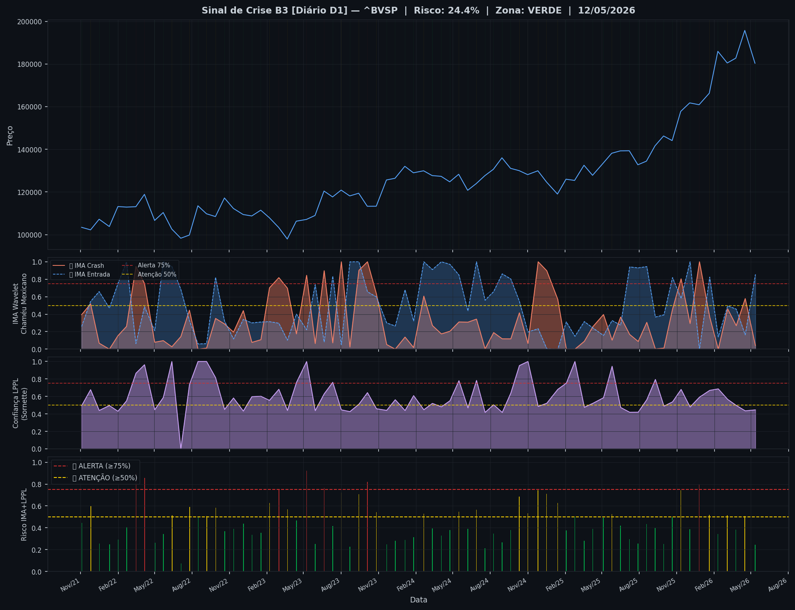
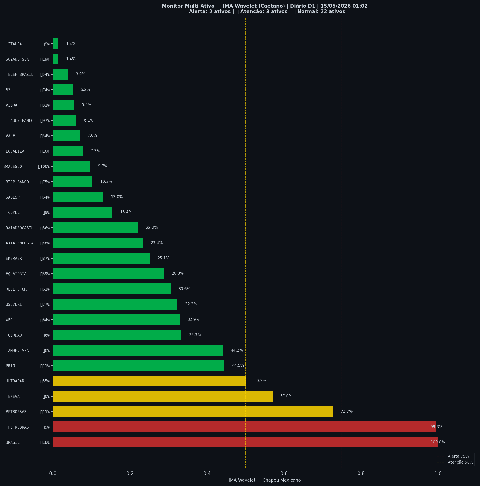

# 🟢 Sinal de Crise B3 — 15/05/2026

> **Gerado em:** 01:10 BRT | **Método:** IMA Wavelet Chapéu Mexicano (Caetano/ITA) + LPPL (Sornette/ETH-Zurich)

---

## Resumo do Dia

| Indicador | Valor | Interpretação |
|---|---|---|
| **Zona** | 🟢 **VERDE** | Normal |
| **Risco Combinado** | **24.4%** | IMA + LPPL combinados |
| 🔴 IMA Crash | 4.1% | Alta frequência espectral |
| 🔵 IMA Entrada | 85.5% | Oportunidade de compra |
| 📐 LPPL Sornette | 44.6% | Estrutura de bolha |
| Ibovespa | 180,342 pts | Fechamento |

> ✅ Sem sinal de crise detectado no momento.

---

## Gráfico do Sinal

---

## Monitor Multi-Ativo (27 ativos)

**Índice de Confiança:** 19% dos ativos em tensão
(✅ Mercado tranquilo)

🔴 Alerta: **2** | 🟡 Atenção: **3** | 🟢 Normal: **22**

| Zona | Ativo | Setor | 🔴 IMA Crash | 🔵 IMA Entrada |
|---|---|---|---|---|
| 🔴 | **BRASIL** | Financeiro | 🔴 100.0% |  17.9% |
| 🔴 | **PETROBRAS** | Petróleo | 🔴 99.3% |  9.3% |
| 🟡 | **PETROBRAS** | Petróleo | 🔴 72.7% |  15.3% |
| 🟡 | **ENEVA** | Energia | 🔴 57.0% |  0.0% |
| 🟡 | **ULTRAPAR** | Outros | 🔴 50.2% |  55.3% |
| 🟢 | **PRIO** | Petróleo | 🔴 44.5% |  11.4% |
| 🟢 | **AMBEV S/A** | Consumo | 🔴 44.2% |  0.0% |
| 🟢 | **GERDAU** | Siderurgia | 🔴 33.3% |  5.8% |
| 🟢 | **WEG** | Industrial | 🔴 32.9% | 🔵 64.1% |
| 🟢 | **USD/BRL** | Câmbio | 🔴 32.3% | 🔵 77.3% |
| 🟢 | **REDE D OR** | Saúde | 🔴 30.6% | 🔵 60.7% |
| 🟢 | **EQUATORIAL** | Energia | 🔴 28.8% |  39.5% |
| 🟢 | **EMBRAER** | Outros | 🔴 25.1% | 🔵 87.2% |
| 🟢 | **AXIA ENERGIA** | Energia | 🔴 23.4% |  47.9% |
| 🟢 | **RAIADROGASIL** | Outros | 🔴 22.2% |  36.4% |
| 🟢 | **COPEL** | Energia | 🔴 15.4% |  9.4% |
| 🟢 | **SABESP** | Saneamento | 🔴 13.0% | 🔵 63.7% |
| 🟢 | **BTGP BANCO** | Financeiro | 🔴 10.2% | 🔵 74.8% |
| 🟢 | **BRADESCO** | Financeiro | 🔴 9.7% | 🔵 100.0% |
| 🟢 | **LOCALIZA** | Aluguel | 🔴 7.7% |  10.3% |
| 🟢 | **VALE** | Mineração | 🔴 7.0% |  53.9% |
| 🟢 | **ITAUUNIBANCO** | Financeiro | 🔴 6.1% | 🔵 96.9% |
| 🟢 | **VIBRA** | Energia | 🔴 5.5% |  31.1% |
| 🟢 | **B3** | Financeiro | 🔴 5.2% | 🔵 73.6% |
| 🟢 | **TELEF BRASIL** | Outros | 🔴 3.9% |  53.6% |
| 🟢 | **SUZANO S.A.** | Papel/Celulose | 🔴 1.4% |  18.5% |
| 🟢 | **ITAUSA** | Financeiro | 🔴 1.4% |  8.6% |

---

## Histórico Recente (últimas 10 leituras)

| Data | Zona | Risco | 🔴 IMA Crash | 🔵 IMA Entrada |
|---|---|---|---|---|
| 2025-10-21 | 🟢 VERDE | 49.8% | — | — |
| 2025-11-11 | 🟡 AMARELO | 74.3% | — | — |
| 2025-12-03 | 🟢 VERDE | 38.6% | — | — |
| 2025-12-26 | 🔴 VERMELHO | 79.6% | — | — |
| 2026-01-20 | 🟡 AMARELO | 51.9% | — | — |
| 2026-02-10 | 🟢 VERDE | 34.3% | — | — |
| 2026-03-05 | 🟡 AMARELO | 51.4% | — | — |
| 2026-03-26 | 🟢 VERDE | 38.3% | — | — |
| 2026-04-17 | 🟡 AMARELO | 50.7% | — | — |
| 2026-05-12 | 🟢 VERDE | 24.4% | — | — |

---

## Como interpretar

| Indicador | O que significa |
|---|---|
| 🔴 **IMA Crash alto** | Alta frequência espectral — mercado nervoso, pré-crise |
| 🔵 **IMA Entrada alto** | Baixa frequência estável — possível oportunidade de compra |
| 📐 **LPPL alto** | Estrutura de bolha detectada — risco de crash acelerado |
| **Índice Multi-Ativo** | % de ativos em tensão — quanto maior, mais confiável o sinal |

> Sinal mais confiável quando **múltiplos ativos** disparam simultaneamente.

---

## Metodologia

O **IMA Wavelet** (Índice de Mudanças Abruptas) é baseado no método do Prof. Marco Antonio Leonel Caetano (ITA/INSPER), publicado na revista Physica-A (Elsevier). Usa a **Transformada Wavelet Contínua com Chapéu Mexicano** para detectar regimes de alta frequência com baixa volatilidade — padrão que antecede mudanças abruptas no mercado.

O **LPPL** (Log-Periodic Power Law) é baseado no modelo do Prof. Didier Sornette (ETH-Zurich), que detecta estruturas de bolha especulativa com oscilações aceleradas.

> **Aviso:** Este é um estudo acadêmico e não constitui recomendação de investimento. Use com análise própria.

---
*Gerado automaticamente pelo Sistema Sinal de Crise B3 | [Metodologia](../metodologia) | [Histórico](../historico)*
