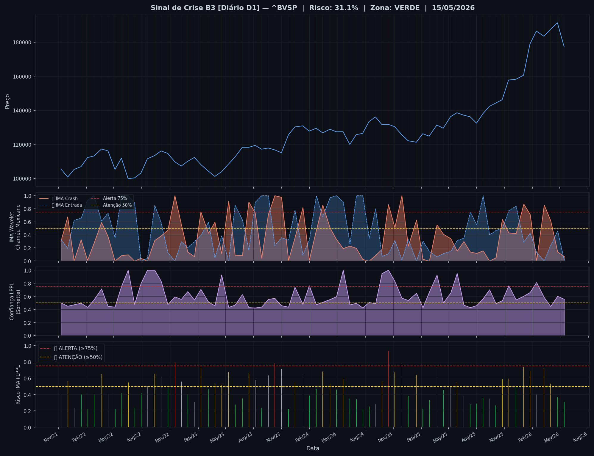
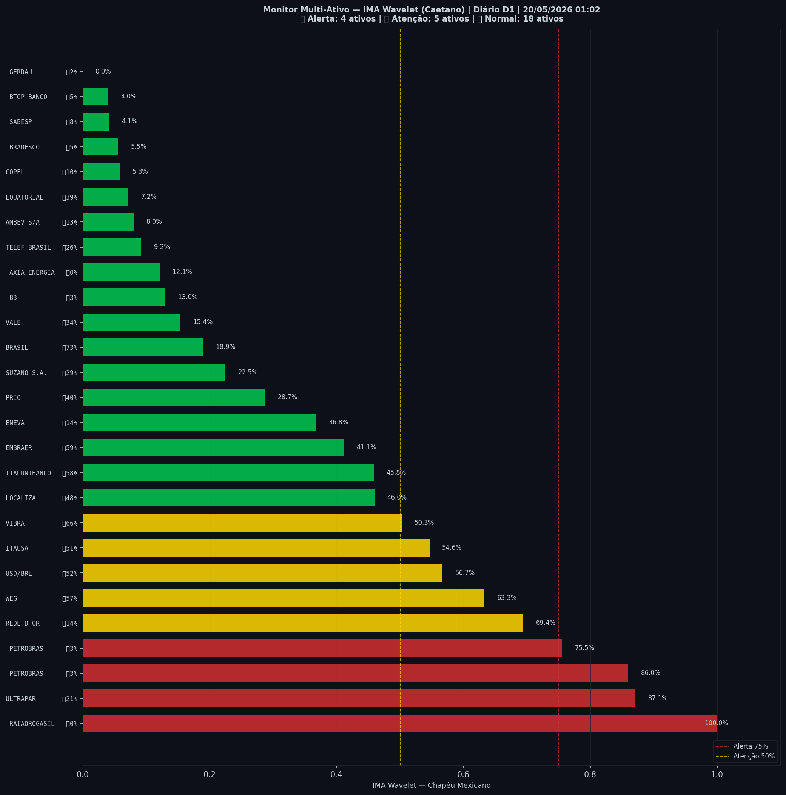

# 🟢 Sinal de Crise B3 — 20/05/2026

> **Gerado em:** 01:10 BRT | **Método:** IMA Wavelet Chapéu Mexicano (Caetano/ITA) + LPPL (Sornette/ETH-Zurich)

---

## Resumo do Dia

| Indicador | Valor | Interpretação |
|---|---|---|
| **Zona** | 🟢 **VERDE** | Normal |
| **Risco Combinado** | **31.1%** | IMA + LPPL combinados |
| 🔴 IMA Crash | 6.7% | Alta frequência espectral |
| 🔵 IMA Entrada | 0.0% | Oportunidade de compra |
| 📐 LPPL Sornette | 55.4% | Estrutura de bolha |
| Ibovespa | 177,284 pts | Fechamento |

> ✅ Sem sinal de crise detectado no momento.

---

## Gráfico do Sinal

---

## Monitor Multi-Ativo (27 ativos)

**Índice de Confiança:** 33% dos ativos em tensão
(⚡ Tensão moderada)

🔴 Alerta: **4** | 🟡 Atenção: **5** | 🟢 Normal: **18**

| Zona | Ativo | Setor | 🔴 IMA Crash | 🔵 IMA Entrada |
|---|---|---|---|---|
| 🔴 | **RAIADROGASIL** | Outros | 🔴 100.0% |  0.4% |
| 🔴 | **ULTRAPAR** | Outros | 🔴 87.1% |  21.5% |
| 🔴 | **PETROBRAS** | Petróleo | 🔴 86.0% |  2.8% |
| 🔴 | **PETROBRAS** | Petróleo | 🔴 75.5% |  2.8% |
| 🟡 | **REDE D OR** | Saúde | 🔴 69.4% |  14.5% |
| 🟡 | **WEG** | Industrial | 🔴 63.3% |  57.0% |
| 🟡 | **USD/BRL** | Câmbio | 🔴 56.7% |  52.4% |
| 🟡 | **ITAUSA** | Financeiro | 🔴 54.6% |  51.4% |
| 🟡 | **VIBRA** | Energia | 🔴 50.3% | 🔵 66.3% |
| 🟢 | **LOCALIZA** | Aluguel | 🔴 46.0% |  47.6% |
| 🟢 | **ITAUUNIBANCO** | Financeiro | 🔴 45.9% |  58.2% |
| 🟢 | **EMBRAER** | Outros | 🔴 41.1% |  59.0% |
| 🟢 | **ENEVA** | Energia | 🔴 36.8% |  14.5% |
| 🟢 | **PRIO** | Petróleo | 🔴 28.7% |  40.2% |
| 🟢 | **SUZANO S.A.** | Papel/Celulose | 🔴 22.5% |  28.6% |
| 🟢 | **BRASIL** | Financeiro | 🔴 18.9% | 🔵 73.0% |
| 🟢 | **VALE** | Mineração | 🔴 15.4% |  34.0% |
| 🟢 | **B3** | Financeiro | 🔴 13.0% |  3.0% |
| 🟢 | **AXIA ENERGIA** | Energia | 🔴 12.1% |  0.0% |
| 🟢 | **TELEF BRASIL** | Outros | 🔴 9.2% |  25.6% |
| 🟢 | **AMBEV S/A** | Consumo | 🔴 8.0% |  12.7% |
| 🟢 | **EQUATORIAL** | Energia | 🔴 7.1% |  39.3% |
| 🟢 | **COPEL** | Energia | 🔴 5.8% |  10.0% |
| 🟢 | **BRADESCO** | Financeiro | 🔴 5.5% |  5.1% |
| 🟢 | **SABESP** | Saneamento | 🔴 4.1% |  7.9% |
| 🟢 | **BTGP BANCO** | Financeiro | 🔴 4.0% |  4.9% |
| 🟢 | **GERDAU** | Siderurgia | 🔴 0.0% |  1.6% |

---

## Histórico Recente (últimas 10 leituras)

| Data | Zona | Risco | 🔴 IMA Crash | 🔵 IMA Entrada |
|---|---|---|---|---|
| 2025-10-24 | 🟡 AMARELO | 58.6% | — | — |
| 2025-11-14 | 🟡 AMARELO | 59.6% | — | — |
| 2025-12-08 | 🟢 VERDE | 48.3% | — | — |
| 2026-01-02 | 🟡 AMARELO | 73.7% | — | — |
| 2026-01-23 | 🟡 AMARELO | 68.5% | — | — |
| 2026-02-13 | 🟢 VERDE | 40.6% | — | — |
| 2026-03-10 | 🟡 AMARELO | 71.8% | — | — |
| 2026-03-31 | 🟡 AMARELO | 53.2% | — | — |
| 2026-04-23 | 🟢 VERDE | 36.9% | — | — |
| 2026-05-15 | 🟢 VERDE | 31.1% | — | — |

---

## Como interpretar

| Indicador | O que significa |
|---|---|
| 🔴 **IMA Crash alto** | Alta frequência espectral — mercado nervoso, pré-crise |
| 🔵 **IMA Entrada alto** | Baixa frequência estável — possível oportunidade de compra |
| 📐 **LPPL alto** | Estrutura de bolha detectada — risco de crash acelerado |
| **Índice Multi-Ativo** | % de ativos em tensão — quanto maior, mais confiável o sinal |

> Sinal mais confiável quando **múltiplos ativos** disparam simultaneamente.

---

## Metodologia

O **IMA Wavelet** (Índice de Mudanças Abruptas) é baseado no método do Prof. Marco Antonio Leonel Caetano (ITA/INSPER), publicado na revista Physica-A (Elsevier). Usa a **Transformada Wavelet Contínua com Chapéu Mexicano** para detectar regimes de alta frequência com baixa volatilidade — padrão que antecede mudanças abruptas no mercado.

O **LPPL** (Log-Periodic Power Law) é baseado no modelo do Prof. Didier Sornette (ETH-Zurich), que detecta estruturas de bolha especulativa com oscilações aceleradas.

> **Aviso:** Este é um estudo acadêmico e não constitui recomendação de investimento. Use com análise própria.

---
*Gerado automaticamente pelo Sistema Sinal de Crise B3 | [Metodologia](../metodologia) | [Histórico](../historico)*
