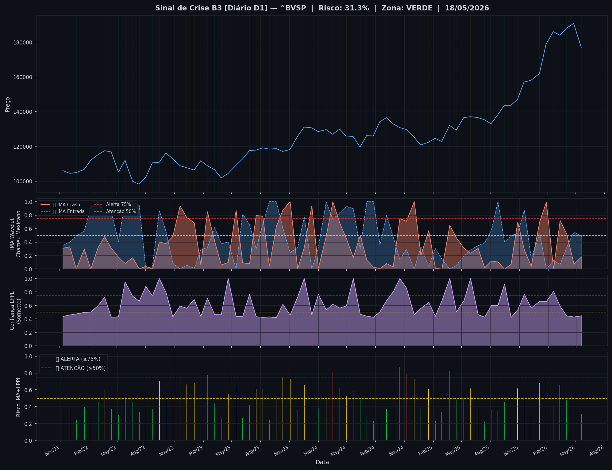
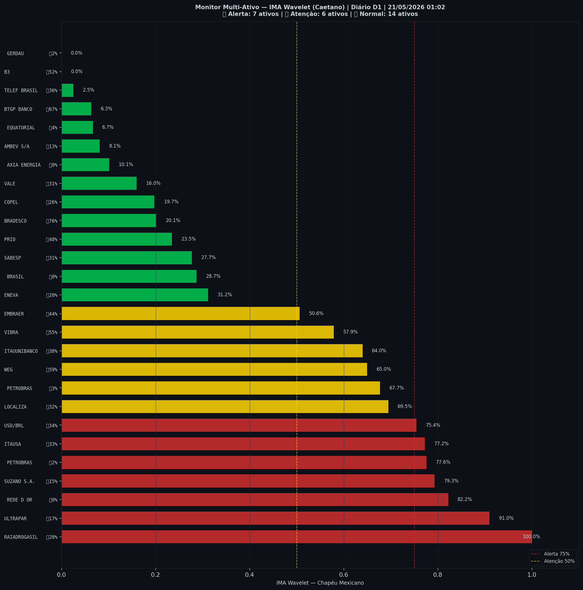

# 🟢 Sinal de Crise B3 — 21/05/2026

> **Gerado em:** 01:10 BRT | **Método:** IMA Wavelet Chapéu Mexicano (Caetano/ITA) + LPPL (Sornette/ETH-Zurich)

---

## Resumo do Dia

| Indicador | Valor | Interpretação |
|---|---|---|
| **Zona** | 🟢 **VERDE** | Normal |
| **Risco Combinado** | **31.3%** | IMA + LPPL combinados |
| 🔴 IMA Crash | 18.0% | Alta frequência espectral |
| 🔵 IMA Entrada | 48.3% | Oportunidade de compra |
| 📐 LPPL Sornette | 44.6% | Estrutura de bolha |
| Ibovespa | 176,976 pts | Fechamento |

> ✅ Sem sinal de crise detectado no momento.

---

## Gráfico do Sinal

---

## Monitor Multi-Ativo (27 ativos)

**Índice de Confiança:** 48% dos ativos em tensão
(⚡ Tensão moderada)

🔴 Alerta: **7** | 🟡 Atenção: **6** | 🟢 Normal: **14**

| Zona | Ativo | Setor | 🔴 IMA Crash | 🔵 IMA Entrada |
|---|---|---|---|---|
| 🔴 | **RAIADROGASIL** | Outros | 🔴 100.0% |  28.0% |
| 🔴 | **ULTRAPAR** | Outros | 🔴 91.0% |  17.4% |
| 🔴 | **REDE D OR** | Saúde | 🔴 82.2% |  0.3% |
| 🔴 | **SUZANO S.A.** | Papel/Celulose | 🔴 79.3% |  15.1% |
| 🔴 | **PETROBRAS** | Petróleo | 🔴 77.6% |  2.0% |
| 🔴 | **ITAUSA** | Financeiro | 🔴 77.2% |  32.6% |
| 🔴 | **USD/BRL** | Câmbio | 🔴 75.4% |  34.3% |
| 🟡 | **LOCALIZA** | Aluguel | 🔴 69.5% |  31.6% |
| 🟡 | **PETROBRAS** | Petróleo | 🔴 67.7% |  2.5% |
| 🟡 | **WEG** | Industrial | 🔴 65.0% |  59.4% |
| 🟡 | **ITAUUNIBANCO** | Financeiro | 🔴 64.0% |  38.5% |
| 🟡 | **VIBRA** | Energia | 🔴 57.9% |  55.4% |
| 🟡 | **EMBRAER** | Outros | 🔴 50.6% |  44.0% |
| 🟢 | **ENEVA** | Energia | 🔴 31.2% |  20.3% |
| 🟢 | **BRASIL** | Financeiro | 🔴 28.7% |  0.0% |
| 🟢 | **SABESP** | Saneamento | 🔴 27.7% |  31.3% |
| 🟢 | **PRIO** | Petróleo | 🔴 23.5% |  48.3% |
| 🟢 | **BRADESCO** | Financeiro | 🔴 20.2% | 🔵 75.6% |
| 🟢 | **COPEL** | Energia | 🔴 19.7% |  25.6% |
| 🟢 | **VALE** | Mineração | 🔴 16.0% |  31.0% |
| 🟢 | **AXIA ENERGIA** | Energia | 🔴 10.1% |  0.0% |
| 🟢 | **AMBEV S/A** | Consumo | 🔴 8.1% |  13.4% |
| 🟢 | **EQUATORIAL** | Energia | 🔴 6.7% |  4.2% |
| 🟢 | **BTGP BANCO** | Financeiro | 🔴 6.3% | 🔵 66.6% |
| 🟢 | **TELEF BRASIL** | Outros | 🔴 2.5% |  36.1% |
| 🟢 | **B3** | Financeiro | 🔴 0.0% |  51.7% |
| 🟢 | **GERDAU** | Siderurgia | 🔴 0.0% |  2.0% |

---

## Histórico Recente (últimas 10 leituras)

| Data | Zona | Risco | 🔴 IMA Crash | 🔵 IMA Entrada |
|---|---|---|---|---|
| 2025-10-27 | 🟡 AMARELO | 61.6% | — | — |
| 2025-11-17 | 🟡 AMARELO | 52.3% | — | — |
| 2025-12-09 | 🟢 VERDE | 30.3% | — | — |
| 2026-01-05 | 🟡 AMARELO | 68.2% | — | — |
| 2026-01-26 | 🔴 VERMELHO | 82.5% | — | — |
| 2026-02-18 | 🟢 VERDE | 40.4% | — | — |
| 2026-03-11 | 🟡 AMARELO | 65.3% | — | — |
| 2026-04-01 | 🟢 VERDE | 48.2% | — | — |
| 2026-04-24 | 🟢 VERDE | 25.0% | — | — |
| 2026-05-18 | 🟢 VERDE | 31.3% | — | — |

---

## Como interpretar

| Indicador | O que significa |
|---|---|
| 🔴 **IMA Crash alto** | Alta frequência espectral — mercado nervoso, pré-crise |
| 🔵 **IMA Entrada alto** | Baixa frequência estável — possível oportunidade de compra |
| 📐 **LPPL alto** | Estrutura de bolha detectada — risco de crash acelerado |
| **Índice Multi-Ativo** | % de ativos em tensão — quanto maior, mais confiável o sinal |

> Sinal mais confiável quando **múltiplos ativos** disparam simultaneamente.

---

## Metodologia

O **IMA Wavelet** (Índice de Mudanças Abruptas) é baseado no método do Prof. Marco Antonio Leonel Caetano (ITA/INSPER), publicado na revista Physica-A (Elsevier). Usa a **Transformada Wavelet Contínua com Chapéu Mexicano** para detectar regimes de alta frequência com baixa volatilidade — padrão que antecede mudanças abruptas no mercado.

O **LPPL** (Log-Periodic Power Law) é baseado no modelo do Prof. Didier Sornette (ETH-Zurich), que detecta estruturas de bolha especulativa com oscilações aceleradas.

> **Aviso:** Este é um estudo acadêmico e não constitui recomendação de investimento. Use com análise própria.

---
*Gerado automaticamente pelo Sistema Sinal de Crise B3 | [Metodologia](../metodologia) | [Histórico](../historico)*
