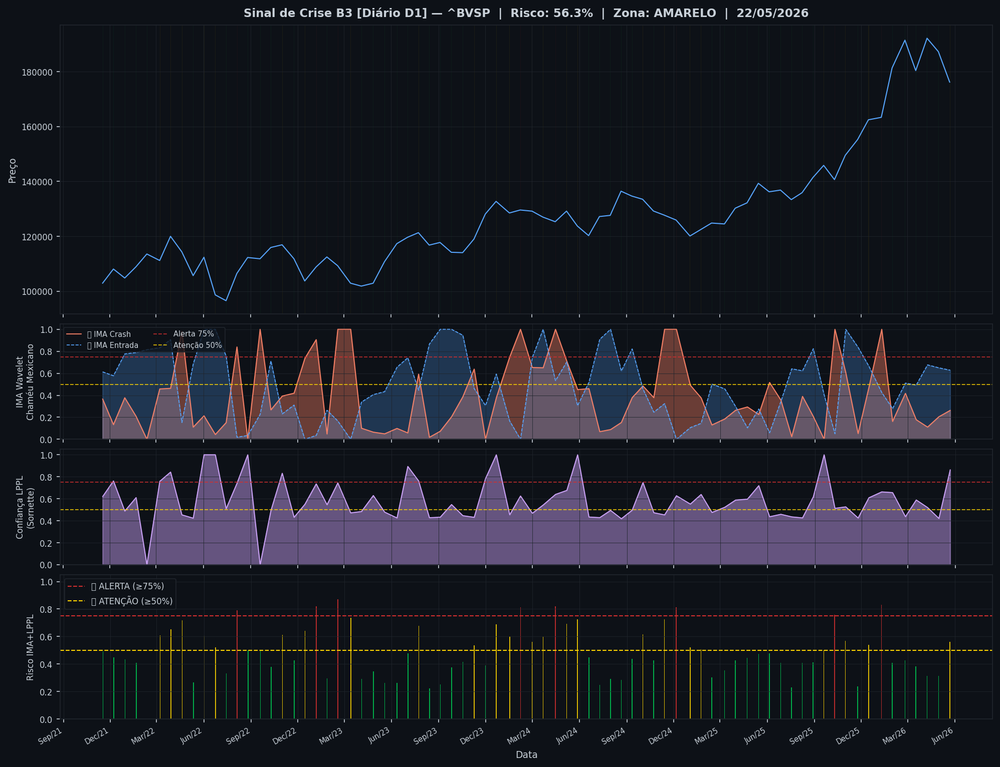
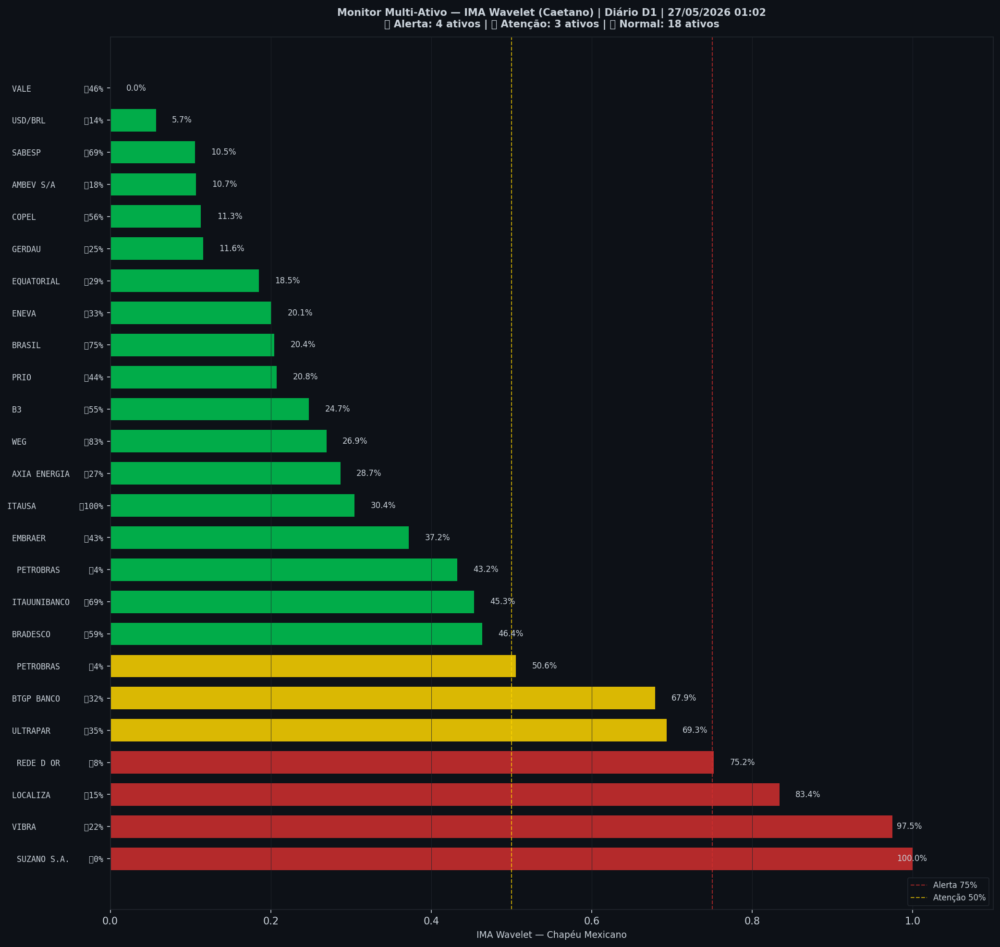

# 🟡 Sinal de Crise B3 — 27/05/2026

> **Gerado em:** 01:10 BRT | **Método:** IMA Wavelet Chapéu Mexicano (Caetano/ITA) + LPPL (Sornette/ETH-Zurich)

---

## Resumo do Dia

| Indicador | Valor | Interpretação |
|---|---|---|
| **Zona** | 🟡 **AMARELO** | Atenção |
| **Risco Combinado** | **56.3%** | IMA + LPPL combinados |
| 🔴 IMA Crash | 26.3% | Alta frequência espectral |
| 🔵 IMA Entrada | 62.8% | Oportunidade de compra |
| 📐 LPPL Sornette | 86.3% | Estrutura de bolha |
| Ibovespa | 176,210 pts | Fechamento |

> ⚡ **ATENÇÃO**: Tensão espectral crescente. Monitore nas próximas sessões.

---

## Gráfico do Sinal

---

## Monitor Multi-Ativo (25 ativos)

**Índice de Confiança:** 28% dos ativos em tensão
(✅ Mercado tranquilo)

🔴 Alerta: **4** | 🟡 Atenção: **3** | 🟢 Normal: **18**

| Zona | Ativo | Setor | 🔴 IMA Crash | 🔵 IMA Entrada |
|---|---|---|---|---|
| 🔴 | **SUZANO S.A.** | Papel/Celulose | 🔴 100.0% |  0.0% |
| 🔴 | **VIBRA** | Energia | 🔴 97.5% |  21.7% |
| 🔴 | **LOCALIZA** | Aluguel | 🔴 83.4% |  15.0% |
| 🔴 | **REDE D OR** | Saúde | 🔴 75.2% |  8.0% |
| 🟡 | **ULTRAPAR** | Outros | 🔴 69.3% |  35.0% |
| 🟡 | **BTGP BANCO** | Financeiro | 🔴 67.9% |  31.7% |
| 🟡 | **PETROBRAS** | Petróleo | 🔴 50.5% |  4.4% |
| 🟢 | **BRADESCO** | Financeiro | 🔴 46.4% |  58.6% |
| 🟢 | **ITAUUNIBANCO** | Financeiro | 🔴 45.4% | 🔵 68.9% |
| 🟢 | **PETROBRAS** | Petróleo | 🔴 43.2% |  4.0% |
| 🟢 | **EMBRAER** | Outros | 🔴 37.2% |  42.6% |
| 🟢 | **ITAUSA** | Financeiro | 🔴 30.4% | 🔵 100.0% |
| 🟢 | **AXIA ENERGIA** | Energia | 🔴 28.7% |  26.9% |
| 🟢 | **WEG** | Industrial | 🔴 27.0% | 🔵 82.7% |
| 🟢 | **B3** | Financeiro | 🔴 24.8% |  55.4% |
| 🟢 | **PRIO** | Petróleo | 🔴 20.8% |  43.6% |
| 🟢 | **BRASIL** | Financeiro | 🔴 20.4% | 🔵 75.1% |
| 🟢 | **ENEVA** | Energia | 🔴 20.1% |  33.1% |
| 🟢 | **EQUATORIAL** | Energia | 🔴 18.5% |  29.2% |
| 🟢 | **GERDAU** | Siderurgia | 🔴 11.6% |  24.5% |
| 🟢 | **COPEL** | Energia | 🔴 11.3% |  55.9% |
| 🟢 | **AMBEV S/A** | Consumo | 🔴 10.7% |  17.8% |
| 🟢 | **SABESP** | Saneamento | 🔴 10.5% | 🔵 69.3% |
| 🟢 | **USD/BRL** | Câmbio | 🔴 5.7% |  14.1% |
| 🟢 | **VALE** | Mineração | 🔴 0.0% |  45.6% |

---

## Histórico Recente (últimas 10 leituras)

| Data | Zona | Risco | 🔴 IMA Crash | 🔵 IMA Entrada |
|---|---|---|---|---|
| 2025-10-31 | 🟡 AMARELO | 56.8% | — | — |
| 2025-11-24 | 🟢 VERDE | 23.8% | — | — |
| 2025-12-15 | 🟡 AMARELO | 54.0% | — | — |
| 2026-01-09 | 🔴 VERMELHO | 83.1% | — | — |
| 2026-01-30 | 🟢 VERDE | 40.9% | — | — |
| 2026-02-24 | 🟢 VERDE | 42.7% | — | — |
| 2026-03-17 | 🟢 VERDE | 38.3% | — | — |
| 2026-04-08 | 🟢 VERDE | 31.5% | — | — |
| 2026-04-30 | 🟢 VERDE | 31.3% | — | — |
| 2026-05-22 | 🟡 AMARELO | 56.3% | — | — |

---

## Como interpretar

| Indicador | O que significa |
|---|---|
| 🔴 **IMA Crash alto** | Alta frequência espectral — mercado nervoso, pré-crise |
| 🔵 **IMA Entrada alto** | Baixa frequência estável — possível oportunidade de compra |
| 📐 **LPPL alto** | Estrutura de bolha detectada — risco de crash acelerado |
| **Índice Multi-Ativo** | % de ativos em tensão — quanto maior, mais confiável o sinal |

> Sinal mais confiável quando **múltiplos ativos** disparam simultaneamente.

---

## Metodologia

O **IMA Wavelet** (Índice de Mudanças Abruptas) é baseado no método do Prof. Marco Antonio Leonel Caetano (ITA/INSPER), publicado na revista Physica-A (Elsevier). Usa a **Transformada Wavelet Contínua com Chapéu Mexicano** para detectar regimes de alta frequência com baixa volatilidade — padrão que antecede mudanças abruptas no mercado.

O **LPPL** (Log-Periodic Power Law) é baseado no modelo do Prof. Didier Sornette (ETH-Zurich), que detecta estruturas de bolha especulativa com oscilações aceleradas.

> **Aviso:** Este é um estudo acadêmico e não constitui recomendação de investimento. Use com análise própria.

---
*Gerado automaticamente pelo Sistema Sinal de Crise B3 | [Metodologia](../metodologia) | [Histórico](../historico)*
