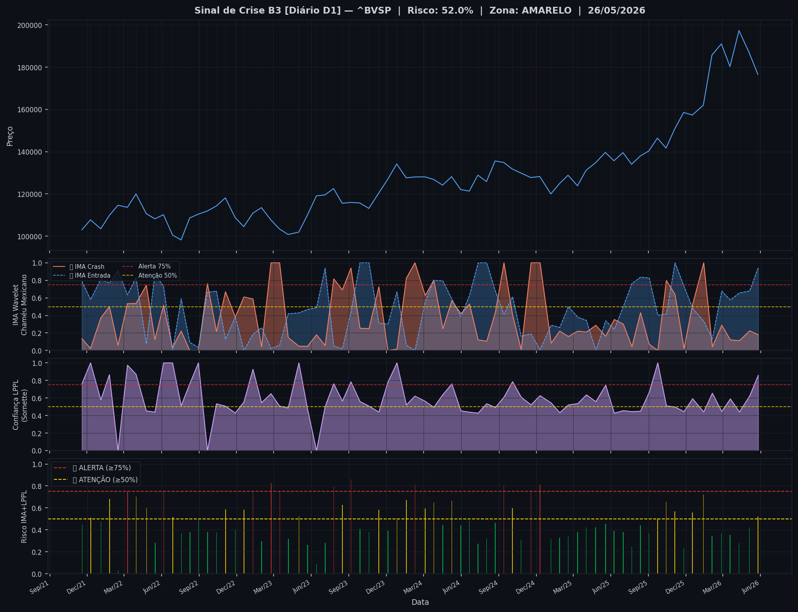
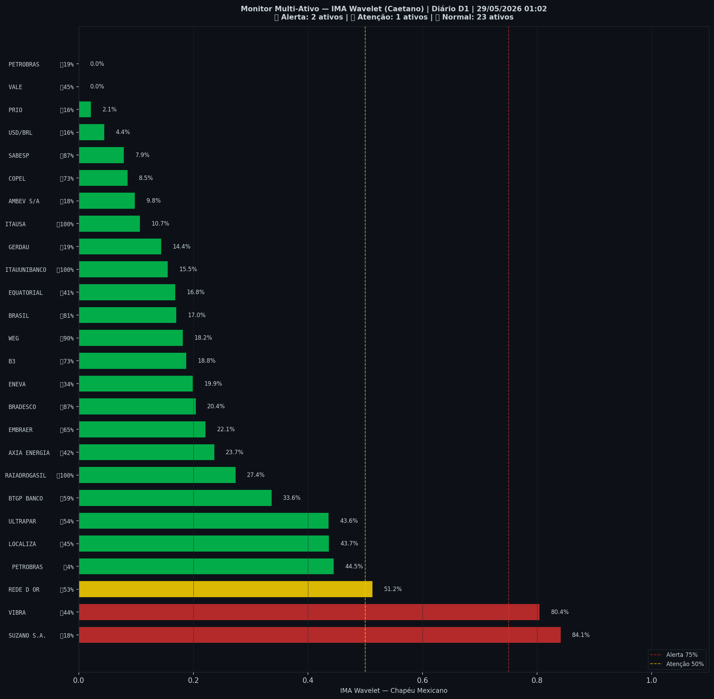

# 🟡 Sinal de Crise B3 — 29/05/2026

> **Gerado em:** 01:10 BRT | **Método:** IMA Wavelet Chapéu Mexicano (Caetano/ITA) + LPPL (Sornette/ETH-Zurich)

---

## Resumo do Dia

| Indicador | Valor | Interpretação |
|---|---|---|
| **Zona** | 🟡 **AMARELO** | Atenção |
| **Risco Combinado** | **52.0%** | IMA + LPPL combinados |
| 🔴 IMA Crash | 18.1% | Alta frequência espectral |
| 🔵 IMA Entrada | 94.7% | Oportunidade de compra |
| 📐 LPPL Sornette | 85.9% | Estrutura de bolha |
| Ibovespa | 176,589 pts | Fechamento |

> ⚡ **ATENÇÃO**: Tensão espectral crescente. Monitore nas próximas sessões.

---

## Gráfico do Sinal

---

## Monitor Multi-Ativo (26 ativos)

**Índice de Confiança:** 12% dos ativos em tensão
(✅ Mercado tranquilo)

🔴 Alerta: **2** | 🟡 Atenção: **1** | 🟢 Normal: **23**

| Zona | Ativo | Setor | 🔴 IMA Crash | 🔵 IMA Entrada |
|---|---|---|---|---|
| 🔴 | **SUZANO S.A.** | Papel/Celulose | 🔴 84.1% |  17.9% |
| 🔴 | **VIBRA** | Energia | 🔴 80.4% |  43.9% |
| 🟡 | **REDE D OR** | Saúde | 🔴 51.2% |  52.5% |
| 🟢 | **PETROBRAS** | Petróleo | 🔴 44.5% |  4.1% |
| 🟢 | **LOCALIZA** | Aluguel | 🔴 43.7% |  44.9% |
| 🟢 | **ULTRAPAR** | Outros | 🔴 43.6% |  53.7% |
| 🟢 | **BTGP BANCO** | Financeiro | 🔴 33.6% |  59.0% |
| 🟢 | **RAIADROGASIL** | Outros | 🔴 27.4% | 🔵 100.0% |
| 🟢 | **AXIA ENERGIA** | Energia | 🔴 23.6% |  41.8% |
| 🟢 | **EMBRAER** | Outros | 🔴 22.1% | 🔵 65.2% |
| 🟢 | **BRADESCO** | Financeiro | 🔴 20.4% | 🔵 86.8% |
| 🟢 | **ENEVA** | Energia | 🔴 19.9% |  34.4% |
| 🟢 | **B3** | Financeiro | 🔴 18.8% | 🔵 72.9% |
| 🟢 | **WEG** | Industrial | 🔴 18.2% | 🔵 89.5% |
| 🟢 | **BRASIL** | Financeiro | 🔴 17.0% | 🔵 81.1% |
| 🟢 | **EQUATORIAL** | Energia | 🔴 16.8% |  41.0% |
| 🟢 | **ITAUUNIBANCO** | Financeiro | 🔴 15.5% | 🔵 100.0% |
| 🟢 | **GERDAU** | Siderurgia | 🔴 14.4% |  19.1% |
| 🟢 | **ITAUSA** | Financeiro | 🔴 10.7% | 🔵 100.0% |
| 🟢 | **AMBEV S/A** | Consumo | 🔴 9.8% |  18.3% |
| 🟢 | **COPEL** | Energia | 🔴 8.5% | 🔵 73.0% |
| 🟢 | **SABESP** | Saneamento | 🔴 7.9% | 🔵 86.6% |
| 🟢 | **USD/BRL** | Câmbio | 🔴 4.4% |  15.9% |
| 🟢 | **PRIO** | Petróleo | 🔴 2.1% |  16.0% |
| 🟢 | **VALE** | Mineração | 🔴 0.0% |  44.6% |
| 🟢 | **PETROBRAS** | Petróleo | 🔴 0.0% |  19.4% |

---

## Histórico Recente (últimas 10 leituras)

| Data | Zona | Risco | 🔴 IMA Crash | 🔵 IMA Entrada |
|---|---|---|---|---|
| 2025-11-04 | 🟡 AMARELO | 56.8% | — | — |
| 2025-11-26 | 🟢 VERDE | 23.4% | — | — |
| 2025-12-17 | 🟡 AMARELO | 55.9% | — | — |
| 2026-01-13 | 🟡 AMARELO | 72.0% | — | — |
| 2026-02-03 | 🟢 VERDE | 34.8% | — | — |
| 2026-02-26 | 🟢 VERDE | 36.7% | — | — |
| 2026-03-19 | 🟢 VERDE | 35.6% | — | — |
| 2026-04-10 | 🟢 VERDE | 27.6% | — | — |
| 2026-05-05 | 🟢 VERDE | 42.3% | — | — |
| 2026-05-26 | 🟡 AMARELO | 52.0% | — | — |

---

## Como interpretar

| Indicador | O que significa |
|---|---|
| 🔴 **IMA Crash alto** | Alta frequência espectral — mercado nervoso, pré-crise |
| 🔵 **IMA Entrada alto** | Baixa frequência estável — possível oportunidade de compra |
| 📐 **LPPL alto** | Estrutura de bolha detectada — risco de crash acelerado |
| **Índice Multi-Ativo** | % de ativos em tensão — quanto maior, mais confiável o sinal |

> Sinal mais confiável quando **múltiplos ativos** disparam simultaneamente.

---

## Metodologia

O **IMA Wavelet** (Índice de Mudanças Abruptas) é baseado no método do Prof. Marco Antonio Leonel Caetano (ITA/INSPER), publicado na revista Physica-A (Elsevier). Usa a **Transformada Wavelet Contínua com Chapéu Mexicano** para detectar regimes de alta frequência com baixa volatilidade — padrão que antecede mudanças abruptas no mercado.

O **LPPL** (Log-Periodic Power Law) é baseado no modelo do Prof. Didier Sornette (ETH-Zurich), que detecta estruturas de bolha especulativa com oscilações aceleradas.

> **Aviso:** Este é um estudo acadêmico e não constitui recomendação de investimento. Use com análise própria.

---
*Gerado automaticamente pelo Sistema Sinal de Crise B3 | [Metodologia](../metodologia) | [Histórico](../historico)*
