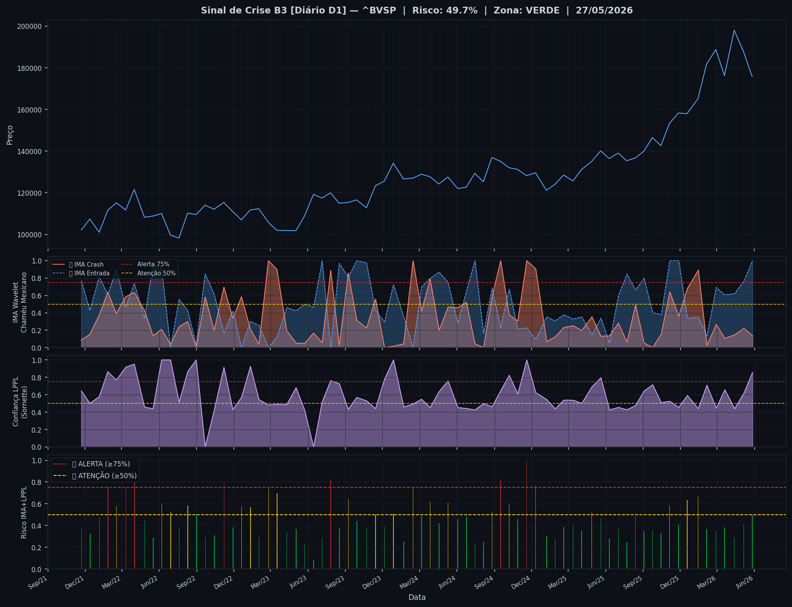
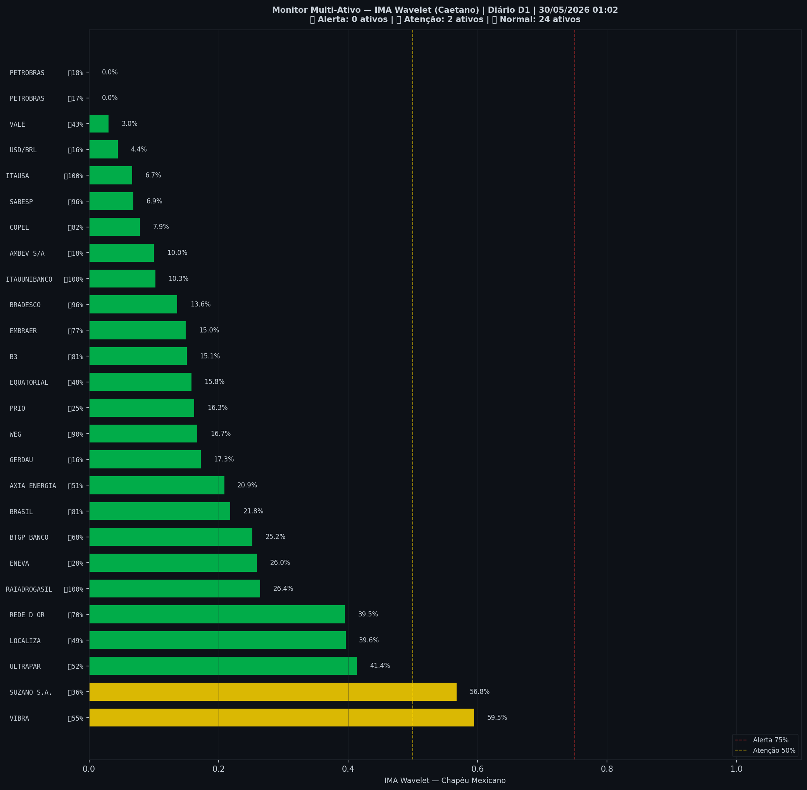

# 🟢 Sinal de Crise B3 — 30/05/2026

> **Gerado em:** 01:10 BRT | **Método:** IMA Wavelet Chapéu Mexicano (Caetano/ITA) + LPPL (Sornette/ETH-Zurich)

---

## Resumo do Dia

| Indicador | Valor | Interpretação |
|---|---|---|
| **Zona** | 🟢 **VERDE** | Normal |
| **Risco Combinado** | **49.7%** | IMA + LPPL combinados |
| 🔴 IMA Crash | 13.7% | Alta frequência espectral |
| 🔵 IMA Entrada | 100.0% | Oportunidade de compra |
| 📐 LPPL Sornette | 85.7% | Estrutura de bolha |
| Ibovespa | 175,744 pts | Fechamento |

> ✅ Sem sinal de crise detectado no momento.

---

## Gráfico do Sinal

---

## Monitor Multi-Ativo (26 ativos)

**Índice de Confiança:** 8% dos ativos em tensão
(✅ Mercado tranquilo)

🔴 Alerta: **0** | 🟡 Atenção: **2** | 🟢 Normal: **24**

| Zona | Ativo | Setor | 🔴 IMA Crash | 🔵 IMA Entrada |
|---|---|---|---|---|
| 🟡 | **VIBRA** | Energia | 🔴 59.5% |  55.2% |
| 🟡 | **SUZANO S.A.** | Papel/Celulose | 🔴 56.8% |  35.8% |
| 🟢 | **ULTRAPAR** | Outros | 🔴 41.4% |  51.9% |
| 🟢 | **LOCALIZA** | Aluguel | 🔴 39.6% |  48.5% |
| 🟢 | **REDE D OR** | Saúde | 🔴 39.6% | 🔵 70.1% |
| 🟢 | **RAIADROGASIL** | Outros | 🔴 26.4% | 🔵 100.0% |
| 🟢 | **ENEVA** | Energia | 🔴 26.0% |  27.9% |
| 🟢 | **BTGP BANCO** | Financeiro | 🔴 25.2% | 🔵 67.7% |
| 🟢 | **BRASIL** | Financeiro | 🔴 21.8% | 🔵 81.1% |
| 🟢 | **AXIA ENERGIA** | Energia | 🔴 20.9% |  50.8% |
| 🟢 | **GERDAU** | Siderurgia | 🔴 17.3% |  16.4% |
| 🟢 | **WEG** | Industrial | 🔴 16.7% | 🔵 90.3% |
| 🟢 | **PRIO** | Petróleo | 🔴 16.3% |  25.4% |
| 🟢 | **EQUATORIAL** | Energia | 🔴 15.8% |  47.5% |
| 🟢 | **B3** | Financeiro | 🔴 15.1% | 🔵 81.1% |
| 🟢 | **EMBRAER** | Outros | 🔴 14.9% | 🔵 76.9% |
| 🟢 | **BRADESCO** | Financeiro | 🔴 13.6% | 🔵 96.3% |
| 🟢 | **ITAUUNIBANCO** | Financeiro | 🔴 10.3% | 🔵 100.0% |
| 🟢 | **AMBEV S/A** | Consumo | 🔴 10.0% |  18.0% |
| 🟢 | **COPEL** | Energia | 🔴 7.9% | 🔵 81.7% |
| 🟢 | **SABESP** | Saneamento | 🔴 6.9% | 🔵 96.2% |
| 🟢 | **ITAUSA** | Financeiro | 🔴 6.7% | 🔵 100.0% |
| 🟢 | **USD/BRL** | Câmbio | 🔴 4.4% |  15.9% |
| 🟢 | **VALE** | Mineração | 🔴 3.0% |  43.0% |
| 🟢 | **PETROBRAS** | Petróleo | 🔴 0.0% |  16.7% |
| 🟢 | **PETROBRAS** | Petróleo | 🔴 0.0% |  17.9% |

---

## Histórico Recente (últimas 10 leituras)

| Data | Zona | Risco | 🔴 IMA Crash | 🔵 IMA Entrada |
|---|---|---|---|---|
| 2025-11-05 | 🟡 AMARELO | 58.4% | — | — |
| 2025-11-27 | 🟢 VERDE | 40.7% | — | — |
| 2025-12-18 | 🟡 AMARELO | 63.5% | — | — |
| 2026-01-14 | 🟡 AMARELO | 66.6% | — | — |
| 2026-02-04 | 🟢 VERDE | 36.8% | — | — |
| 2026-02-27 | 🟢 VERDE | 35.5% | — | — |
| 2026-03-20 | 🟢 VERDE | 38.2% | — | — |
| 2026-04-13 | 🟢 VERDE | 29.4% | — | — |
| 2026-05-06 | 🟢 VERDE | 42.0% | — | — |
| 2026-05-27 | 🟢 VERDE | 49.7% | — | — |

---

## Como interpretar

| Indicador | O que significa |
|---|---|
| 🔴 **IMA Crash alto** | Alta frequência espectral — mercado nervoso, pré-crise |
| 🔵 **IMA Entrada alto** | Baixa frequência estável — possível oportunidade de compra |
| 📐 **LPPL alto** | Estrutura de bolha detectada — risco de crash acelerado |
| **Índice Multi-Ativo** | % de ativos em tensão — quanto maior, mais confiável o sinal |

> Sinal mais confiável quando **múltiplos ativos** disparam simultaneamente.

---

## Metodologia

O **IMA Wavelet** (Índice de Mudanças Abruptas) é baseado no método do Prof. Marco Antonio Leonel Caetano (ITA/INSPER), publicado na revista Physica-A (Elsevier). Usa a **Transformada Wavelet Contínua com Chapéu Mexicano** para detectar regimes de alta frequência com baixa volatilidade — padrão que antecede mudanças abruptas no mercado.

O **LPPL** (Log-Periodic Power Law) é baseado no modelo do Prof. Didier Sornette (ETH-Zurich), que detecta estruturas de bolha especulativa com oscilações aceleradas.

> **Aviso:** Este é um estudo acadêmico e não constitui recomendação de investimento. Use com análise própria.

---
*Gerado automaticamente pelo Sistema Sinal de Crise B3 | [Metodologia](../metodologia) | [Histórico](../historico)*
