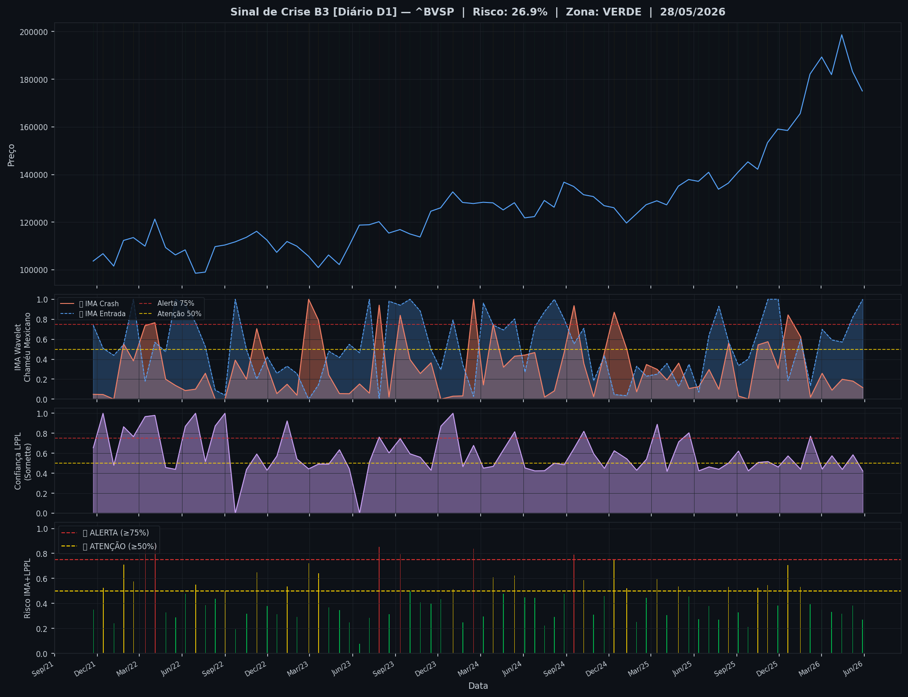
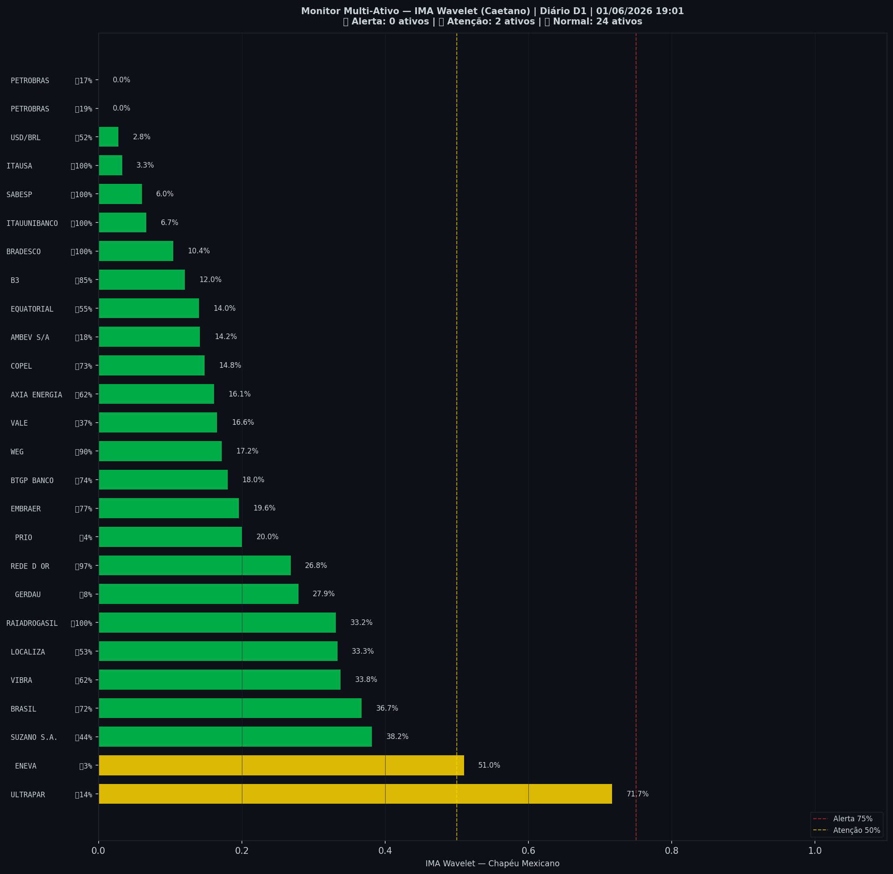

# 🟢 Sinal de Crise B3 — 01/06/2026

> **Gerado em:** 19:02 BRT | **Método:** IMA Wavelet Chapéu Mexicano (Caetano/ITA) + LPPL (Sornette/ETH-Zurich)

---

## Resumo do Dia

| Indicador | Valor | Interpretação |
|---|---|---|
| **Zona** | 🟢 **VERDE** | Normal |
| **Risco Combinado** | **26.9%** | IMA + LPPL combinados |
| 🔴 IMA Crash | 11.6% | Alta frequência espectral |
| 🔵 IMA Entrada | 100.0% | Oportunidade de compra |
| 📐 LPPL Sornette | 42.2% | Estrutura de bolha |
| Ibovespa | 175,063 pts | Fechamento |

> ✅ Sem sinal de crise detectado no momento.

---

## Gráfico do Sinal

---

## Monitor Multi-Ativo (26 ativos)

**Índice de Confiança:** 8% dos ativos em tensão
(✅ Mercado tranquilo)

🔴 Alerta: **0** | 🟡 Atenção: **2** | 🟢 Normal: **24**

| Zona | Ativo | Setor | 🔴 IMA Crash | 🔵 IMA Entrada |
|---|---|---|---|---|
| 🟡 | **ULTRAPAR** | Outros | 🔴 71.7% |  14.1% |
| 🟡 | **ENEVA** | Energia | 🔴 51.0% |  3.2% |
| 🟢 | **SUZANO S.A.** | Papel/Celulose | 🔴 38.2% |  44.0% |
| 🟢 | **BRASIL** | Financeiro | 🔴 36.7% | 🔵 71.8% |
| 🟢 | **VIBRA** | Energia | 🔴 33.8% | 🔵 62.3% |
| 🟢 | **LOCALIZA** | Aluguel | 🔴 33.3% |  53.4% |
| 🟢 | **RAIADROGASIL** | Outros | 🔴 33.1% | 🔵 100.0% |
| 🟢 | **GERDAU** | Siderurgia | 🔴 27.9% |  8.0% |
| 🟢 | **REDE D OR** | Saúde | 🔴 26.8% | 🔵 97.1% |
| 🟢 | **PRIO** | Petróleo | 🔴 20.0% |  4.5% |
| 🟢 | **EMBRAER** | Outros | 🔴 19.6% | 🔵 76.5% |
| 🟢 | **BTGP BANCO** | Financeiro | 🔴 18.0% | 🔵 73.8% |
| 🟢 | **WEG** | Industrial | 🔴 17.2% | 🔵 89.8% |
| 🟢 | **VALE** | Mineração | 🔴 16.6% |  36.7% |
| 🟢 | **AXIA ENERGIA** | Energia | 🔴 16.1% | 🔵 61.7% |
| 🟢 | **COPEL** | Energia | 🔴 14.8% | 🔵 72.6% |
| 🟢 | **AMBEV S/A** | Consumo | 🔴 14.2% |  17.8% |
| 🟢 | **EQUATORIAL** | Energia | 🔴 14.0% |  54.7% |
| 🟢 | **B3** | Financeiro | 🔴 12.0% | 🔵 84.9% |
| 🟢 | **BRADESCO** | Financeiro | 🔴 10.4% | 🔵 100.0% |
| 🟢 | **ITAUUNIBANCO** | Financeiro | 🔴 6.7% | 🔵 100.0% |
| 🟢 | **SABESP** | Saneamento | 🔴 6.0% | 🔵 99.9% |
| 🟢 | **ITAUSA** | Financeiro | 🔴 3.3% | 🔵 100.0% |
| 🟢 | **USD/BRL** | Câmbio | 🔴 2.8% |  51.6% |
| 🟢 | **PETROBRAS** | Petróleo | 🔴 0.0% |  17.1% |
| 🟢 | **PETROBRAS** | Petróleo | 🔴 0.0% |  18.8% |

---

## Histórico Recente (últimas 10 leituras)

| Data | Zona | Risco | 🔴 IMA Crash | 🔵 IMA Entrada |
|---|---|---|---|---|
| 2025-11-06 | 🟡 AMARELO | 54.6% | — | — |
| 2025-11-28 | 🟢 VERDE | 38.5% | — | — |
| 2025-12-19 | 🟡 AMARELO | 70.8% | — | — |
| 2026-01-15 | 🟡 AMARELO | 53.1% | — | — |
| 2026-02-05 | 🟢 VERDE | 39.5% | — | — |
| 2026-03-02 | 🟢 VERDE | 35.0% | — | — |
| 2026-03-23 | 🟢 VERDE | 33.2% | — | — |
| 2026-04-14 | 🟢 VERDE | 31.9% | — | — |
| 2026-05-07 | 🟢 VERDE | 38.3% | — | — |
| 2026-05-28 | 🟢 VERDE | 26.9% | — | — |

---

## Como interpretar

| Indicador | O que significa |
|---|---|
| 🔴 **IMA Crash alto** | Alta frequência espectral — mercado nervoso, pré-crise |
| 🔵 **IMA Entrada alto** | Baixa frequência estável — possível oportunidade de compra |
| 📐 **LPPL alto** | Estrutura de bolha detectada — risco de crash acelerado |
| **Índice Multi-Ativo** | % de ativos em tensão — quanto maior, mais confiável o sinal |

> Sinal mais confiável quando **múltiplos ativos** disparam simultaneamente.

---

## Metodologia

O **IMA Wavelet** (Índice de Mudanças Abruptas) é baseado no método do Prof. Marco Antonio Leonel Caetano (ITA/INSPER), publicado na revista Physica-A (Elsevier). Usa a **Transformada Wavelet Contínua com Chapéu Mexicano** para detectar regimes de alta frequência com baixa volatilidade — padrão que antecede mudanças abruptas no mercado.

O **LPPL** (Log-Periodic Power Law) é baseado no modelo do Prof. Didier Sornette (ETH-Zurich), que detecta estruturas de bolha especulativa com oscilações aceleradas.

> **Aviso:** Este é um estudo acadêmico e não constitui recomendação de investimento. Use com análise própria.

---
*Gerado automaticamente pelo Sistema Sinal de Crise B3 | [Metodologia](../metodologia) | [Histórico](../historico)*
