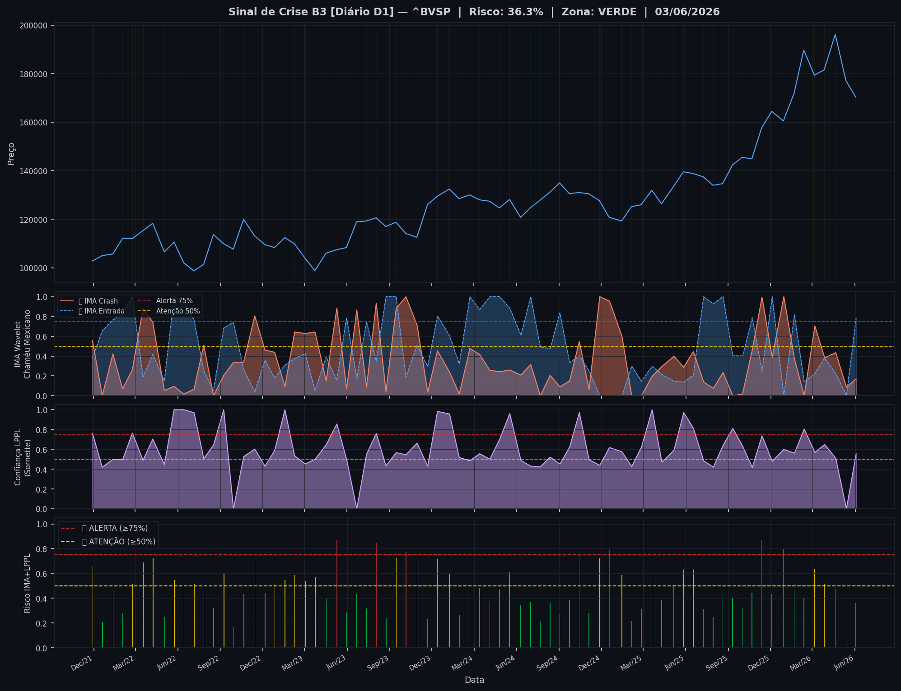
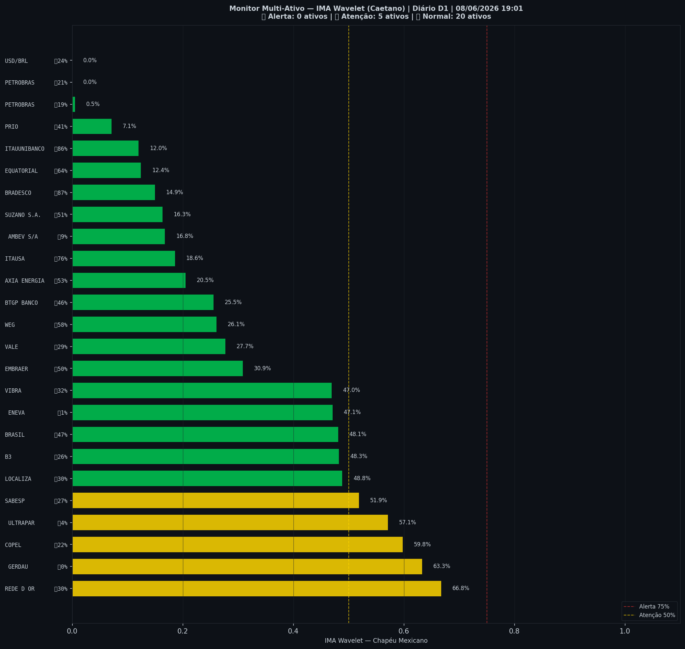

# 🟢 Sinal de Crise B3 — 08/06/2026

> **Gerado em:** 19:03 BRT | **Método:** IMA Wavelet Chapéu Mexicano (Caetano/ITA) + LPPL (Sornette/ETH-Zurich)

---

## Resumo do Dia

| Indicador | Valor | Interpretação |
|---|---|---|
| **Zona** | 🟢 **VERDE** | Normal |
| **Risco Combinado** | **36.2%** | IMA + LPPL combinados |
| 🔴 IMA Crash | 17.0% | Alta frequência espectral |
| 🔵 IMA Entrada | 78.5% | Oportunidade de compra |
| 📐 LPPL Sornette | 55.5% | Estrutura de bolha |
| Ibovespa | 170,331 pts | Fechamento |

> ✅ Sem sinal de crise detectado no momento.

---

## Gráfico do Sinal

---

## Monitor Multi-Ativo (25 ativos)

**Índice de Confiança:** 20% dos ativos em tensão
(✅ Mercado tranquilo)

🔴 Alerta: **0** | 🟡 Atenção: **5** | 🟢 Normal: **20**

| Zona | Ativo | Setor | 🔴 IMA Crash | 🔵 IMA Entrada |
|---|---|---|---|---|
| 🟡 | **REDE D OR** | Saúde | 🔴 66.8% |  30.1% |
| 🟡 | **GERDAU** | Siderurgia | 🔴 63.3% |  0.0% |
| 🟡 | **COPEL** | Energia | 🔴 59.8% |  21.6% |
| 🟡 | **ULTRAPAR** | Outros | 🔴 57.1% |  4.4% |
| 🟡 | **SABESP** | Saneamento | 🔴 51.9% |  27.2% |
| 🟢 | **LOCALIZA** | Aluguel | 🔴 48.9% |  30.3% |
| 🟢 | **B3** | Financeiro | 🔴 48.3% |  26.3% |
| 🟢 | **BRASIL** | Financeiro | 🔴 48.1% |  46.7% |
| 🟢 | **ENEVA** | Energia | 🔴 47.1% |  0.6% |
| 🟢 | **VIBRA** | Energia | 🔴 46.9% |  31.5% |
| 🟢 | **EMBRAER** | Outros | 🔴 30.9% |  49.8% |
| 🟢 | **VALE** | Mineração | 🔴 27.7% |  28.8% |
| 🟢 | **WEG** | Industrial | 🔴 26.1% |  58.1% |
| 🟢 | **BTGP BANCO** | Financeiro | 🔴 25.5% |  45.9% |
| 🟢 | **AXIA ENERGIA** | Energia | 🔴 20.5% |  52.7% |
| 🟢 | **ITAUSA** | Financeiro | 🔴 18.6% | 🔵 75.7% |
| 🟢 | **AMBEV S/A** | Consumo | 🔴 16.8% |  8.8% |
| 🟢 | **SUZANO S.A.** | Papel/Celulose | 🔴 16.3% |  51.5% |
| 🟢 | **BRADESCO** | Financeiro | 🔴 14.9% | 🔵 86.7% |
| 🟢 | **EQUATORIAL** | Energia | 🔴 12.4% | 🔵 63.7% |
| 🟢 | **ITAUUNIBANCO** | Financeiro | 🔴 12.0% | 🔵 85.6% |
| 🟢 | **PRIO** | Petróleo | 🔴 7.1% |  40.8% |
| 🟢 | **PETROBRAS** | Petróleo | 🔴 0.5% |  18.9% |
| 🟢 | **PETROBRAS** | Petróleo | 🔴 0.0% |  20.9% |
| 🟢 | **USD/BRL** | Câmbio | 🔴 0.0% |  23.5% |

---

## Histórico Recente (últimas 10 leituras)

| Data | Zona | Risco | 🔴 IMA Crash | 🔵 IMA Entrada |
|---|---|---|---|---|
| 2025-11-12 | 🔴 VERMELHO | 86.6% | — | — |
| 2025-12-04 | 🟢 VERDE | 43.4% | — | — |
| 2025-12-29 | 🔴 VERMELHO | 80.0% | — | — |
| 2026-01-21 | 🟢 VERDE | 46.6% | — | — |
| 2026-02-11 | 🟢 VERDE | 40.2% | — | — |
| 2026-03-06 | 🟡 AMARELO | 63.7% | — | — |
| 2026-03-27 | 🟡 AMARELO | 51.6% | — | — |
| 2026-04-20 | 🟢 VERDE | 47.3% | — | — |
| 2026-05-13 | 🟢 VERDE | 4.3% | — | — |
| 2026-06-03 | 🟢 VERDE | 36.2% | — | — |

---

## Como interpretar

| Indicador | O que significa |
|---|---|
| 🔴 **IMA Crash alto** | Alta frequência espectral — mercado nervoso, pré-crise |
| 🔵 **IMA Entrada alto** | Baixa frequência estável — possível oportunidade de compra |
| 📐 **LPPL alto** | Estrutura de bolha detectada — risco de crash acelerado |
| **Índice Multi-Ativo** | % de ativos em tensão — quanto maior, mais confiável o sinal |

> Sinal mais confiável quando **múltiplos ativos** disparam simultaneamente.

---

## Metodologia

O **IMA Wavelet** (Índice de Mudanças Abruptas) é baseado no método do Prof. Marco Antonio Leonel Caetano (ITA/INSPER), publicado na revista Physica-A (Elsevier). Usa a **Transformada Wavelet Contínua com Chapéu Mexicano** para detectar regimes de alta frequência com baixa volatilidade — padrão que antecede mudanças abruptas no mercado.

O **LPPL** (Log-Periodic Power Law) é baseado no modelo do Prof. Didier Sornette (ETH-Zurich), que detecta estruturas de bolha especulativa com oscilações aceleradas.

> **Aviso:** Este é um estudo acadêmico e não constitui recomendação de investimento. Use com análise própria.

---
*Gerado automaticamente pelo Sistema Sinal de Crise B3 | [Metodologia](../metodologia) | [Histórico](../historico)*
