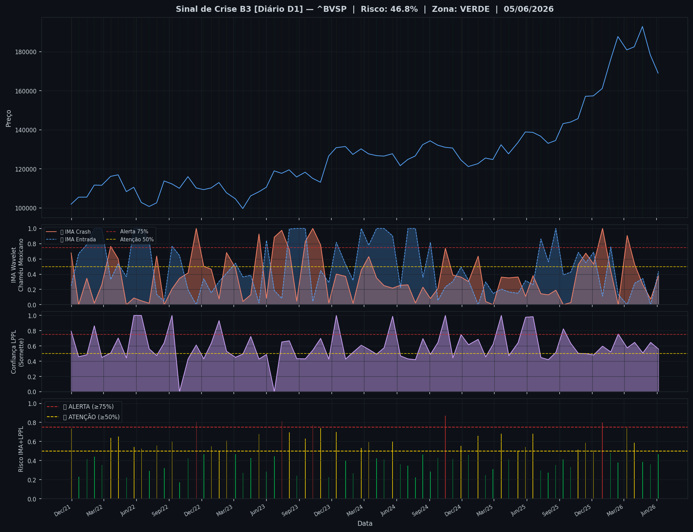
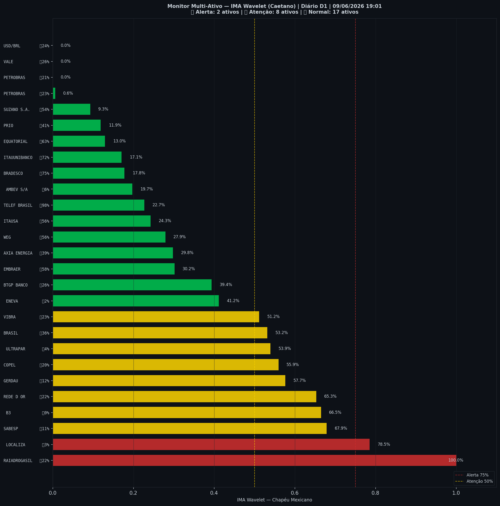

# 🟢 Sinal de Crise B3 — 09/06/2026

> **Gerado em:** 19:03 BRT | **Método:** IMA Wavelet Chapéu Mexicano (Caetano/ITA) + LPPL (Sornette/ETH-Zurich)

---

## Resumo do Dia

| Indicador | Valor | Interpretação |
|---|---|---|
| **Zona** | 🟢 **VERDE** | Normal |
| **Risco Combinado** | **46.8%** | IMA + LPPL combinados |
| 🔴 IMA Crash | 37.7% | Alta frequência espectral |
| 🔵 IMA Entrada | 43.7% | Oportunidade de compra |
| 📐 LPPL Sornette | 55.9% | Estrutura de bolha |
| Ibovespa | 169,019 pts | Fechamento |

> ✅ Sem sinal de crise detectado no momento.

---

## Gráfico do Sinal

---

## Monitor Multi-Ativo (27 ativos)

**Índice de Confiança:** 37% dos ativos em tensão
(⚡ Tensão moderada)

🔴 Alerta: **2** | 🟡 Atenção: **8** | 🟢 Normal: **17**

| Zona | Ativo | Setor | 🔴 IMA Crash | 🔵 IMA Entrada |
|---|---|---|---|---|
| 🔴 | **RAIADROGASIL** | Outros | 🔴 100.0% |  21.7% |
| 🔴 | **LOCALIZA** | Aluguel | 🔴 78.5% |  2.6% |
| 🟡 | **SABESP** | Saneamento | 🔴 67.9% |  10.8% |
| 🟡 | **B3** | Financeiro | 🔴 66.5% |  0.0% |
| 🟡 | **REDE D OR** | Saúde | 🔴 65.3% |  22.0% |
| 🟡 | **GERDAU** | Siderurgia | 🔴 57.7% |  11.6% |
| 🟡 | **COPEL** | Energia | 🔴 56.0% |  20.1% |
| 🟡 | **ULTRAPAR** | Outros | 🔴 53.9% |  3.8% |
| 🟡 | **BRASIL** | Financeiro | 🔴 53.2% |  36.2% |
| 🟡 | **VIBRA** | Energia | 🔴 51.2% |  23.1% |
| 🟢 | **ENEVA** | Energia | 🔴 41.1% |  2.5% |
| 🟢 | **BTGP BANCO** | Financeiro | 🔴 39.4% |  26.4% |
| 🟢 | **EMBRAER** | Outros | 🔴 30.2% |  57.5% |
| 🟢 | **AXIA ENERGIA** | Energia | 🔴 29.8% |  39.1% |
| 🟢 | **WEG** | Industrial | 🔴 27.9% |  56.1% |
| 🟢 | **ITAUSA** | Financeiro | 🔴 24.3% |  56.3% |
| 🟢 | **TELEF BRASIL** | Outros | 🔴 22.7% | 🔵 97.5% |
| 🟢 | **AMBEV S/A** | Consumo | 🔴 19.7% |  5.7% |
| 🟢 | **BRADESCO** | Financeiro | 🔴 17.8% | 🔵 75.4% |
| 🟢 | **ITAUUNIBANCO** | Financeiro | 🔴 17.1% | 🔵 71.6% |
| 🟢 | **EQUATORIAL** | Energia | 🔴 13.0% | 🔵 62.7% |
| 🟢 | **PRIO** | Petróleo | 🔴 11.9% |  41.1% |
| 🟢 | **SUZANO S.A.** | Papel/Celulose | 🔴 9.3% |  53.6% |
| 🟢 | **PETROBRAS** | Petróleo | 🔴 0.6% |  23.3% |
| 🟢 | **VALE** | Mineração | 🔴 0.0% |  25.6% |
| 🟢 | **PETROBRAS** | Petróleo | 🔴 0.0% |  21.4% |
| 🟢 | **USD/BRL** | Câmbio | 🔴 0.0% |  23.5% |

---

## Histórico Recente (últimas 10 leituras)

| Data | Zona | Risco | 🔴 IMA Crash | 🔵 IMA Entrada |
|---|---|---|---|---|
| 2025-11-13 | 🟡 AMARELO | 58.7% | — | — |
| 2025-12-05 | 🟡 AMARELO | 50.6% | — | — |
| 2025-12-30 | 🔴 VERMELHO | 79.9% | — | — |
| 2026-01-22 | 🟢 VERDE | 48.2% | — | — |
| 2026-02-12 | 🟢 VERDE | 37.8% | — | — |
| 2026-03-09 | 🟡 AMARELO | 74.1% | — | — |
| 2026-03-30 | 🟡 AMARELO | 58.8% | — | — |
| 2026-04-22 | 🟢 VERDE | 38.5% | — | — |
| 2026-05-14 | 🟢 VERDE | 36.0% | — | — |
| 2026-06-05 | 🟢 VERDE | 46.8% | — | — |

---

## Como interpretar

| Indicador | O que significa |
|---|---|
| 🔴 **IMA Crash alto** | Alta frequência espectral — mercado nervoso, pré-crise |
| 🔵 **IMA Entrada alto** | Baixa frequência estável — possível oportunidade de compra |
| 📐 **LPPL alto** | Estrutura de bolha detectada — risco de crash acelerado |
| **Índice Multi-Ativo** | % de ativos em tensão — quanto maior, mais confiável o sinal |

> Sinal mais confiável quando **múltiplos ativos** disparam simultaneamente.

---

## Metodologia

O **IMA Wavelet** (Índice de Mudanças Abruptas) é baseado no método do Prof. Marco Antonio Leonel Caetano (ITA/INSPER), publicado na revista Physica-A (Elsevier). Usa a **Transformada Wavelet Contínua com Chapéu Mexicano** para detectar regimes de alta frequência com baixa volatilidade — padrão que antecede mudanças abruptas no mercado.

O **LPPL** (Log-Periodic Power Law) é baseado no modelo do Prof. Didier Sornette (ETH-Zurich), que detecta estruturas de bolha especulativa com oscilações aceleradas.

> **Aviso:** Este é um estudo acadêmico e não constitui recomendação de investimento. Use com análise própria.

---
*Gerado automaticamente pelo Sistema Sinal de Crise B3 | [Metodologia](../metodologia) | [Histórico](../historico)*
