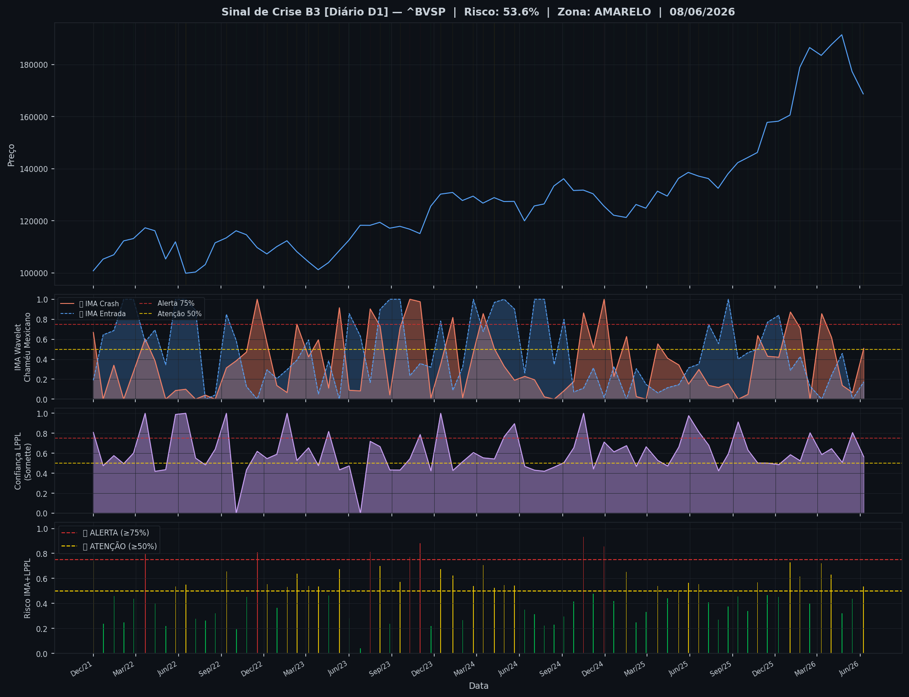
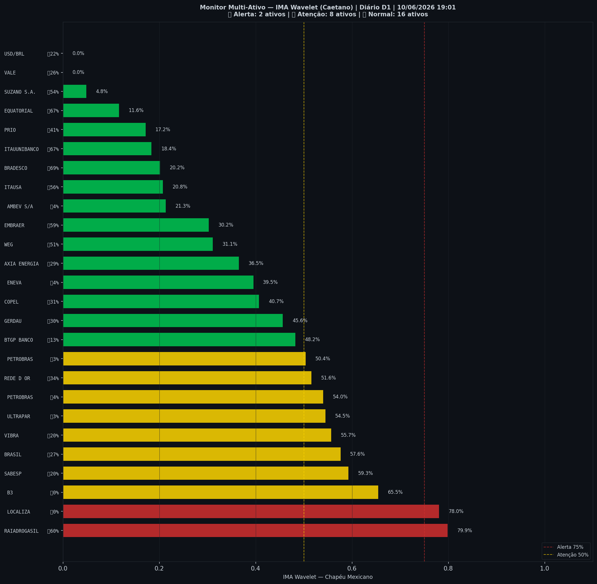

# 🟡 Sinal de Crise B3 — 10/06/2026

> **Gerado em:** 19:04 BRT | **Método:** IMA Wavelet Chapéu Mexicano (Caetano/ITA) + LPPL (Sornette/ETH-Zurich)

---

## Resumo do Dia

| Indicador | Valor | Interpretação |
|---|---|---|
| **Zona** | 🟡 **AMARELO** | Atenção |
| **Risco Combinado** | **53.6%** | IMA + LPPL combinados |
| 🔴 IMA Crash | 50.9% | Alta frequência espectral |
| 🔵 IMA Entrada | 17.4% | Oportunidade de compra |
| 📐 LPPL Sornette | 56.4% | Estrutura de bolha |
| Ibovespa | 168,669 pts | Fechamento |

> ⚡ **ATENÇÃO**: Tensão espectral crescente. Monitore nas próximas sessões.

---

## Gráfico do Sinal

---

## Monitor Multi-Ativo (26 ativos)

**Índice de Confiança:** 38% dos ativos em tensão
(⚡ Tensão moderada)

🔴 Alerta: **2** | 🟡 Atenção: **8** | 🟢 Normal: **16**

| Zona | Ativo | Setor | 🔴 IMA Crash | 🔵 IMA Entrada |
|---|---|---|---|---|
| 🔴 | **RAIADROGASIL** | Outros | 🔴 79.9% | 🔵 60.1% |
| 🔴 | **LOCALIZA** | Aluguel | 🔴 78.0% |  0.0% |
| 🟡 | **B3** | Financeiro | 🔴 65.5% |  0.0% |
| 🟡 | **SABESP** | Saneamento | 🔴 59.3% |  20.3% |
| 🟡 | **BRASIL** | Financeiro | 🔴 57.6% |  27.3% |
| 🟡 | **VIBRA** | Energia | 🔴 55.7% |  19.6% |
| 🟡 | **ULTRAPAR** | Outros | 🔴 54.5% |  2.8% |
| 🟡 | **PETROBRAS** | Petróleo | 🔴 54.0% |  4.2% |
| 🟡 | **REDE D OR** | Saúde | 🔴 51.6% |  34.0% |
| 🟡 | **PETROBRAS** | Petróleo | 🔴 50.4% |  3.4% |
| 🟢 | **BTGP BANCO** | Financeiro | 🔴 48.2% |  12.6% |
| 🟢 | **GERDAU** | Siderurgia | 🔴 45.6% |  30.3% |
| 🟢 | **COPEL** | Energia | 🔴 40.7% |  30.6% |
| 🟢 | **ENEVA** | Energia | 🔴 39.5% |  3.7% |
| 🟢 | **AXIA ENERGIA** | Energia | 🔴 36.5% |  29.4% |
| 🟢 | **WEG** | Industrial | 🔴 31.1% |  51.3% |
| 🟢 | **EMBRAER** | Outros | 🔴 30.2% |  59.2% |
| 🟢 | **AMBEV S/A** | Consumo | 🔴 21.3% |  3.9% |
| 🟢 | **ITAUSA** | Financeiro | 🔴 20.8% |  56.1% |
| 🟢 | **BRADESCO** | Financeiro | 🔴 20.2% | 🔵 68.6% |
| 🟢 | **ITAUUNIBANCO** | Financeiro | 🔴 18.4% | 🔵 67.2% |
| 🟢 | **PRIO** | Petróleo | 🔴 17.2% |  40.6% |
| 🟢 | **EQUATORIAL** | Energia | 🔴 11.6% | 🔵 66.7% |
| 🟢 | **SUZANO S.A.** | Papel/Celulose | 🔴 4.9% |  54.4% |
| 🟢 | **VALE** | Mineração | 🔴 0.0% |  26.2% |
| 🟢 | **USD/BRL** | Câmbio | 🔴 0.0% |  22.1% |

---

## Histórico Recente (últimas 10 leituras)

| Data | Zona | Risco | 🔴 IMA Crash | 🔵 IMA Entrada |
|---|---|---|---|---|
| 2025-11-14 | 🟢 VERDE | 46.6% | — | — |
| 2025-12-08 | 🟢 VERDE | 45.3% | — | — |
| 2026-01-02 | 🟡 AMARELO | 72.9% | — | — |
| 2026-01-23 | 🟡 AMARELO | 61.7% | — | — |
| 2026-02-13 | 🟢 VERDE | 40.2% | — | — |
| 2026-03-10 | 🟡 AMARELO | 72.1% | — | — |
| 2026-03-31 | 🟡 AMARELO | 63.2% | — | — |
| 2026-04-23 | 🟢 VERDE | 32.3% | — | — |
| 2026-05-15 | 🟢 VERDE | 43.7% | — | — |
| 2026-06-08 | 🟡 AMARELO | 53.6% | — | — |

---

## Como interpretar

| Indicador | O que significa |
|---|---|
| 🔴 **IMA Crash alto** | Alta frequência espectral — mercado nervoso, pré-crise |
| 🔵 **IMA Entrada alto** | Baixa frequência estável — possível oportunidade de compra |
| 📐 **LPPL alto** | Estrutura de bolha detectada — risco de crash acelerado |
| **Índice Multi-Ativo** | % de ativos em tensão — quanto maior, mais confiável o sinal |

> Sinal mais confiável quando **múltiplos ativos** disparam simultaneamente.

---

## Metodologia

O **IMA Wavelet** (Índice de Mudanças Abruptas) é baseado no método do Prof. Marco Antonio Leonel Caetano (ITA/INSPER), publicado na revista Physica-A (Elsevier). Usa a **Transformada Wavelet Contínua com Chapéu Mexicano** para detectar regimes de alta frequência com baixa volatilidade — padrão que antecede mudanças abruptas no mercado.

O **LPPL** (Log-Periodic Power Law) é baseado no modelo do Prof. Didier Sornette (ETH-Zurich), que detecta estruturas de bolha especulativa com oscilações aceleradas.

> **Aviso:** Este é um estudo acadêmico e não constitui recomendação de investimento. Use com análise própria.

---
*Gerado automaticamente pelo Sistema Sinal de Crise B3 | [Metodologia](../metodologia) | [Histórico](../historico)*
