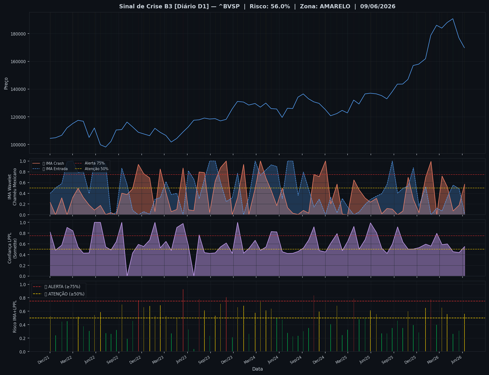
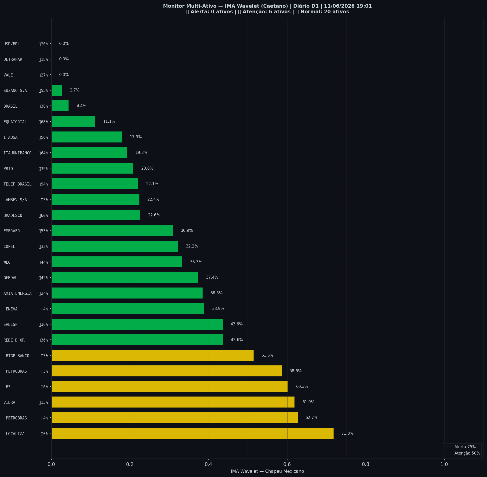

# 🟡 Sinal de Crise B3 — 11/06/2026

> **Gerado em:** 19:03 BRT | **Método:** IMA Wavelet Chapéu Mexicano (Caetano/ITA) + LPPL (Sornette/ETH-Zurich)

---

## Resumo do Dia

| Indicador | Valor | Interpretação |
|---|---|---|
| **Zona** | 🟡 **AMARELO** | Atenção |
| **Risco Combinado** | **56.0%** | IMA + LPPL combinados |
| 🔴 IMA Crash | 56.9% | Alta frequência espectral |
| 🔵 IMA Entrada | 2.2% | Oportunidade de compra |
| 📐 LPPL Sornette | 55.1% | Estrutura de bolha |
| Ibovespa | 169,813 pts | Fechamento |

> ⚡ **ATENÇÃO**: Tensão espectral crescente. Monitore nas próximas sessões.

---

## Gráfico do Sinal

---

## Monitor Multi-Ativo (26 ativos)

**Índice de Confiança:** 23% dos ativos em tensão
(✅ Mercado tranquilo)

🔴 Alerta: **0** | 🟡 Atenção: **6** | 🟢 Normal: **20**

| Zona | Ativo | Setor | 🔴 IMA Crash | 🔵 IMA Entrada |
|---|---|---|---|---|
| 🟡 | **LOCALIZA** | Aluguel | 🔴 71.8% |  0.0% |
| 🟡 | **PETROBRAS** | Petróleo | 🔴 62.7% |  3.6% |
| 🟡 | **VIBRA** | Energia | 🔴 61.9% |  13.4% |
| 🟡 | **B3** | Financeiro | 🔴 60.3% |  0.0% |
| 🟡 | **PETROBRAS** | Petróleo | 🔴 58.6% |  2.5% |
| 🟡 | **BTGP BANCO** | Financeiro | 🔴 51.5% |  2.7% |
| 🟢 | **REDE D OR** | Saúde | 🔴 43.6% |  36.4% |
| 🟢 | **SABESP** | Saneamento | 🔴 43.6% |  36.0% |
| 🟢 | **ENEVA** | Energia | 🔴 38.9% |  4.3% |
| 🟢 | **AXIA ENERGIA** | Energia | 🔴 38.5% |  24.4% |
| 🟢 | **GERDAU** | Siderurgia | 🔴 37.4% |  41.9% |
| 🟢 | **WEG** | Industrial | 🔴 33.3% |  44.4% |
| 🟢 | **COPEL** | Energia | 🔴 32.2% |  32.9% |
| 🟢 | **EMBRAER** | Outros | 🔴 30.9% |  53.1% |
| 🟢 | **BRADESCO** | Financeiro | 🔴 22.6% | 🔵 60.2% |
| 🟢 | **AMBEV S/A** | Consumo | 🔴 22.4% |  2.5% |
| 🟢 | **TELEF BRASIL** | Outros | 🔴 22.1% | 🔵 94.4% |
| 🟢 | **PRIO** | Petróleo | 🔴 20.8% |  39.4% |
| 🟢 | **ITAUUNIBANCO** | Financeiro | 🔴 19.3% | 🔵 64.3% |
| 🟢 | **ITAUSA** | Financeiro | 🔴 17.9% |  56.3% |
| 🟢 | **EQUATORIAL** | Energia | 🔴 11.1% | 🔵 67.8% |
| 🟢 | **BRASIL** | Financeiro | 🔴 4.4% |  38.0% |
| 🟢 | **SUZANO S.A.** | Papel/Celulose | 🔴 2.7% |  54.5% |
| 🟢 | **VALE** | Mineração | 🔴 0.0% |  27.5% |
| 🟢 | **ULTRAPAR** | Outros | 🔴 0.0% |  18.1% |
| 🟢 | **USD/BRL** | Câmbio | 🔴 0.0% |  20.5% |

---

## Histórico Recente (últimas 10 leituras)

| Data | Zona | Risco | 🔴 IMA Crash | 🔵 IMA Entrada |
|---|---|---|---|---|
| 2025-11-17 | 🟢 VERDE | 39.4% | — | — |
| 2025-12-09 | 🟢 VERDE | 28.5% | — | — |
| 2026-01-05 | 🟡 AMARELO | 64.9% | — | — |
| 2026-01-26 | 🔴 VERMELHO | 77.6% | — | — |
| 2026-02-18 | 🟢 VERDE | 39.8% | — | — |
| 2026-03-11 | 🟡 AMARELO | 65.3% | — | — |
| 2026-04-01 | 🟡 AMARELO | 55.9% | — | — |
| 2026-04-24 | 🟢 VERDE | 26.3% | — | — |
| 2026-05-18 | 🟢 VERDE | 30.9% | — | — |
| 2026-06-09 | 🟡 AMARELO | 56.0% | — | — |

---

## Como interpretar

| Indicador | O que significa |
|---|---|
| 🔴 **IMA Crash alto** | Alta frequência espectral — mercado nervoso, pré-crise |
| 🔵 **IMA Entrada alto** | Baixa frequência estável — possível oportunidade de compra |
| 📐 **LPPL alto** | Estrutura de bolha detectada — risco de crash acelerado |
| **Índice Multi-Ativo** | % de ativos em tensão — quanto maior, mais confiável o sinal |

> Sinal mais confiável quando **múltiplos ativos** disparam simultaneamente.

---

## Metodologia

O **IMA Wavelet** (Índice de Mudanças Abruptas) é baseado no método do Prof. Marco Antonio Leonel Caetano (ITA/INSPER), publicado na revista Physica-A (Elsevier). Usa a **Transformada Wavelet Contínua com Chapéu Mexicano** para detectar regimes de alta frequência com baixa volatilidade — padrão que antecede mudanças abruptas no mercado.

O **LPPL** (Log-Periodic Power Law) é baseado no modelo do Prof. Didier Sornette (ETH-Zurich), que detecta estruturas de bolha especulativa com oscilações aceleradas.

> **Aviso:** Este é um estudo acadêmico e não constitui recomendação de investimento. Use com análise própria.

---
*Gerado automaticamente pelo Sistema Sinal de Crise B3 | [Metodologia](../metodologia) | [Histórico](../historico)*
