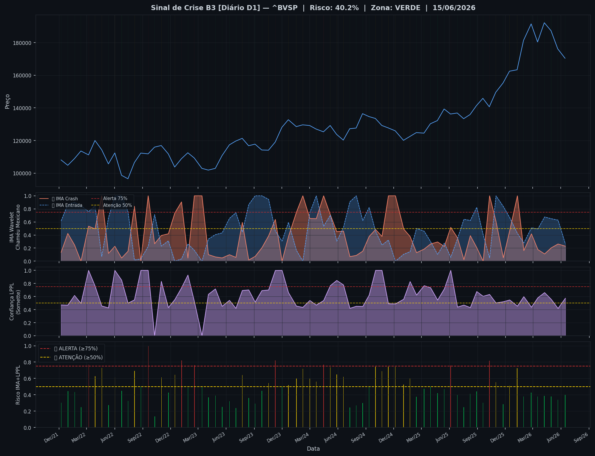
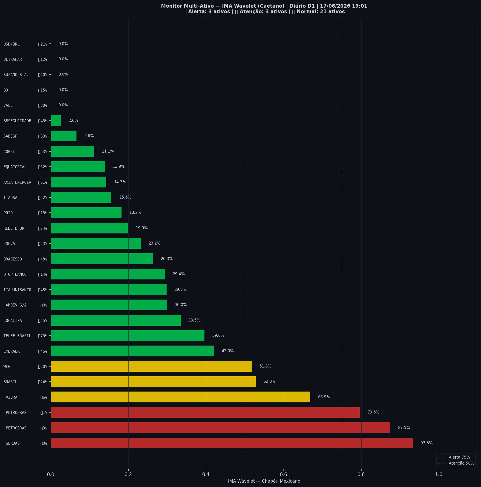

# 🟢 Sinal de Crise B3 — 17/06/2026

> **Gerado em:** 19:02 BRT | **Método:** IMA Wavelet Chapéu Mexicano (Caetano/ITA) + LPPL (Sornette/ETH-Zurich)

---

## Resumo do Dia

| Indicador | Valor | Interpretação |
|---|---|---|
| **Zona** | 🟢 **VERDE** | Normal |
| **Risco Combinado** | **40.2%** | IMA + LPPL combinados |
| 🔴 IMA Crash | 23.0% | Alta frequência espectral |
| 🔵 IMA Entrada | 26.4% | Oportunidade de compra |
| 📐 LPPL Sornette | 57.4% | Estrutura de bolha |
| Ibovespa | 170,415 pts | Fechamento |

> ✅ Sem sinal de crise detectado no momento.

---

## Gráfico do Sinal

---

## Monitor Multi-Ativo (27 ativos)

**Índice de Confiança:** 22% dos ativos em tensão
(✅ Mercado tranquilo)

🔴 Alerta: **3** | 🟡 Atenção: **3** | 🟢 Normal: **21**

| Zona | Ativo | Setor | 🔴 IMA Crash | 🔵 IMA Entrada |
|---|---|---|---|---|
| 🔴 | **GERDAU** | Siderurgia | 🔴 93.3% |  0.0% |
| 🔴 | **PETROBRAS** | Petróleo | 🔴 87.5% |  2.5% |
| 🔴 | **PETROBRAS** | Petróleo | 🔴 79.6% |  1.4% |
| 🟡 | **VIBRA** | Energia | 🔴 66.9% |  6.5% |
| 🟡 | **BRASIL** | Financeiro | 🔴 52.8% |  23.8% |
| 🟡 | **WEG** | Industrial | 🔴 51.8% |  19.9% |
| 🟢 | **EMBRAER** | Outros | 🔴 42.0% |  45.6% |
| 🟢 | **TELEF BRASIL** | Outros | 🔴 39.6% | 🔵 74.8% |
| 🟢 | **LOCALIZA** | Aluguel | 🔴 33.5% |  25.0% |
| 🟢 | **AMBEV S/A** | Consumo | 🔴 30.0% |  0.0% |
| 🟢 | **ITAUUNIBANCO** | Financeiro | 🔴 29.8% |  48.0% |
| 🟢 | **BTGP BANCO** | Financeiro | 🔴 29.4% |  13.7% |
| 🟢 | **BRADESCO** | Financeiro | 🔴 26.3% |  47.7% |
| 🟢 | **ENEVA** | Energia | 🔴 23.2% |  22.9% |
| 🟢 | **REDE D OR** | Saúde | 🔴 19.9% | 🔵 73.7% |
| 🟢 | **PRIO** | Petróleo | 🔴 18.2% |  15.3% |
| 🟢 | **ITAUSA** | Financeiro | 🔴 15.6% |  51.6% |
| 🟢 | **AXIA ENERGIA** | Energia | 🔴 14.3% |  51.2% |
| 🟢 | **EQUATORIAL** | Energia | 🔴 13.9% |  51.6% |
| 🟢 | **COPEL** | Energia | 🔴 11.1% |  52.5% |
| 🟢 | **SABESP** | Saneamento | 🔴 6.6% | 🔵 83.2% |
| 🟢 | **BBSEGURIDADE** | Financeiro | 🔴 2.6% |  44.9% |
| 🟢 | **VALE** | Mineração | 🔴 0.0% |  29.5% |
| 🟢 | **B3** | Financeiro | 🔴 0.0% |  15.0% |
| 🟢 | **SUZANO S.A.** | Papel/Celulose | 🔴 0.0% |  39.7% |
| 🟢 | **ULTRAPAR** | Outros | 🔴 0.0% |  12.1% |
| 🟢 | **USD/BRL** | Câmbio | 🔴 0.0% |  20.9% |

---

## Histórico Recente (últimas 10 leituras)

| Data | Zona | Risco | 🔴 IMA Crash | 🔵 IMA Entrada |
|---|---|---|---|---|
| 2025-11-24 | 🟢 VERDE | 28.6% | — | — |
| 2025-12-15 | 🟡 AMARELO | 50.9% | — | — |
| 2026-01-09 | 🟡 AMARELO | 72.6% | — | — |
| 2026-01-30 | 🟢 VERDE | 38.0% | — | — |
| 2026-02-24 | 🟢 VERDE | 42.7% | — | — |
| 2026-03-17 | 🟢 VERDE | 37.9% | — | — |
| 2026-04-08 | 🟢 VERDE | 38.5% | — | — |
| 2026-04-30 | 🟢 VERDE | 38.0% | — | — |
| 2026-05-22 | 🟢 VERDE | 34.0% | — | — |
| 2026-06-15 | 🟢 VERDE | 40.2% | — | — |

---

## Como interpretar

| Indicador | O que significa |
|---|---|
| 🔴 **IMA Crash alto** | Alta frequência espectral — mercado nervoso, pré-crise |
| 🔵 **IMA Entrada alto** | Baixa frequência estável — possível oportunidade de compra |
| 📐 **LPPL alto** | Estrutura de bolha detectada — risco de crash acelerado |
| **Índice Multi-Ativo** | % de ativos em tensão — quanto maior, mais confiável o sinal |

> Sinal mais confiável quando **múltiplos ativos** disparam simultaneamente.

---

## Metodologia

O **IMA Wavelet** (Índice de Mudanças Abruptas) é baseado no método do Prof. Marco Antonio Leonel Caetano (ITA/INSPER), publicado na revista Physica-A (Elsevier). Usa a **Transformada Wavelet Contínua com Chapéu Mexicano** para detectar regimes de alta frequência com baixa volatilidade — padrão que antecede mudanças abruptas no mercado.

O **LPPL** (Log-Periodic Power Law) é baseado no modelo do Prof. Didier Sornette (ETH-Zurich), que detecta estruturas de bolha especulativa com oscilações aceleradas.

> **Aviso:** Este é um estudo acadêmico e não constitui recomendação de investimento. Use com análise própria.

---
*Gerado automaticamente pelo Sistema Sinal de Crise B3 | [Metodologia](../metodologia) | [Histórico](../historico)*
