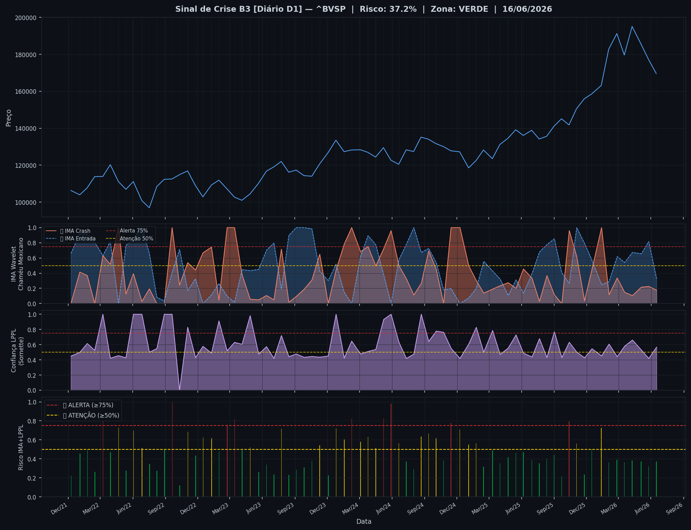
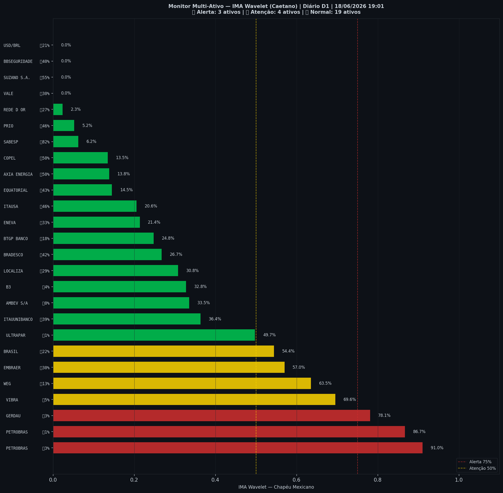

# 🟢 Sinal de Crise B3 — 18/06/2026

> **Gerado em:** 19:02 BRT | **Método:** IMA Wavelet Chapéu Mexicano (Caetano/ITA) + LPPL (Sornette/ETH-Zurich)

---

## Resumo do Dia

| Indicador | Valor | Interpretação |
|---|---|---|
| **Zona** | 🟢 **VERDE** | Normal |
| **Risco Combinado** | **37.2%** | IMA + LPPL combinados |
| 🔴 IMA Crash | 17.7% | Alta frequência espectral |
| 🔵 IMA Entrada | 32.8% | Oportunidade de compra |
| 📐 LPPL Sornette | 56.8% | Estrutura de bolha |
| Ibovespa | 169,649 pts | Fechamento |

> ✅ Sem sinal de crise detectado no momento.

---

## Gráfico do Sinal

---

## Monitor Multi-Ativo (26 ativos)

**Índice de Confiança:** 27% dos ativos em tensão
(✅ Mercado tranquilo)

🔴 Alerta: **3** | 🟡 Atenção: **4** | 🟢 Normal: **19**

| Zona | Ativo | Setor | 🔴 IMA Crash | 🔵 IMA Entrada |
|---|---|---|---|---|
| 🔴 | **PETROBRAS** | Petróleo | 🔴 91.0% |  2.9% |
| 🔴 | **PETROBRAS** | Petróleo | 🔴 86.7% |  1.1% |
| 🔴 | **GERDAU** | Siderurgia | 🔴 78.1% |  3.0% |
| 🟡 | **VIBRA** | Energia | 🔴 69.6% |  5.3% |
| 🟡 | **WEG** | Industrial | 🔴 63.5% |  12.7% |
| 🟡 | **EMBRAER** | Outros | 🔴 57.0% |  30.0% |
| 🟡 | **BRASIL** | Financeiro | 🔴 54.4% |  21.6% |
| 🟢 | **ULTRAPAR** | Outros | 🔴 49.8% |  1.1% |
| 🟢 | **ITAUUNIBANCO** | Financeiro | 🔴 36.4% |  38.6% |
| 🟢 | **AMBEV S/A** | Consumo | 🔴 33.5% |  0.0% |
| 🟢 | **B3** | Financeiro | 🔴 32.8% |  3.7% |
| 🟢 | **LOCALIZA** | Aluguel | 🔴 30.8% |  28.8% |
| 🟢 | **BRADESCO** | Financeiro | 🔴 26.7% |  42.5% |
| 🟢 | **BTGP BANCO** | Financeiro | 🔴 24.8% |  17.6% |
| 🟢 | **ENEVA** | Energia | 🔴 21.4% |  32.6% |
| 🟢 | **ITAUSA** | Financeiro | 🔴 20.6% |  45.7% |
| 🟢 | **EQUATORIAL** | Energia | 🔴 14.5% |  43.2% |
| 🟢 | **AXIA ENERGIA** | Energia | 🔴 13.8% |  49.9% |
| 🟢 | **COPEL** | Energia | 🔴 13.5% |  50.2% |
| 🟢 | **SABESP** | Saneamento | 🔴 6.2% | 🔵 81.7% |
| 🟢 | **PRIO** | Petróleo | 🔴 5.2% |  46.4% |
| 🟢 | **REDE D OR** | Saúde | 🔴 2.3% |  27.5% |
| 🟢 | **VALE** | Mineração | 🔴 0.0% |  29.8% |
| 🟢 | **SUZANO S.A.** | Papel/Celulose | 🔴 0.0% |  55.1% |
| 🟢 | **BBSEGURIDADE** | Financeiro | 🔴 0.0% |  40.1% |
| 🟢 | **USD/BRL** | Câmbio | 🔴 0.0% |  21.0% |

---

## Histórico Recente (últimas 10 leituras)

| Data | Zona | Risco | 🔴 IMA Crash | 🔵 IMA Entrada |
|---|---|---|---|---|
| 2025-11-25 | 🟢 VERDE | 23.2% | — | — |
| 2025-12-16 | 🟢 VERDE | 49.9% | — | — |
| 2026-01-12 | 🟡 AMARELO | 72.6% | — | — |
| 2026-02-02 | 🟢 VERDE | 36.2% | — | — |
| 2026-02-25 | 🟢 VERDE | 38.9% | — | — |
| 2026-03-18 | 🟢 VERDE | 36.4% | — | — |
| 2026-04-09 | 🟢 VERDE | 38.3% | — | — |
| 2026-05-04 | 🟢 VERDE | 37.2% | — | — |
| 2026-05-25 | 🟢 VERDE | 32.2% | — | — |
| 2026-06-16 | 🟢 VERDE | 37.2% | — | — |

---

## Como interpretar

| Indicador | O que significa |
|---|---|
| 🔴 **IMA Crash alto** | Alta frequência espectral — mercado nervoso, pré-crise |
| 🔵 **IMA Entrada alto** | Baixa frequência estável — possível oportunidade de compra |
| 📐 **LPPL alto** | Estrutura de bolha detectada — risco de crash acelerado |
| **Índice Multi-Ativo** | % de ativos em tensão — quanto maior, mais confiável o sinal |

> Sinal mais confiável quando **múltiplos ativos** disparam simultaneamente.

---

## Metodologia

O **IMA Wavelet** (Índice de Mudanças Abruptas) é baseado no método do Prof. Marco Antonio Leonel Caetano (ITA/INSPER), publicado na revista Physica-A (Elsevier). Usa a **Transformada Wavelet Contínua com Chapéu Mexicano** para detectar regimes de alta frequência com baixa volatilidade — padrão que antecede mudanças abruptas no mercado.

O **LPPL** (Log-Periodic Power Law) é baseado no modelo do Prof. Didier Sornette (ETH-Zurich), que detecta estruturas de bolha especulativa com oscilações aceleradas.

> **Aviso:** Este é um estudo acadêmico e não constitui recomendação de investimento. Use com análise própria.

---
*Gerado automaticamente pelo Sistema Sinal de Crise B3 | [Metodologia](../metodologia) | [Histórico](../historico)*
