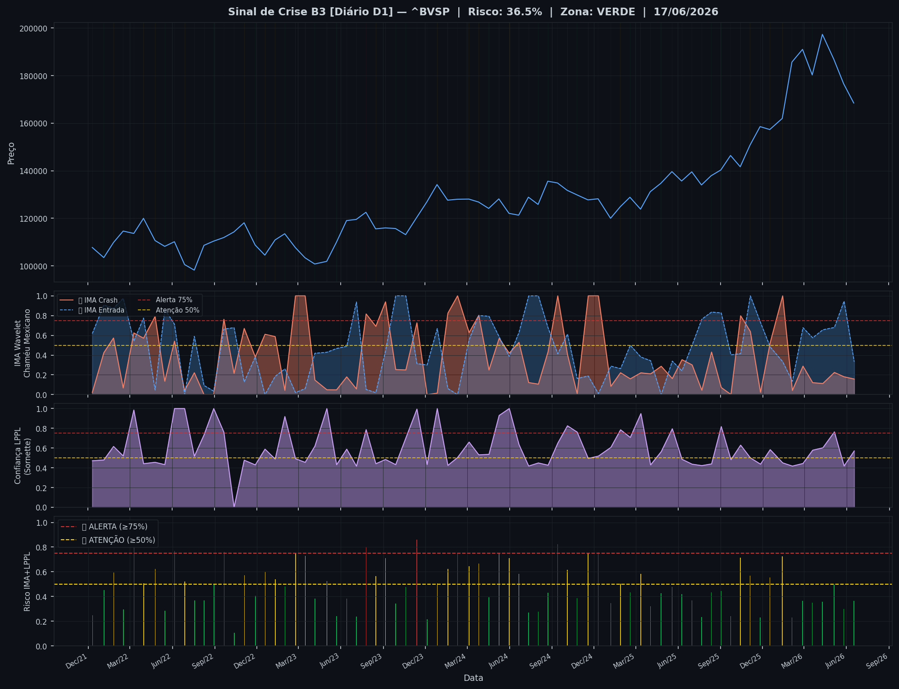
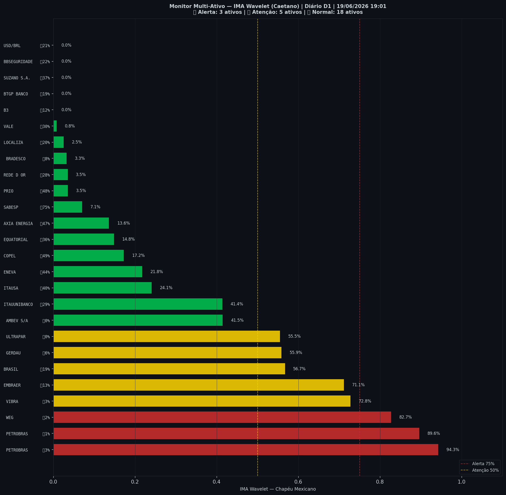

# 🟢 Sinal de Crise B3 — 19/06/2026

> **Gerado em:** 19:02 BRT | **Método:** IMA Wavelet Chapéu Mexicano (Caetano/ITA) + LPPL (Sornette/ETH-Zurich)

---

## Resumo do Dia

| Indicador | Valor | Interpretação |
|---|---|---|
| **Zona** | 🟢 **VERDE** | Normal |
| **Risco Combinado** | **36.5%** | IMA + LPPL combinados |
| 🔴 IMA Crash | 15.8% | Alta frequência espectral |
| 🔵 IMA Entrada | 33.2% | Oportunidade de compra |
| 📐 LPPL Sornette | 57.1% | Estrutura de bolha |
| Ibovespa | 168,454 pts | Fechamento |

> ✅ Sem sinal de crise detectado no momento.

---

## Gráfico do Sinal

---

## Monitor Multi-Ativo (26 ativos)

**Índice de Confiança:** 31% dos ativos em tensão
(⚡ Tensão moderada)

🔴 Alerta: **3** | 🟡 Atenção: **5** | 🟢 Normal: **18**

| Zona | Ativo | Setor | 🔴 IMA Crash | 🔵 IMA Entrada |
|---|---|---|---|---|
| 🔴 | **PETROBRAS** | Petróleo | 🔴 94.2% |  2.9% |
| 🔴 | **PETROBRAS** | Petróleo | 🔴 89.6% |  0.9% |
| 🔴 | **WEG** | Industrial | 🔴 82.7% |  1.5% |
| 🟡 | **VIBRA** | Energia | 🔴 72.8% |  3.4% |
| 🟡 | **EMBRAER** | Outros | 🔴 71.1% |  12.7% |
| 🟡 | **BRASIL** | Financeiro | 🔴 56.7% |  18.8% |
| 🟡 | **GERDAU** | Siderurgia | 🔴 55.9% |  6.5% |
| 🟡 | **ULTRAPAR** | Outros | 🔴 55.5% |  0.0% |
| 🟢 | **AMBEV S/A** | Consumo | 🔴 41.5% |  0.0% |
| 🟢 | **ITAUUNIBANCO** | Financeiro | 🔴 41.4% |  29.3% |
| 🟢 | **ITAUSA** | Financeiro | 🔴 24.1% |  40.2% |
| 🟢 | **ENEVA** | Energia | 🔴 21.8% |  44.3% |
| 🟢 | **COPEL** | Energia | 🔴 17.2% |  49.1% |
| 🟢 | **EQUATORIAL** | Energia | 🔴 14.8% |  35.5% |
| 🟢 | **AXIA ENERGIA** | Energia | 🔴 13.6% |  46.8% |
| 🟢 | **SABESP** | Saneamento | 🔴 7.1% | 🔵 74.8% |
| 🟢 | **PRIO** | Petróleo | 🔴 3.5% |  47.7% |
| 🟢 | **REDE D OR** | Saúde | 🔴 3.5% |  28.0% |
| 🟢 | **BRADESCO** | Financeiro | 🔴 3.3% |  7.9% |
| 🟢 | **LOCALIZA** | Aluguel | 🔴 2.5% |  20.2% |
| 🟢 | **VALE** | Mineração | 🔴 0.8% |  29.7% |
| 🟢 | **B3** | Financeiro | 🔴 0.0% |  12.1% |
| 🟢 | **BTGP BANCO** | Financeiro | 🔴 0.0% |  18.7% |
| 🟢 | **SUZANO S.A.** | Papel/Celulose | 🔴 0.0% |  36.5% |
| 🟢 | **BBSEGURIDADE** | Financeiro | 🔴 0.0% |  22.3% |
| 🟢 | **USD/BRL** | Câmbio | 🔴 0.0% |  21.4% |

---

## Histórico Recente (últimas 10 leituras)

| Data | Zona | Risco | 🔴 IMA Crash | 🔵 IMA Entrada |
|---|---|---|---|---|
| 2025-11-26 | 🟢 VERDE | 23.0% | — | — |
| 2025-12-17 | 🟡 AMARELO | 55.5% | — | — |
| 2026-01-13 | 🟡 AMARELO | 72.5% | — | — |
| 2026-02-03 | 🟢 VERDE | 23.0% | — | — |
| 2026-02-26 | 🟢 VERDE | 36.6% | — | — |
| 2026-03-19 | 🟢 VERDE | 35.0% | — | — |
| 2026-04-10 | 🟢 VERDE | 35.8% | — | — |
| 2026-05-05 | 🟢 VERDE | 49.4% | — | — |
| 2026-05-26 | 🟢 VERDE | 30.0% | — | — |
| 2026-06-17 | 🟢 VERDE | 36.5% | — | — |

---

## Como interpretar

| Indicador | O que significa |
|---|---|
| 🔴 **IMA Crash alto** | Alta frequência espectral — mercado nervoso, pré-crise |
| 🔵 **IMA Entrada alto** | Baixa frequência estável — possível oportunidade de compra |
| 📐 **LPPL alto** | Estrutura de bolha detectada — risco de crash acelerado |
| **Índice Multi-Ativo** | % de ativos em tensão — quanto maior, mais confiável o sinal |

> Sinal mais confiável quando **múltiplos ativos** disparam simultaneamente.

---

## Metodologia

O **IMA Wavelet** (Índice de Mudanças Abruptas) é baseado no método do Prof. Marco Antonio Leonel Caetano (ITA/INSPER), publicado na revista Physica-A (Elsevier). Usa a **Transformada Wavelet Contínua com Chapéu Mexicano** para detectar regimes de alta frequência com baixa volatilidade — padrão que antecede mudanças abruptas no mercado.

O **LPPL** (Log-Periodic Power Law) é baseado no modelo do Prof. Didier Sornette (ETH-Zurich), que detecta estruturas de bolha especulativa com oscilações aceleradas.

> **Aviso:** Este é um estudo acadêmico e não constitui recomendação de investimento. Use com análise própria.

---
*Gerado automaticamente pelo Sistema Sinal de Crise B3 | [Metodologia](../metodologia) | [Histórico](../historico)*
