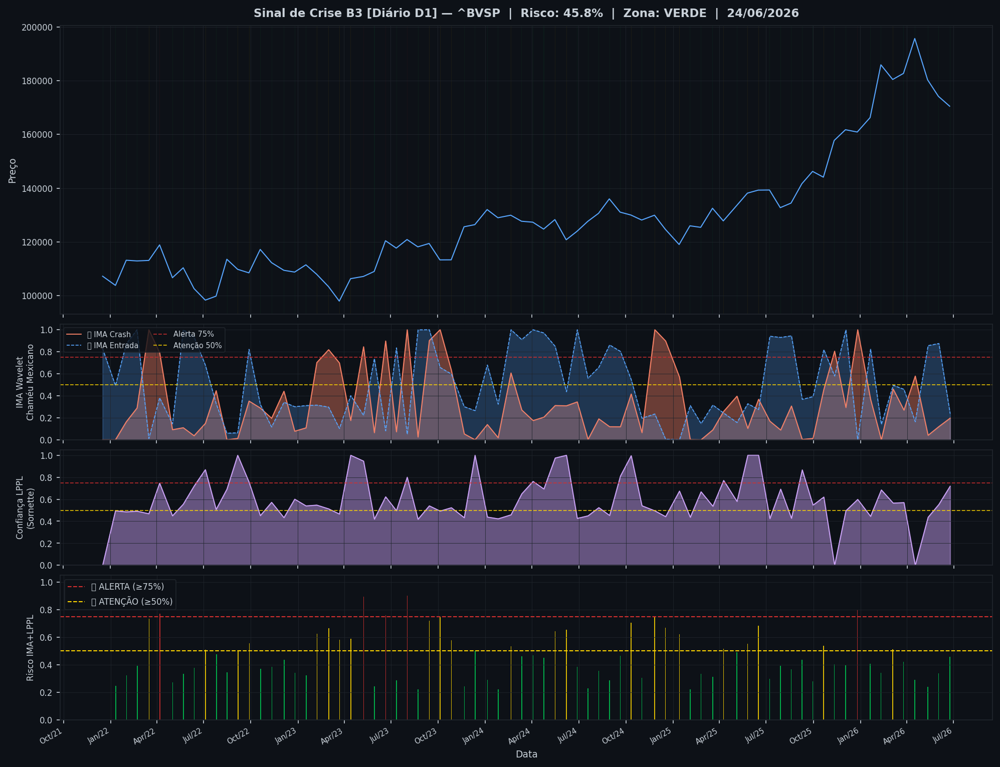
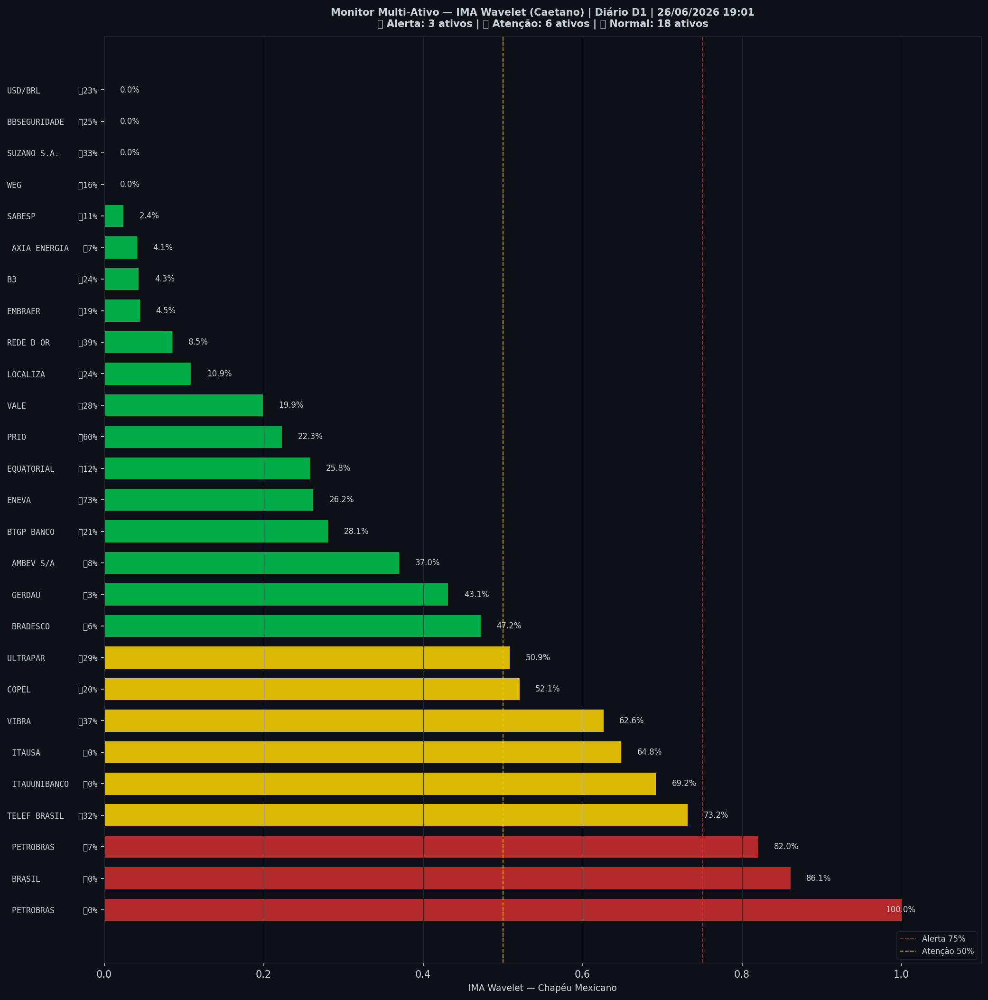

# 🟢 Sinal de Crise B3 — 26/06/2026

> **Gerado em:** 19:03 BRT | **Método:** IMA Wavelet Chapéu Mexicano (Caetano/ITA) + LPPL (Sornette/ETH-Zurich)

---

## Resumo do Dia

| Indicador | Valor | Interpretação |
|---|---|---|
| **Zona** | 🟢 **VERDE** | Normal |
| **Risco Combinado** | **45.8%** | IMA + LPPL combinados |
| 🔴 IMA Crash | 19.7% | Alta frequência espectral |
| 🔵 IMA Entrada | 23.7% | Oportunidade de compra |
| 📐 LPPL Sornette | 71.9% | Estrutura de bolha |
| Ibovespa | 170,507 pts | Fechamento |

> ✅ Sem sinal de crise detectado no momento.

---

## Gráfico do Sinal

---

## Monitor Multi-Ativo (27 ativos)

**Índice de Confiança:** 33% dos ativos em tensão
(⚡ Tensão moderada)

🔴 Alerta: **3** | 🟡 Atenção: **6** | 🟢 Normal: **18**

| Zona | Ativo | Setor | 🔴 IMA Crash | 🔵 IMA Entrada |
|---|---|---|---|---|
| 🔴 | **PETROBRAS** | Petróleo | 🔴 100.0% |  0.0% |
| 🔴 | **BRASIL** | Financeiro | 🔴 86.1% |  0.0% |
| 🔴 | **PETROBRAS** | Petróleo | 🔴 82.0% |  6.9% |
| 🟡 | **TELEF BRASIL** | Outros | 🔴 73.2% |  31.7% |
| 🟡 | **ITAUUNIBANCO** | Financeiro | 🔴 69.2% |  0.0% |
| 🟡 | **ITAUSA** | Financeiro | 🔴 64.8% |  0.0% |
| 🟡 | **VIBRA** | Energia | 🔴 62.6% |  36.7% |
| 🟡 | **COPEL** | Energia | 🔴 52.1% |  20.3% |
| 🟡 | **ULTRAPAR** | Outros | 🔴 50.9% |  29.3% |
| 🟢 | **BRADESCO** | Financeiro | 🔴 47.2% |  5.7% |
| 🟢 | **GERDAU** | Siderurgia | 🔴 43.1% |  3.1% |
| 🟢 | **AMBEV S/A** | Consumo | 🔴 37.0% |  8.0% |
| 🟢 | **BTGP BANCO** | Financeiro | 🔴 28.1% |  20.5% |
| 🟢 | **ENEVA** | Energia | 🔴 26.2% | 🔵 73.1% |
| 🟢 | **EQUATORIAL** | Energia | 🔴 25.8% |  11.8% |
| 🟢 | **PRIO** | Petróleo | 🔴 22.3% | 🔵 60.0% |
| 🟢 | **VALE** | Mineração | 🔴 19.9% |  28.2% |
| 🟢 | **LOCALIZA** | Aluguel | 🔴 10.9% |  23.6% |
| 🟢 | **REDE D OR** | Saúde | 🔴 8.5% |  39.0% |
| 🟢 | **EMBRAER** | Outros | 🔴 4.5% |  19.1% |
| 🟢 | **B3** | Financeiro | 🔴 4.3% |  24.3% |
| 🟢 | **AXIA ENERGIA** | Energia | 🔴 4.1% |  6.9% |
| 🟢 | **SABESP** | Saneamento | 🔴 2.4% |  10.7% |
| 🟢 | **WEG** | Industrial | 🔴 0.0% |  16.4% |
| 🟢 | **SUZANO S.A.** | Papel/Celulose | 🔴 0.0% |  33.0% |
| 🟢 | **BBSEGURIDADE** | Financeiro | 🔴 0.0% |  24.9% |
| 🟢 | **USD/BRL** | Câmbio | 🔴 0.0% |  23.0% |

---

## Histórico Recente (últimas 10 leituras)

| Data | Zona | Risco | 🔴 IMA Crash | 🔵 IMA Entrada |
|---|---|---|---|---|
| 2025-12-03 | 🟢 VERDE | 39.5% | — | — |
| 2025-12-26 | 🔴 VERMELHO | 79.9% | — | — |
| 2026-01-20 | 🟢 VERDE | 40.7% | — | — |
| 2026-02-10 | 🟢 VERDE | 34.3% | — | — |
| 2026-03-05 | 🟡 AMARELO | 51.3% | — | — |
| 2026-03-26 | 🟢 VERDE | 41.9% | — | — |
| 2026-04-17 | 🟢 VERDE | 28.9% | — | — |
| 2026-05-12 | 🟢 VERDE | 23.9% | — | — |
| 2026-06-02 | 🟢 VERDE | 33.7% | — | — |
| 2026-06-24 | 🟢 VERDE | 45.8% | — | — |

---

## Como interpretar

| Indicador | O que significa |
|---|---|
| 🔴 **IMA Crash alto** | Alta frequência espectral — mercado nervoso, pré-crise |
| 🔵 **IMA Entrada alto** | Baixa frequência estável — possível oportunidade de compra |
| 📐 **LPPL alto** | Estrutura de bolha detectada — risco de crash acelerado |
| **Índice Multi-Ativo** | % de ativos em tensão — quanto maior, mais confiável o sinal |

> Sinal mais confiável quando **múltiplos ativos** disparam simultaneamente.

---

## Metodologia

O **IMA Wavelet** (Índice de Mudanças Abruptas) é baseado no método do Prof. Marco Antonio Leonel Caetano (ITA/INSPER), publicado na revista Physica-A (Elsevier). Usa a **Transformada Wavelet Contínua com Chapéu Mexicano** para detectar regimes de alta frequência com baixa volatilidade — padrão que antecede mudanças abruptas no mercado.

O **LPPL** (Log-Periodic Power Law) é baseado no modelo do Prof. Didier Sornette (ETH-Zurich), que detecta estruturas de bolha especulativa com oscilações aceleradas.

> **Aviso:** Este é um estudo acadêmico e não constitui recomendação de investimento. Use com análise própria.

---
*Gerado automaticamente pelo Sistema Sinal de Crise B3 | [Metodologia](../metodologia) | [Histórico](../historico)*
