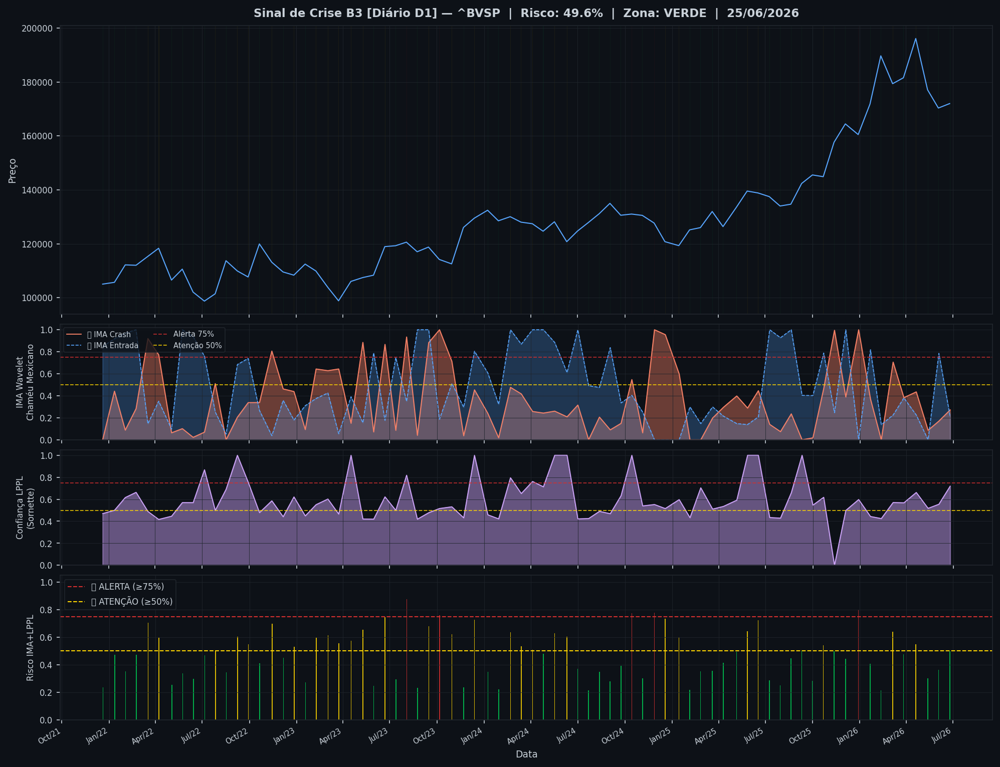
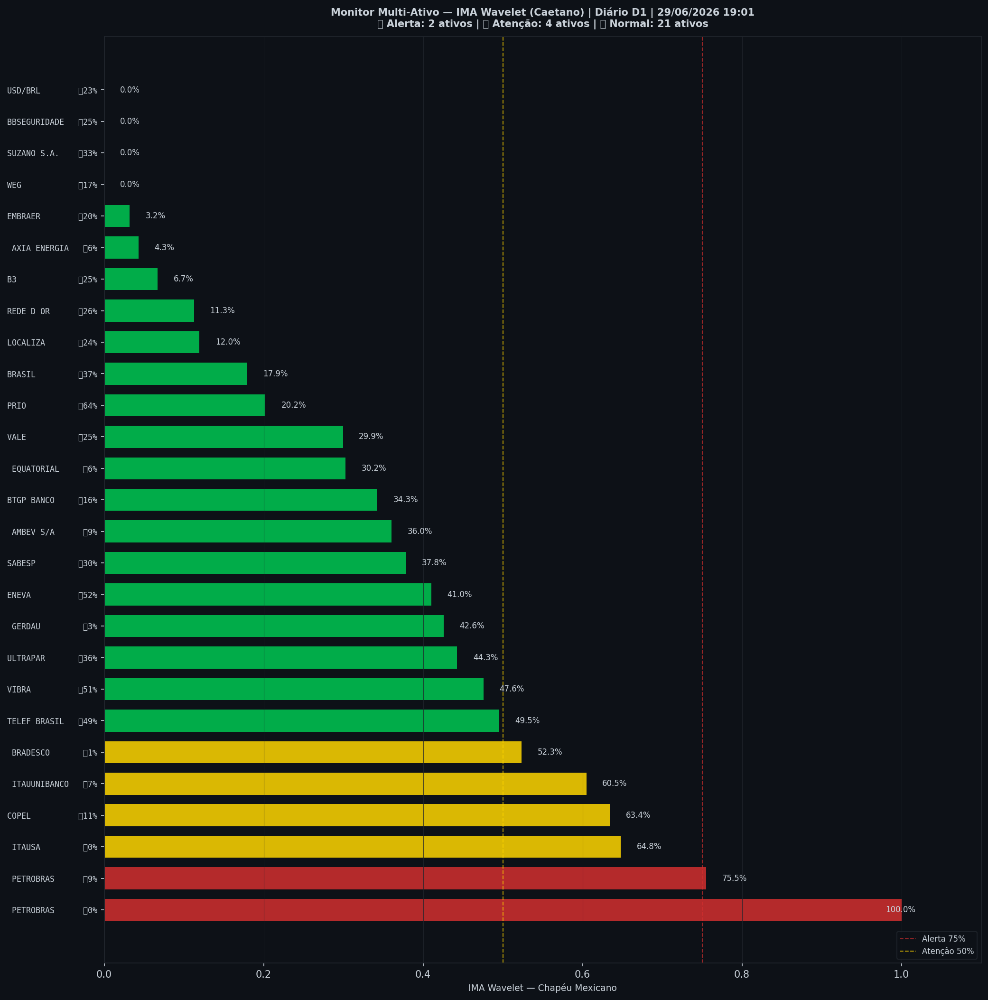

# 🟢 Sinal de Crise B3 — 29/06/2026

> **Gerado em:** 19:02 BRT | **Método:** IMA Wavelet Chapéu Mexicano (Caetano/ITA) + LPPL (Sornette/ETH-Zurich)

---

## Resumo do Dia

| Indicador | Valor | Interpretação |
|---|---|---|
| **Zona** | 🟢 **VERDE** | Normal |
| **Risco Combinado** | **49.6%** | IMA + LPPL combinados |
| 🔴 IMA Crash | 27.2% | Alta frequência espectral |
| 🔵 IMA Entrada | 20.8% | Oportunidade de compra |
| 📐 LPPL Sornette | 72.0% | Estrutura de bolha |
| Ibovespa | 171,990 pts | Fechamento |

> ✅ Sem sinal de crise detectado no momento.

---

## Gráfico do Sinal

---

## Monitor Multi-Ativo (27 ativos)

**Índice de Confiança:** 22% dos ativos em tensão
(✅ Mercado tranquilo)

🔴 Alerta: **2** | 🟡 Atenção: **4** | 🟢 Normal: **21**

| Zona | Ativo | Setor | 🔴 IMA Crash | 🔵 IMA Entrada |
|---|---|---|---|---|
| 🔴 | **PETROBRAS** | Petróleo | 🔴 100.0% |  0.0% |
| 🔴 | **PETROBRAS** | Petróleo | 🔴 75.5% |  9.1% |
| 🟡 | **ITAUSA** | Financeiro | 🔴 64.8% |  0.0% |
| 🟡 | **COPEL** | Energia | 🔴 63.4% |  11.0% |
| 🟡 | **ITAUUNIBANCO** | Financeiro | 🔴 60.5% |  6.9% |
| 🟡 | **BRADESCO** | Financeiro | 🔴 52.3% |  0.7% |
| 🟢 | **TELEF BRASIL** | Outros | 🔴 49.5% |  49.2% |
| 🟢 | **VIBRA** | Energia | 🔴 47.6% |  51.4% |
| 🟢 | **ULTRAPAR** | Outros | 🔴 44.3% |  36.2% |
| 🟢 | **GERDAU** | Siderurgia | 🔴 42.6% |  2.8% |
| 🟢 | **ENEVA** | Energia | 🔴 41.0% |  52.1% |
| 🟢 | **SABESP** | Saneamento | 🔴 37.8% |  29.6% |
| 🟢 | **AMBEV S/A** | Consumo | 🔴 36.0% |  8.5% |
| 🟢 | **BTGP BANCO** | Financeiro | 🔴 34.3% |  15.9% |
| 🟢 | **EQUATORIAL** | Energia | 🔴 30.2% |  6.2% |
| 🟢 | **VALE** | Mineração | 🔴 29.9% |  25.0% |
| 🟢 | **PRIO** | Petróleo | 🔴 20.2% | 🔵 64.0% |
| 🟢 | **BRASIL** | Financeiro | 🔴 17.9% |  36.7% |
| 🟢 | **LOCALIZA** | Aluguel | 🔴 11.9% |  23.7% |
| 🟢 | **REDE D OR** | Saúde | 🔴 11.3% |  25.8% |
| 🟢 | **B3** | Financeiro | 🔴 6.7% |  25.3% |
| 🟢 | **AXIA ENERGIA** | Energia | 🔴 4.3% |  6.0% |
| 🟢 | **EMBRAER** | Outros | 🔴 3.2% |  19.8% |
| 🟢 | **WEG** | Industrial | 🔴 0.0% |  16.9% |
| 🟢 | **SUZANO S.A.** | Papel/Celulose | 🔴 0.0% |  32.7% |
| 🟢 | **BBSEGURIDADE** | Financeiro | 🔴 0.0% |  24.6% |
| 🟢 | **USD/BRL** | Câmbio | 🔴 0.0% |  23.0% |

---

## Histórico Recente (últimas 10 leituras)

| Data | Zona | Risco | 🔴 IMA Crash | 🔵 IMA Entrada |
|---|---|---|---|---|
| 2025-12-04 | 🟢 VERDE | 44.4% | — | — |
| 2025-12-29 | 🔴 VERMELHO | 79.9% | — | — |
| 2026-01-21 | 🟢 VERDE | 40.7% | — | — |
| 2026-02-11 | 🟢 VERDE | 21.2% | — | — |
| 2026-03-06 | 🟡 AMARELO | 63.8% | — | — |
| 2026-03-27 | 🟢 VERDE | 47.6% | — | — |
| 2026-04-20 | 🟡 AMARELO | 54.9% | — | — |
| 2026-05-13 | 🟢 VERDE | 30.2% | — | — |
| 2026-06-03 | 🟢 VERDE | 36.2% | — | — |
| 2026-06-25 | 🟢 VERDE | 49.6% | — | — |

---

## Como interpretar

| Indicador | O que significa |
|---|---|
| 🔴 **IMA Crash alto** | Alta frequência espectral — mercado nervoso, pré-crise |
| 🔵 **IMA Entrada alto** | Baixa frequência estável — possível oportunidade de compra |
| 📐 **LPPL alto** | Estrutura de bolha detectada — risco de crash acelerado |
| **Índice Multi-Ativo** | % de ativos em tensão — quanto maior, mais confiável o sinal |

> Sinal mais confiável quando **múltiplos ativos** disparam simultaneamente.

---

## Metodologia

O **IMA Wavelet** (Índice de Mudanças Abruptas) é baseado no método do Prof. Marco Antonio Leonel Caetano (ITA/INSPER), publicado na revista Physica-A (Elsevier). Usa a **Transformada Wavelet Contínua com Chapéu Mexicano** para detectar regimes de alta frequência com baixa volatilidade — padrão que antecede mudanças abruptas no mercado.

O **LPPL** (Log-Periodic Power Law) é baseado no modelo do Prof. Didier Sornette (ETH-Zurich), que detecta estruturas de bolha especulativa com oscilações aceleradas.

> **Aviso:** Este é um estudo acadêmico e não constitui recomendação de investimento. Use com análise própria.

---
*Gerado automaticamente pelo Sistema Sinal de Crise B3 | [Metodologia](../metodologia) | [Histórico](../historico)*
