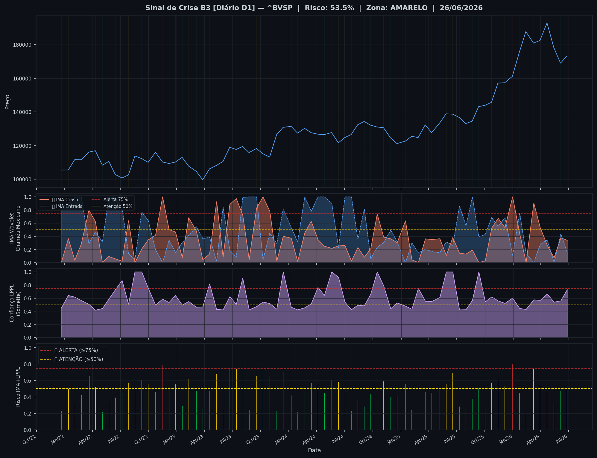
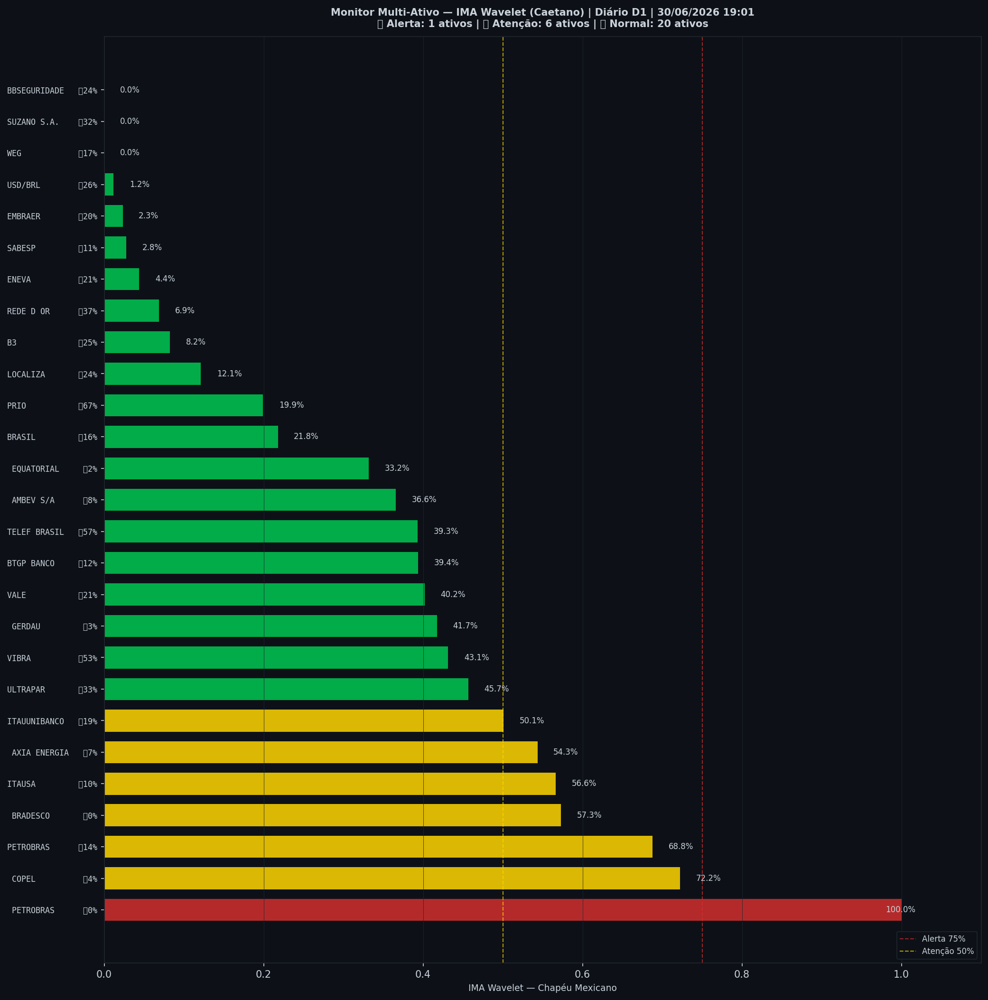

# 🟡 Sinal de Crise B3 — 30/06/2026

> **Gerado em:** 19:03 BRT | **Método:** IMA Wavelet Chapéu Mexicano (Caetano/ITA) + LPPL (Sornette/ETH-Zurich)

---

## Resumo do Dia

| Indicador | Valor | Interpretação |
|---|---|---|
| **Zona** | 🟡 **AMARELO** | Atenção |
| **Risco Combinado** | **53.5%** | IMA + LPPL combinados |
| 🔴 IMA Crash | 33.9% | Alta frequência espectral |
| 🔵 IMA Entrada | 15.7% | Oportunidade de compra |
| 📐 LPPL Sornette | 73.0% | Estrutura de bolha |
| Ibovespa | 173,295 pts | Fechamento |

> ⚡ **ATENÇÃO**: Tensão espectral crescente. Monitore nas próximas sessões.

---

## Gráfico do Sinal

---

## Monitor Multi-Ativo (27 ativos)

**Índice de Confiança:** 26% dos ativos em tensão
(✅ Mercado tranquilo)

🔴 Alerta: **1** | 🟡 Atenção: **6** | 🟢 Normal: **20**

| Zona | Ativo | Setor | 🔴 IMA Crash | 🔵 IMA Entrada |
|---|---|---|---|---|
| 🔴 | **PETROBRAS** | Petróleo | 🔴 100.0% |  0.0% |
| 🟡 | **COPEL** | Energia | 🔴 72.2% |  4.4% |
| 🟡 | **PETROBRAS** | Petróleo | 🔴 68.8% |  13.7% |
| 🟡 | **BRADESCO** | Financeiro | 🔴 57.3% |  0.0% |
| 🟡 | **ITAUSA** | Financeiro | 🔴 56.6% |  10.1% |
| 🟡 | **AXIA ENERGIA** | Energia | 🔴 54.3% |  7.2% |
| 🟡 | **ITAUUNIBANCO** | Financeiro | 🔴 50.1% |  18.9% |
| 🟢 | **ULTRAPAR** | Outros | 🔴 45.7% |  32.8% |
| 🟢 | **VIBRA** | Energia | 🔴 43.1% |  53.2% |
| 🟢 | **GERDAU** | Siderurgia | 🔴 41.7% |  2.8% |
| 🟢 | **VALE** | Mineração | 🔴 40.2% |  20.8% |
| 🟢 | **BTGP BANCO** | Financeiro | 🔴 39.4% |  11.9% |
| 🟢 | **TELEF BRASIL** | Outros | 🔴 39.3% |  57.0% |
| 🟢 | **AMBEV S/A** | Consumo | 🔴 36.6% |  8.1% |
| 🟢 | **EQUATORIAL** | Energia | 🔴 33.2% |  2.3% |
| 🟢 | **BRASIL** | Financeiro | 🔴 21.8% |  15.8% |
| 🟢 | **PRIO** | Petróleo | 🔴 19.9% | 🔵 66.9% |
| 🟢 | **LOCALIZA** | Aluguel | 🔴 12.1% |  23.7% |
| 🟢 | **B3** | Financeiro | 🔴 8.2% |  25.4% |
| 🟢 | **REDE D OR** | Saúde | 🔴 6.9% |  37.5% |
| 🟢 | **ENEVA** | Energia | 🔴 4.4% |  21.3% |
| 🟢 | **SABESP** | Saneamento | 🔴 2.8% |  11.4% |
| 🟢 | **EMBRAER** | Outros | 🔴 2.3% |  20.2% |
| 🟢 | **USD/BRL** | Câmbio | 🔴 1.2% |  25.8% |
| 🟢 | **WEG** | Industrial | 🔴 0.0% |  16.9% |
| 🟢 | **SUZANO S.A.** | Papel/Celulose | 🔴 0.0% |  32.3% |
| 🟢 | **BBSEGURIDADE** | Financeiro | 🔴 0.0% |  24.3% |

---

## Histórico Recente (últimas 10 leituras)

| Data | Zona | Risco | 🔴 IMA Crash | 🔵 IMA Entrada |
|---|---|---|---|---|
| 2025-12-05 | 🟡 AMARELO | 52.6% | — | — |
| 2025-12-30 | 🔴 VERMELHO | 80.0% | — | — |
| 2026-01-22 | 🟢 VERDE | 44.3% | — | — |
| 2026-02-12 | 🟢 VERDE | 21.4% | — | — |
| 2026-03-09 | 🟡 AMARELO | 74.1% | — | — |
| 2026-03-30 | 🟡 AMARELO | 54.8% | — | — |
| 2026-04-22 | 🟢 VERDE | 46.2% | — | — |
| 2026-05-14 | 🟢 VERDE | 30.6% | — | — |
| 2026-06-05 | 🟢 VERDE | 46.8% | — | — |
| 2026-06-26 | 🟡 AMARELO | 53.5% | — | — |

---

## Como interpretar

| Indicador | O que significa |
|---|---|
| 🔴 **IMA Crash alto** | Alta frequência espectral — mercado nervoso, pré-crise |
| 🔵 **IMA Entrada alto** | Baixa frequência estável — possível oportunidade de compra |
| 📐 **LPPL alto** | Estrutura de bolha detectada — risco de crash acelerado |
| **Índice Multi-Ativo** | % de ativos em tensão — quanto maior, mais confiável o sinal |

> Sinal mais confiável quando **múltiplos ativos** disparam simultaneamente.

---

## Metodologia

O **IMA Wavelet** (Índice de Mudanças Abruptas) é baseado no método do Prof. Marco Antonio Leonel Caetano (ITA/INSPER), publicado na revista Physica-A (Elsevier). Usa a **Transformada Wavelet Contínua com Chapéu Mexicano** para detectar regimes de alta frequência com baixa volatilidade — padrão que antecede mudanças abruptas no mercado.

O **LPPL** (Log-Periodic Power Law) é baseado no modelo do Prof. Didier Sornette (ETH-Zurich), que detecta estruturas de bolha especulativa com oscilações aceleradas.

> **Aviso:** Este é um estudo acadêmico e não constitui recomendação de investimento. Use com análise própria.

---
*Gerado automaticamente pelo Sistema Sinal de Crise B3 | [Metodologia](../metodologia) | [Histórico](../historico)*
