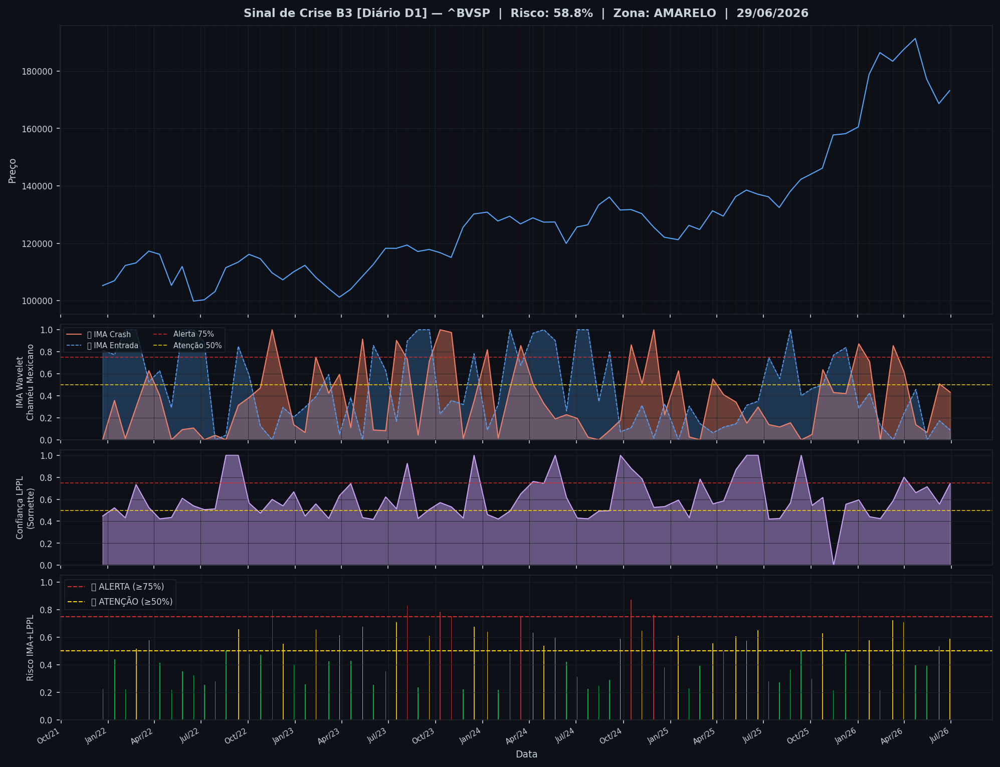
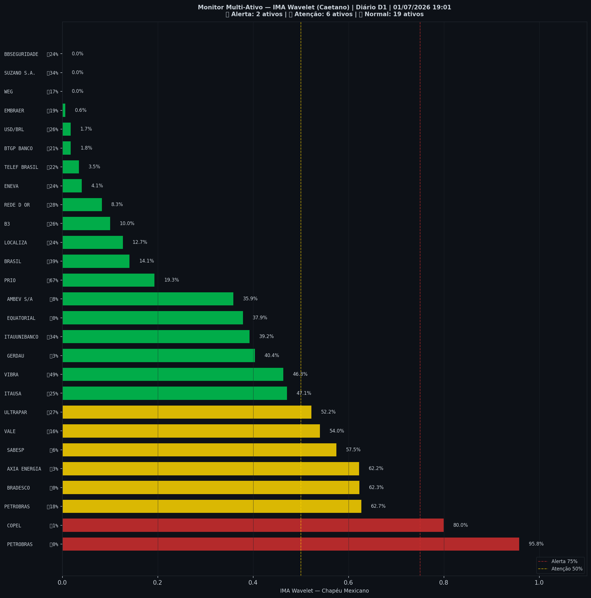

# 🟡 Sinal de Crise B3 — 01/07/2026

> **Gerado em:** 19:03 BRT | **Método:** IMA Wavelet Chapéu Mexicano (Caetano/ITA) + LPPL (Sornette/ETH-Zurich)

---

## Resumo do Dia

| Indicador | Valor | Interpretação |
|---|---|---|
| **Zona** | 🟡 **AMARELO** | Atenção |
| **Risco Combinado** | **58.8%** | IMA + LPPL combinados |
| 🔴 IMA Crash | 43.2% | Alta frequência espectral |
| 🔵 IMA Entrada | 8.9% | Oportunidade de compra |
| 📐 LPPL Sornette | 74.5% | Estrutura de bolha |
| Ibovespa | 173,205 pts | Fechamento |

> ⚡ **ATENÇÃO**: Tensão espectral crescente. Monitore nas próximas sessões.

---

## Gráfico do Sinal

---

## Monitor Multi-Ativo (27 ativos)

**Índice de Confiança:** 30% dos ativos em tensão
(✅ Mercado tranquilo)

🔴 Alerta: **2** | 🟡 Atenção: **6** | 🟢 Normal: **19**

| Zona | Ativo | Setor | 🔴 IMA Crash | 🔵 IMA Entrada |
|---|---|---|---|---|
| 🔴 | **PETROBRAS** | Petróleo | 🔴 95.8% |  0.0% |
| 🔴 | **COPEL** | Energia | 🔴 80.0% |  1.2% |
| 🟡 | **PETROBRAS** | Petróleo | 🔴 62.7% |  17.6% |
| 🟡 | **BRADESCO** | Financeiro | 🔴 62.3% |  0.0% |
| 🟡 | **AXIA ENERGIA** | Energia | 🔴 62.2% |  2.8% |
| 🟡 | **SABESP** | Saneamento | 🔴 57.5% |  5.9% |
| 🟡 | **VALE** | Mineração | 🔴 54.0% |  15.9% |
| 🟡 | **ULTRAPAR** | Outros | 🔴 52.2% |  26.8% |
| 🟢 | **ITAUSA** | Financeiro | 🔴 47.1% |  24.5% |
| 🟢 | **VIBRA** | Energia | 🔴 46.3% |  49.1% |
| 🟢 | **GERDAU** | Siderurgia | 🔴 40.4% |  3.2% |
| 🟢 | **ITAUUNIBANCO** | Financeiro | 🔴 39.2% |  33.8% |
| 🟢 | **EQUATORIAL** | Energia | 🔴 37.9% |  0.0% |
| 🟢 | **AMBEV S/A** | Consumo | 🔴 35.9% |  8.1% |
| 🟢 | **PRIO** | Petróleo | 🔴 19.3% | 🔵 67.2% |
| 🟢 | **BRASIL** | Financeiro | 🔴 14.1% |  38.8% |
| 🟢 | **LOCALIZA** | Aluguel | 🔴 12.7% |  24.5% |
| 🟢 | **B3** | Financeiro | 🔴 10.0% |  26.3% |
| 🟢 | **REDE D OR** | Saúde | 🔴 8.3% |  28.3% |
| 🟢 | **ENEVA** | Energia | 🔴 4.0% |  23.6% |
| 🟢 | **TELEF BRASIL** | Outros | 🔴 3.5% |  21.8% |
| 🟢 | **BTGP BANCO** | Financeiro | 🔴 1.8% |  21.1% |
| 🟢 | **USD/BRL** | Câmbio | 🔴 1.7% |  26.4% |
| 🟢 | **EMBRAER** | Outros | 🔴 0.6% |  18.5% |
| 🟢 | **WEG** | Industrial | 🔴 0.0% |  16.7% |
| 🟢 | **SUZANO S.A.** | Papel/Celulose | 🔴 0.0% |  33.8% |
| 🟢 | **BBSEGURIDADE** | Financeiro | 🔴 0.0% |  24.1% |

---

## Histórico Recente (últimas 10 leituras)

| Data | Zona | Risco | 🔴 IMA Crash | 🔵 IMA Entrada |
|---|---|---|---|---|
| 2025-12-08 | 🟢 VERDE | 48.8% | — | — |
| 2026-01-02 | 🟡 AMARELO | 73.4% | — | — |
| 2026-01-23 | 🟡 AMARELO | 57.6% | — | — |
| 2026-02-13 | 🟢 VERDE | 21.2% | — | — |
| 2026-03-10 | 🟡 AMARELO | 72.2% | — | — |
| 2026-03-31 | 🟡 AMARELO | 71.0% | — | — |
| 2026-04-23 | 🟢 VERDE | 39.9% | — | — |
| 2026-05-15 | 🟢 VERDE | 39.1% | — | — |
| 2026-06-08 | 🟡 AMARELO | 53.2% | — | — |
| 2026-06-29 | 🟡 AMARELO | 58.8% | — | — |

---

## Como interpretar

| Indicador | O que significa |
|---|---|
| 🔴 **IMA Crash alto** | Alta frequência espectral — mercado nervoso, pré-crise |
| 🔵 **IMA Entrada alto** | Baixa frequência estável — possível oportunidade de compra |
| 📐 **LPPL alto** | Estrutura de bolha detectada — risco de crash acelerado |
| **Índice Multi-Ativo** | % de ativos em tensão — quanto maior, mais confiável o sinal |

> Sinal mais confiável quando **múltiplos ativos** disparam simultaneamente.

---

## Metodologia

O **IMA Wavelet** (Índice de Mudanças Abruptas) é baseado no método do Prof. Marco Antonio Leonel Caetano (ITA/INSPER), publicado na revista Physica-A (Elsevier). Usa a **Transformada Wavelet Contínua com Chapéu Mexicano** para detectar regimes de alta frequência com baixa volatilidade — padrão que antecede mudanças abruptas no mercado.

O **LPPL** (Log-Periodic Power Law) é baseado no modelo do Prof. Didier Sornette (ETH-Zurich), que detecta estruturas de bolha especulativa com oscilações aceleradas.

> **Aviso:** Este é um estudo acadêmico e não constitui recomendação de investimento. Use com análise própria.

---
*Gerado automaticamente pelo Sistema Sinal de Crise B3 | [Metodologia](../metodologia) | [Histórico](../historico)*
