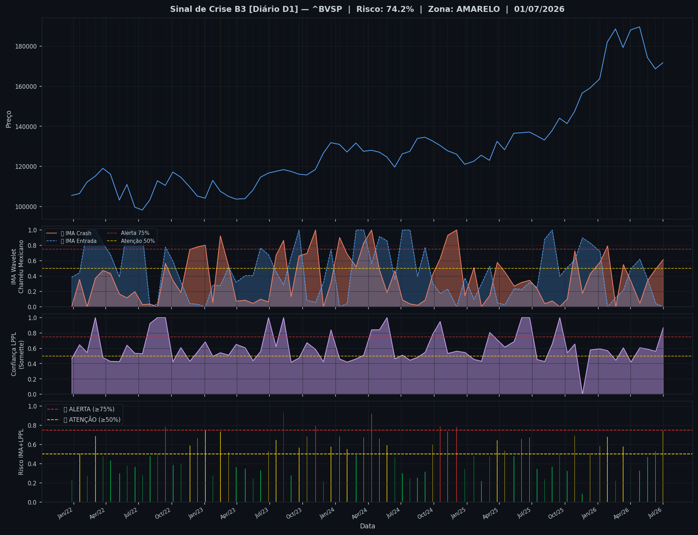
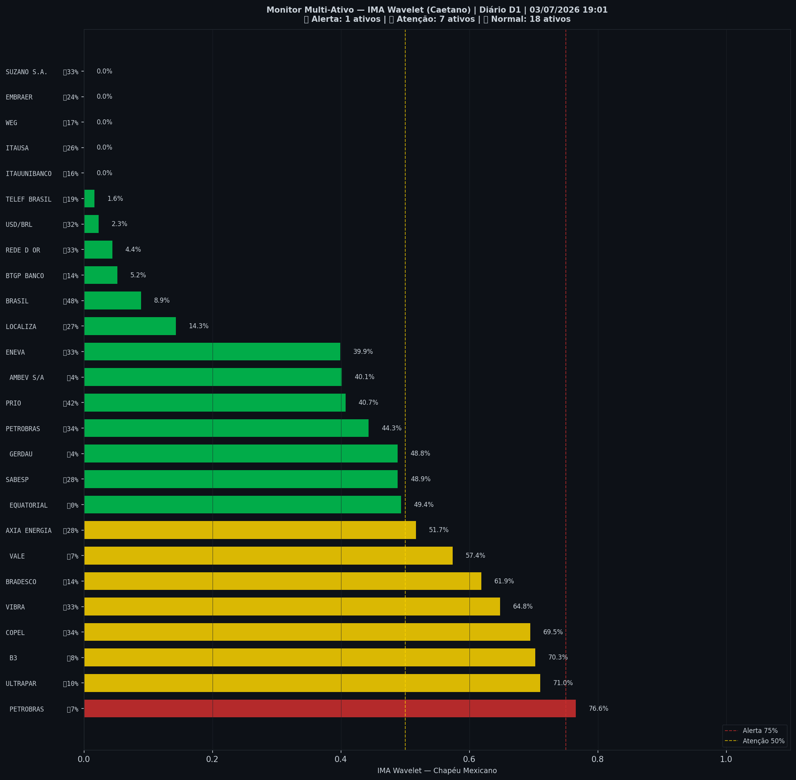

# 🟡 Sinal de Crise B3 — 03/07/2026

> **Gerado em:** 19:03 BRT | **Método:** IMA Wavelet Chapéu Mexicano (Caetano/ITA) + LPPL (Sornette/ETH-Zurich)

---

## Resumo do Dia

| Indicador | Valor | Interpretação |
|---|---|---|
| **Zona** | 🟡 **AMARELO** | Atenção |
| **Risco Combinado** | **74.2%** | IMA + LPPL combinados |
| 🔴 IMA Crash | 61.5% | Alta frequência espectral |
| 🔵 IMA Entrada | 0.0% | Oportunidade de compra |
| 📐 LPPL Sornette | 86.9% | Estrutura de bolha |
| Ibovespa | 171,689 pts | Fechamento |

> ⚡ **ATENÇÃO**: Tensão espectral crescente. Monitore nas próximas sessões.

---

## Gráfico do Sinal

---

## Monitor Multi-Ativo (26 ativos)

**Índice de Confiança:** 31% dos ativos em tensão
(⚡ Tensão moderada)

🔴 Alerta: **1** | 🟡 Atenção: **7** | 🟢 Normal: **18**

| Zona | Ativo | Setor | 🔴 IMA Crash | 🔵 IMA Entrada |
|---|---|---|---|---|
| 🔴 | **PETROBRAS** | Petróleo | 🔴 76.6% |  6.8% |
| 🟡 | **ULTRAPAR** | Outros | 🔴 71.0% |  10.3% |
| 🟡 | **B3** | Financeiro | 🔴 70.3% |  7.7% |
| 🟡 | **COPEL** | Energia | 🔴 69.5% |  34.3% |
| 🟡 | **VIBRA** | Energia | 🔴 64.8% |  32.7% |
| 🟡 | **BRADESCO** | Financeiro | 🔴 61.9% |  13.6% |
| 🟡 | **VALE** | Mineração | 🔴 57.4% |  7.4% |
| 🟡 | **AXIA ENERGIA** | Energia | 🔴 51.7% |  27.6% |
| 🟢 | **EQUATORIAL** | Energia | 🔴 49.4% |  0.0% |
| 🟢 | **SABESP** | Saneamento | 🔴 48.9% |  27.7% |
| 🟢 | **GERDAU** | Siderurgia | 🔴 48.8% |  4.0% |
| 🟢 | **PETROBRAS** | Petróleo | 🔴 44.3% |  34.5% |
| 🟢 | **PRIO** | Petróleo | 🔴 40.7% |  41.9% |
| 🟢 | **AMBEV S/A** | Consumo | 🔴 40.1% |  4.2% |
| 🟢 | **ENEVA** | Energia | 🔴 39.9% |  32.9% |
| 🟢 | **LOCALIZA** | Aluguel | 🔴 14.3% |  27.3% |
| 🟢 | **BRASIL** | Financeiro | 🔴 8.9% |  48.4% |
| 🟢 | **BTGP BANCO** | Financeiro | 🔴 5.2% |  13.9% |
| 🟢 | **REDE D OR** | Saúde | 🔴 4.4% |  33.0% |
| 🟢 | **USD/BRL** | Câmbio | 🔴 2.3% |  31.8% |
| 🟢 | **TELEF BRASIL** | Outros | 🔴 1.6% |  19.2% |
| 🟢 | **ITAUUNIBANCO** | Financeiro | 🔴 0.0% |  15.9% |
| 🟢 | **ITAUSA** | Financeiro | 🔴 0.0% |  26.0% |
| 🟢 | **WEG** | Industrial | 🔴 0.0% |  16.8% |
| 🟢 | **EMBRAER** | Outros | 🔴 0.0% |  23.8% |
| 🟢 | **SUZANO S.A.** | Papel/Celulose | 🔴 0.0% |  32.8% |

---

## Histórico Recente (últimas 10 leituras)

| Data | Zona | Risco | 🔴 IMA Crash | 🔵 IMA Entrada |
|---|---|---|---|---|
| 2025-12-10 | 🟡 AMARELO | 50.5% | — | — |
| 2026-01-06 | 🟡 AMARELO | 58.7% | — | — |
| 2026-01-27 | 🟡 AMARELO | 68.1% | — | — |
| 2026-02-19 | 🟢 VERDE | 22.2% | — | — |
| 2026-03-12 | 🟡 AMARELO | 57.8% | — | — |
| 2026-04-02 | 🟢 VERDE | 37.5% | — | — |
| 2026-04-27 | 🟢 VERDE | 32.7% | — | — |
| 2026-05-19 | 🟢 VERDE | 46.8% | — | — |
| 2026-06-10 | 🟡 AMARELO | 52.6% | — | — |
| 2026-07-01 | 🟡 AMARELO | 74.2% | — | — |

---

## Como interpretar

| Indicador | O que significa |
|---|---|
| 🔴 **IMA Crash alto** | Alta frequência espectral — mercado nervoso, pré-crise |
| 🔵 **IMA Entrada alto** | Baixa frequência estável — possível oportunidade de compra |
| 📐 **LPPL alto** | Estrutura de bolha detectada — risco de crash acelerado |
| **Índice Multi-Ativo** | % de ativos em tensão — quanto maior, mais confiável o sinal |

> Sinal mais confiável quando **múltiplos ativos** disparam simultaneamente.

---

## Metodologia

O **IMA Wavelet** (Índice de Mudanças Abruptas) é baseado no método do Prof. Marco Antonio Leonel Caetano (ITA/INSPER), publicado na revista Physica-A (Elsevier). Usa a **Transformada Wavelet Contínua com Chapéu Mexicano** para detectar regimes de alta frequência com baixa volatilidade — padrão que antecede mudanças abruptas no mercado.

O **LPPL** (Log-Periodic Power Law) é baseado no modelo do Prof. Didier Sornette (ETH-Zurich), que detecta estruturas de bolha especulativa com oscilações aceleradas.

> **Aviso:** Este é um estudo acadêmico e não constitui recomendação de investimento. Use com análise própria.

---
*Gerado automaticamente pelo Sistema Sinal de Crise B3 | [Metodologia](../metodologia) | [Histórico](../historico)*
