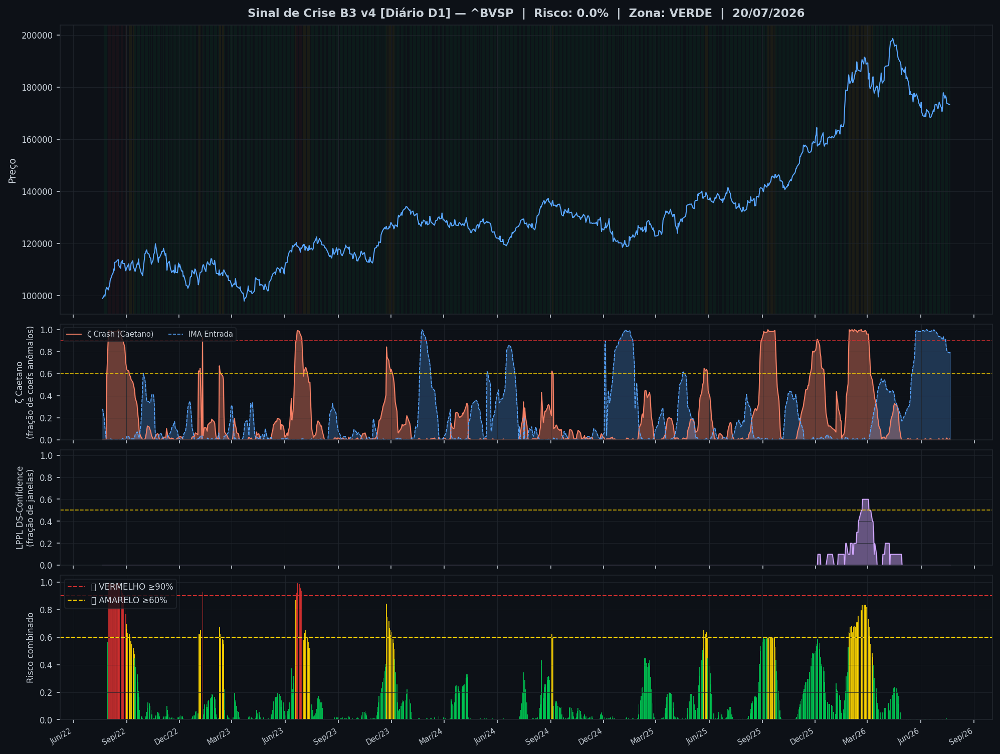
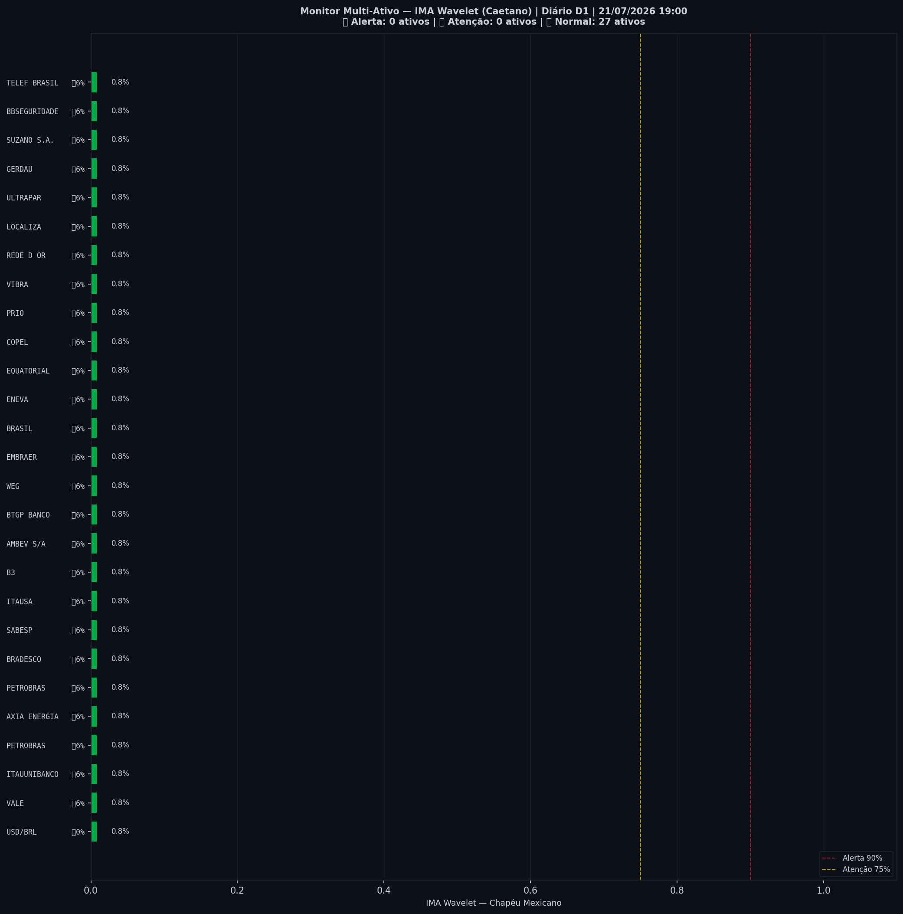

> [!success] 🟢 **VERDE** — Risco 0% · ＝ -0 p.p. vs leitura anterior
> `░░░░░░░░░░░░░░░░░░░░`
> Mercado sem sinais relevantes de estresse.

| Indicador | Valor |
|---|---|
| 🔴 ζ Crash — severidade da queda em curso | **0%** |
| 🔵 ζ Entrada — estrutura de fundo | 80% |
| 🫧 LPPL DS-Confidence | 0% |
| 📊 Ibovespa | 173.326 pts |

## Últimos 30 pregões

| Data | Zona | Risco | IMA Crash | Entrada | LPPL |
|---|---|---|---|---|---|
| 2026-07-20 21:00 | 🟢 VERDE | **0%** | 0% | 80% | 0% |
| 2026-07-19 21:00 | 🟢 VERDE | **0%** | 1% | 79% | 0% |
| 2026-07-16 21:00 | 🟢 VERDE | **0%** | 0% | 80% | 0% |
| 2026-07-15 21:00 | 🟢 VERDE | **0%** | 1% | 80% | 0% |
| 2026-07-14 21:00 | 🟢 VERDE | **1%** | 2% | 81% | 0% |
| 2026-07-13 21:00 | 🟢 VERDE | **0%** | 1% | 85% | 0% |
| 2026-07-12 21:00 | 🟢 VERDE | **0%** | 0% | 91% | 0% |
| 2026-07-09 21:00 | 🟢 VERDE | **0%** | 0% | 91% | 0% |
| 2026-07-08 21:00 | 🟢 VERDE | **0%** | 1% | 94% | 0% |
| 2026-07-07 21:00 | 🟢 VERDE | **0%** | 1% | 93% | 0% |
| 2026-07-06 21:00 | 🟢 VERDE | **0%** | 0% | 91% | 0% |
| 2026-07-05 21:00 | 🟢 VERDE | **0%** | 0% | 93% | 0% |
| 2026-07-02 21:00 | 🟢 VERDE | **0%** | 0% | 94% | 0% |
| 2026-07-01 21:00 | 🟢 VERDE | **0%** | 1% | 94% | 0% |
| 2026-06-30 21:00 | 🟢 VERDE | **0%** | 1% | 94% | 0% |
| 2026-06-29 21:00 | 🟢 VERDE | **0%** | 0% | 95% | 0% |
| 2026-06-28 21:00 | 🟢 VERDE | **0%** | 0% | 96% | 0% |
| 2026-06-25 21:00 | 🟢 VERDE | **0%** | 0% | 98% | 0% |
| 2026-06-24 21:00 | 🟢 VERDE | **0%** | 0% | 98% | 0% |
| 2026-06-23 21:00 | 🟢 VERDE | **0%** | 0% | 99% | 0% |
| 2026-06-22 21:00 | 🟢 VERDE | **0%** | 0% | 100% | 0% |
| 2026-06-21 21:00 | 🟢 VERDE | **0%** | 0% | 99% | 0% |
| 2026-06-18 21:00 | 🟢 VERDE | **0%** | 0% | 99% | 0% |
| 2026-06-17 21:00 | 🟢 VERDE | **0%** | 1% | 98% | 0% |
| 2026-06-16 21:00 | 🟢 VERDE | **0%** | 1% | 98% | 0% |
| 2026-06-15 21:00 | 🟢 VERDE | **0%** | 1% | 98% | 0% |
| 2026-06-14 21:00 | 🟢 VERDE | **0%** | 0% | 98% | 0% |
| 2026-06-11 21:00 | 🟢 VERDE | **0%** | 0% | 99% | 0% |
| 2026-06-10 21:00 | 🟢 VERDE | **0%** | 0% | 100% | 0% |
| 2026-06-09 21:00 | 🟢 VERDE | **0%** | 0% | 100% | 0% |

## Monitor Multi-Ativo

**0% dos ativos em tensão** (0🔴 0🟡) — quanto mais ativos disparam juntos, mais confiável o sinal.

| Zona | Ativo | Setor | IMA Crash | IMA Entrada |
|---|---|---|---|---|
| 🟢 | **VALE** | Mineração | 0.8% | 6.2% |
| 🟢 | **ITAUUNIBANCO** | Financeiro | 0.8% | 6.2% |
| 🟢 | **PETROBRAS** | Petróleo | 0.8% | 6.2% |
| 🟢 | **AXIA ENERGIA** | Energia | 0.8% | 6.2% |
| 🟢 | **PETROBRAS** | Petróleo | 0.8% | 6.2% |
| 🟢 | **BRADESCO** | Financeiro | 0.8% | 6.2% |
| 🟢 | **SABESP** | Saneamento | 0.8% | 6.2% |
| 🟢 | **ITAUSA** | Financeiro | 0.8% | 6.2% |
| 🟢 | **B3** | Financeiro | 0.8% | 6.2% |
| 🟢 | **AMBEV S/A** | Consumo | 0.8% | 6.2% |
| 🟢 | **BTGP BANCO** | Financeiro | 0.8% | 6.2% |
| 🟢 | **WEG** | Industrial | 0.8% | 6.2% |
| 🟢 | **EMBRAER** | Outros | 0.8% | 6.2% |
| 🟢 | **BRASIL** | Financeiro | 0.8% | 6.2% |
| 🟢 | **ENEVA** | Energia | 0.8% | 6.2% |
| 🟢 | **EQUATORIAL** | Energia | 0.8% | 6.2% |
| 🟢 | **COPEL** | Energia | 0.8% | 6.2% |
| 🟢 | **PRIO** | Petróleo | 0.8% | 6.2% |
| 🟢 | **VIBRA** | Energia | 0.8% | 6.2% |
| 🟢 | **REDE D OR** | Saúde | 0.8% | 6.2% |
| 🟢 | **LOCALIZA** | Aluguel | 0.8% | 6.2% |
| 🟢 | **ULTRAPAR** | Outros | 0.8% | 6.2% |
| 🟢 | **GERDAU** | Siderurgia | 0.8% | 6.2% |
| 🟢 | **SUZANO S.A.** | Papel/Celulose | 0.8% | 6.2% |
| 🟢 | **BBSEGURIDADE** | Financeiro | 0.8% | 6.2% |
| 🟢 | **TELEF BRASIL** | Outros | 0.8% | 6.2% |
| 🟢 | **USD/BRL** | Câmbio | 0.8% | 0.0% |

*Página atualizada em 21/07/2026 19:00 BRT (leitura da barra de 2026-07-20 BRT).*

> [!info]- Como interpretar (clique para expandir)
> - **ζ Crash**: fração dos coeficientes wavelet acima do corte (Caetano & Yoneyama 2009). Escala absoluta: ζ=0,90 = 90% dos coeficientes anômalos — historicamente, quedas com ζ≥0,90 foram mais fundas e mais longas. **Mede a severidade do movimento em curso, não prevê o início da queda.**
> - **ζ Entrada**: coeficientes negativos além do corte — estrutura de fundo, possível região de compra.
> - **LPPL DS-Confidence**: fração de janelas (60–504 pregões) em que o modelo de bolha de Sornette produz um ajuste válido. 30% já é relevante; acima de 50% é forte evidência de estrutura de bolha.
> - **Zonas com histerese**: o sinal só muda de zona ao cruzar o limiar de entrada, e só volta ao cruzar o de saída — evita flip-flop diário.

---
*Sinal de Crise B3 v4 · IMA Wavelet ([Caetano & Yoneyama, Physica-A 2007](https://doi.org/10.1016/j.physa.2007.03.054)) + LPPL DS-Confidence (Sornette, ETH-Zurich) · [Metodologia](metodologia) · [Histórico](historico)*

> [!quote]- Aviso
> Estudo acadêmico. Não constitui recomendação de investimento.
