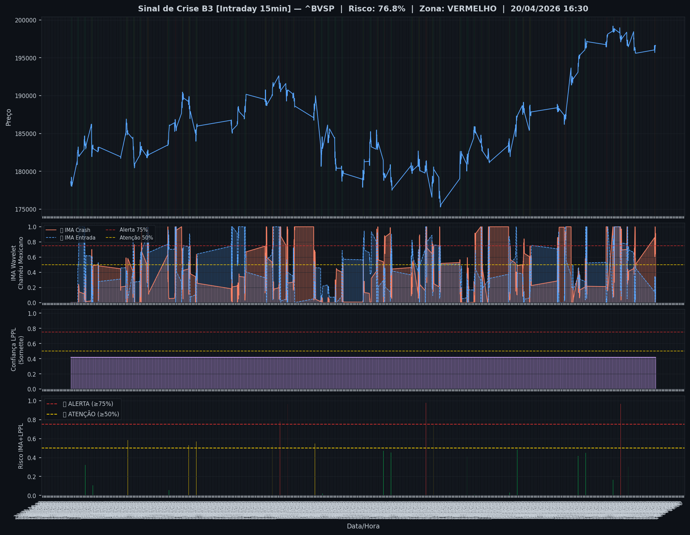
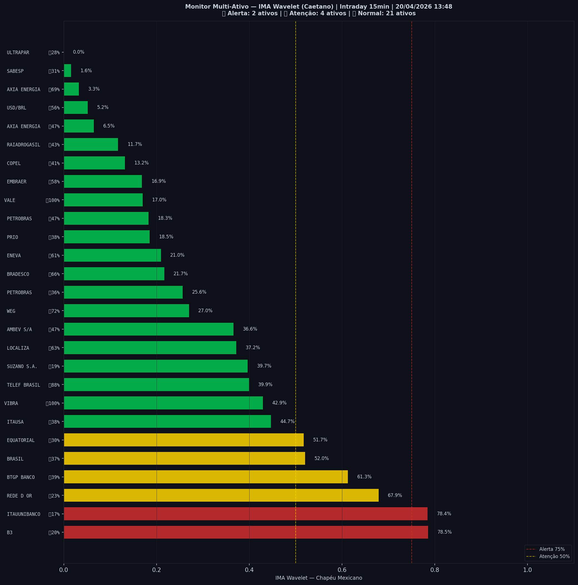

# 🔴 Intraday — 20/04/2026 13:51

| Indicador | Valor |
|---|---|
| **Zona** | 🔴 **VERMELHO** |
| **Risco IMA** | **76.8%** |
| 🔴 IMA Crash 15min | 76.8% |
| 💵 USD/BRL IMA Crash | 5.2% 🟢 |
| 💵 USD/BRL IMA Entrada | 56.4% |
| Ativos em tensão | 22% (2🔴 4🟡) |

> *Atualizado às 13:51 BRT — Método IMA Wavelet Chapéu Mexicano (Caetano/ITA)*
