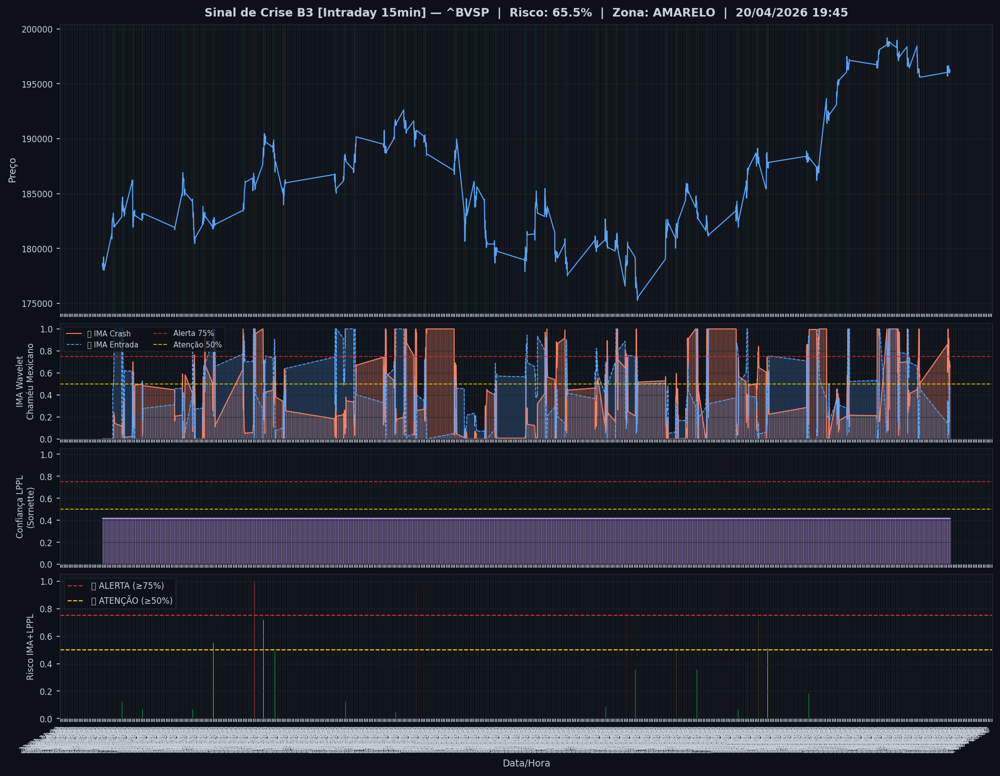
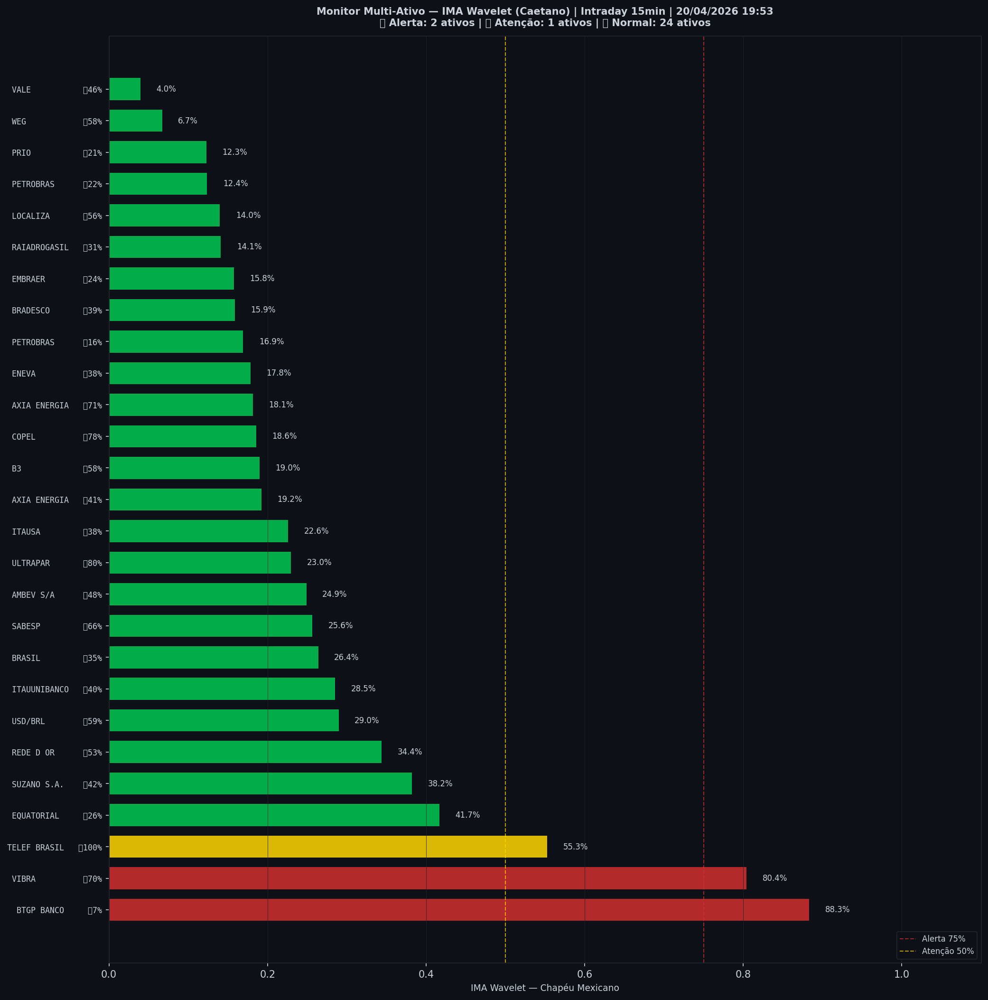

# 🟢 Intraday — 20/04/2026 19:57

| Indicador | Valor |
|---|---|
| **Zona** | 🟢 **VERDE** |
| **Risco IMA** | **38.1%** |
| 🔴 IMA Crash 15min | 34.4% |
| 💵 USD/BRL IMA Crash | 42.1% 🟢 |
| 💵 USD/BRL IMA Entrada | 34.7% |
| Ativos em tensão | 12% (2🔴 1🟡) |

> *Atualizado às 19:57 BRT — Método IMA Wavelet Chapéu Mexicano (Caetano/ITA)*
