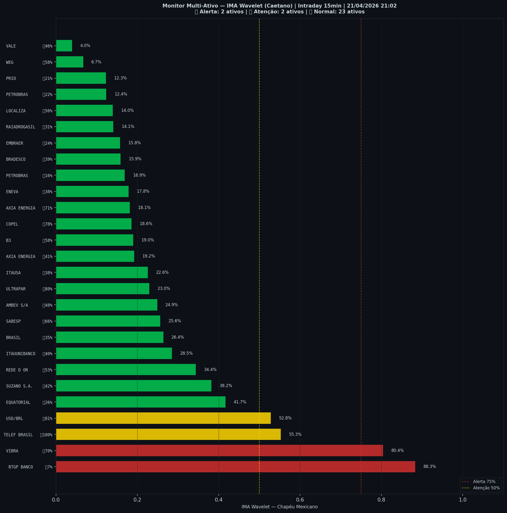

# 🟡 Intraday — 21/04/2026 21:10

| Indicador | Valor |
|---|---|
| **Zona** | 🟡 **AMARELO** |
| **Risco IMA** | **65.5%** |
| 🔴 IMA Crash 15min | 65.5% |
| 💵 USD/BRL IMA Crash | 52.8% 🟡 |
| 💵 USD/BRL IMA Entrada | 81.4% |
| Ativos em tensão | 15% (2🔴 2🟡) |

> *Atualizado às 21:10 BRT — Método IMA Wavelet Chapéu Mexicano (Caetano/ITA)*
