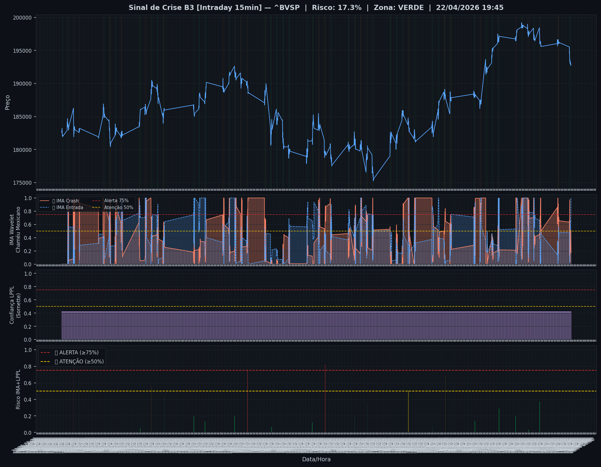
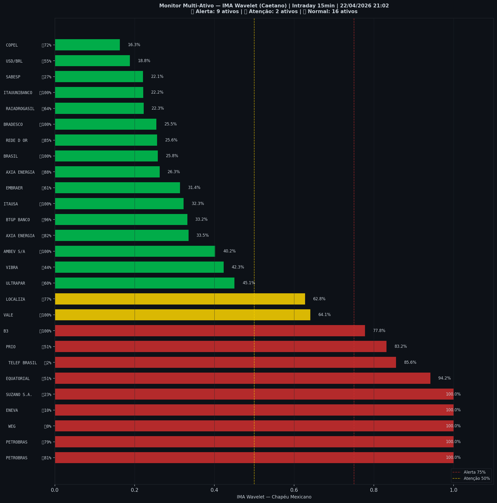

# 🟢 Intraday — 22/04/2026 21:10

| Indicador | Valor |
|---|---|
| **Zona** | 🟢 **VERDE** |
| **Risco IMA** | **17.3%** |
| 🔴 IMA Crash 15min | 17.3% |
| 💵 USD/BRL IMA Crash | 18.8% 🟢 |
| 💵 USD/BRL IMA Entrada | 55.0% |
| Ativos em tensão | 41% (9🔴 2🟡) |

> *Atualizado às 21:10 BRT — Método IMA Wavelet Chapéu Mexicano (Caetano/ITA)*
