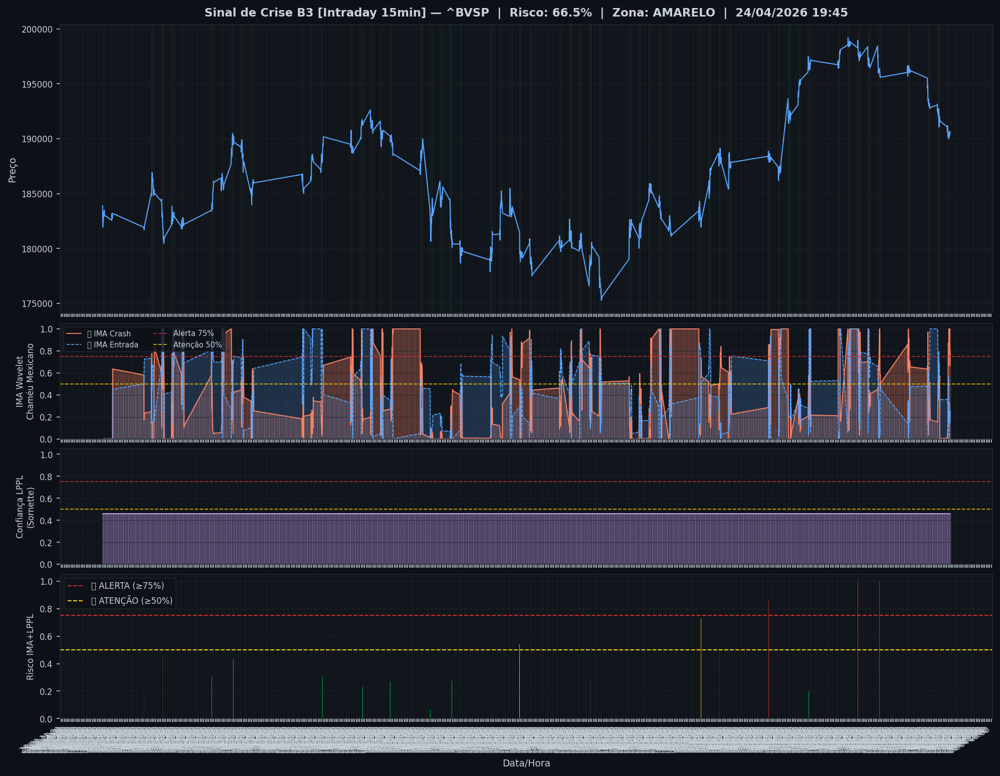
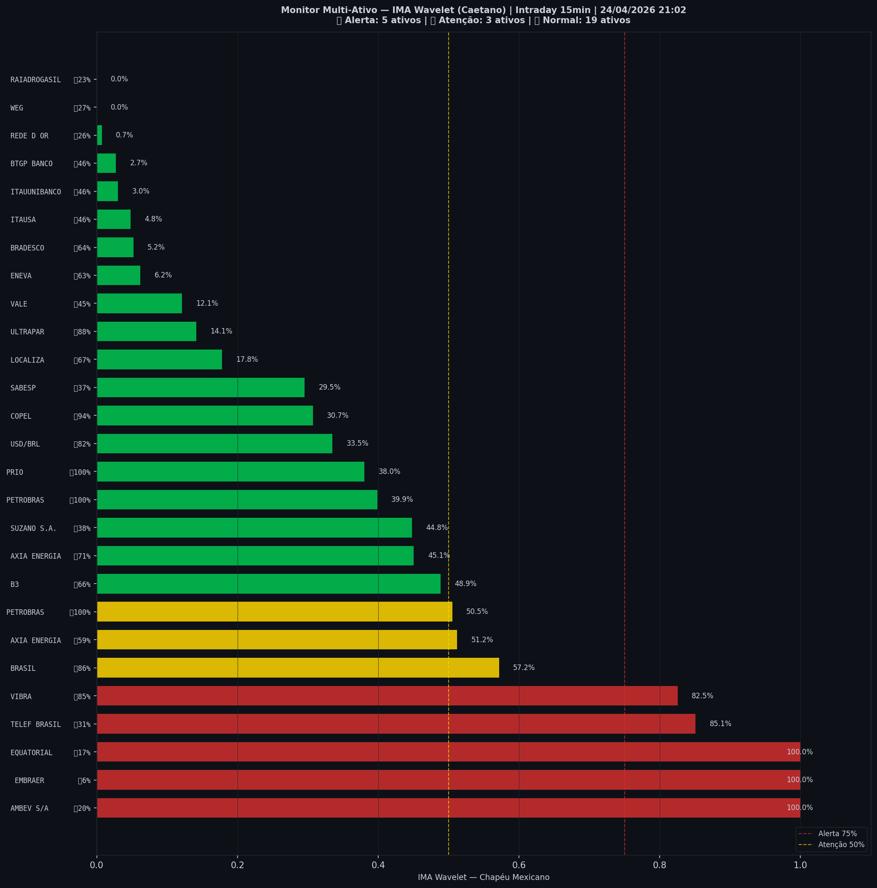

# 🟡 Intraday — 24/04/2026 21:10

| Indicador | Valor |
|---|---|
| **Zona** | 🟡 **AMARELO** |
| **Risco IMA** | **66.5%** |
| 🔴 IMA Crash 15min | 66.5% |
| 💵 USD/BRL IMA Crash | 33.5% 🟢 |
| 💵 USD/BRL IMA Entrada | 81.9% |
| Ativos em tensão | 30% (5🔴 3🟡) |

> *Atualizado às 21:10 BRT — Método IMA Wavelet Chapéu Mexicano (Caetano/ITA)*
