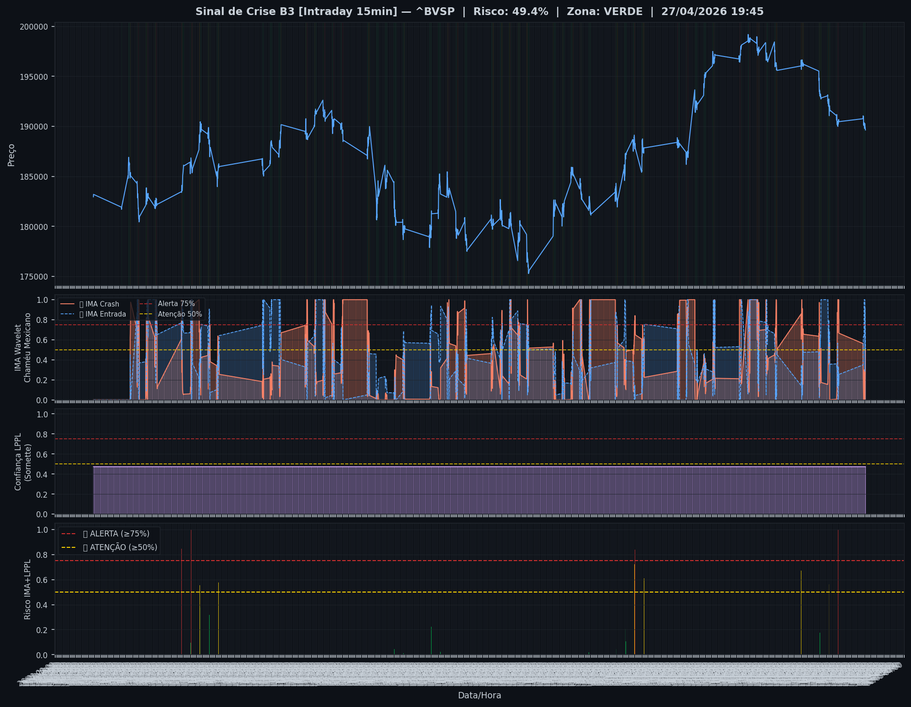
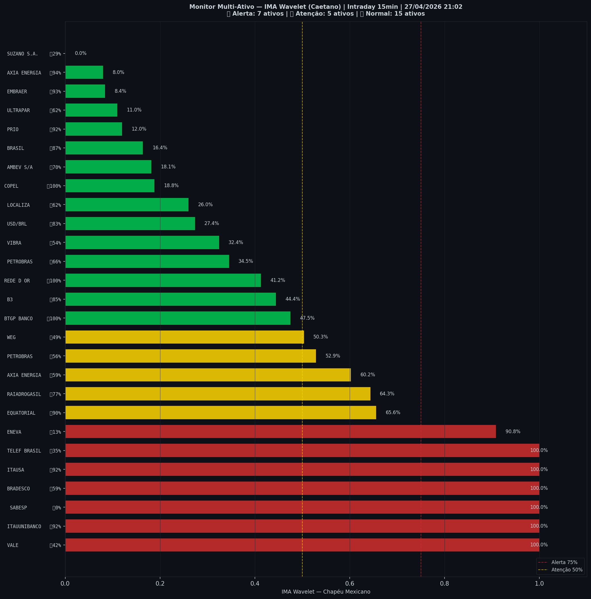

# 🟢 Intraday — 27/04/2026 21:10

| Indicador | Valor |
|---|---|
| **Zona** | 🟢 **VERDE** |
| **Risco IMA** | **49.4%** |
| 🔴 IMA Crash 15min | 49.4% |
| 💵 USD/BRL IMA Crash | 27.4% 🟢 |
| 💵 USD/BRL IMA Entrada | 82.6% |
| Ativos em tensão | 44% (7🔴 5🟡) |

> *Atualizado às 21:10 BRT — Método IMA Wavelet Chapéu Mexicano (Caetano/ITA)*
