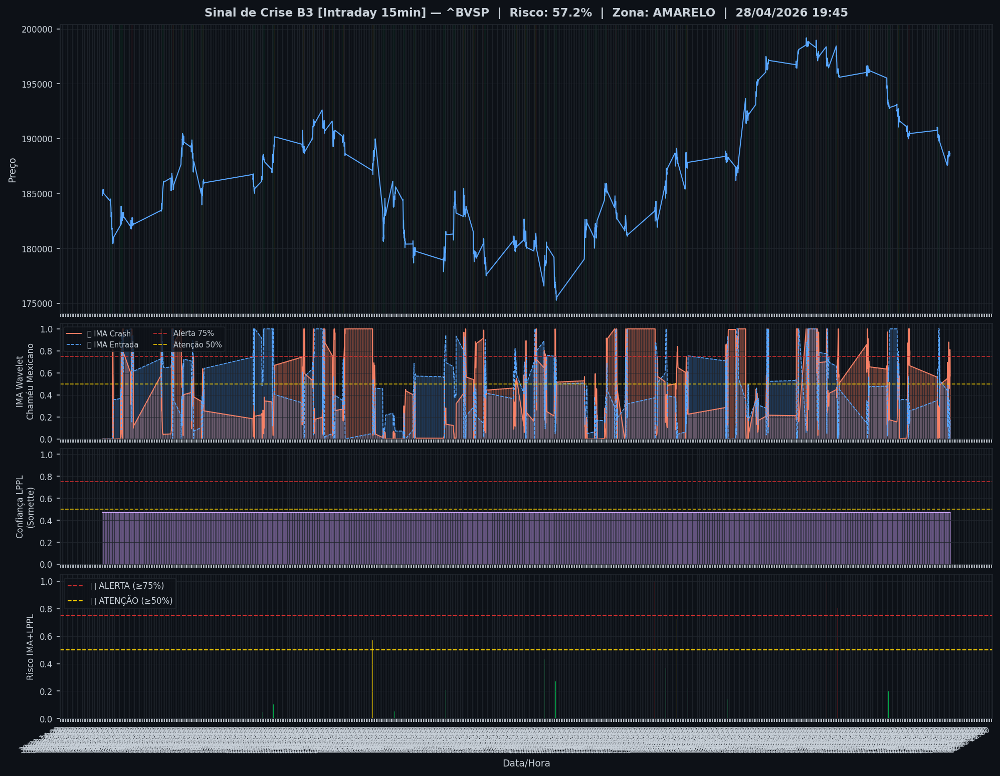
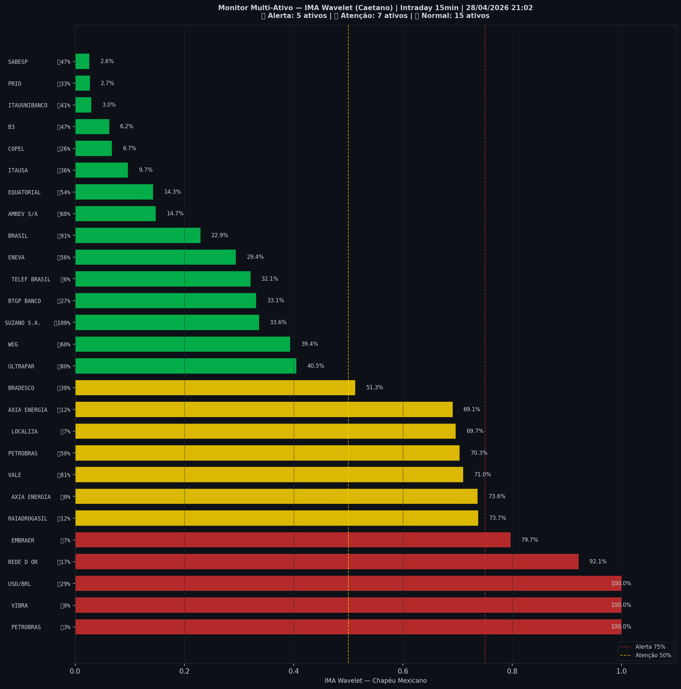

# 🟡 Intraday — 28/04/2026 21:10

| Indicador | Valor |
|---|---|
| **Zona** | 🟡 **AMARELO** |
| **Risco IMA** | **57.2%** |
| 🔴 IMA Crash 15min | 57.2% |
| 💵 USD/BRL IMA Crash | 100.0% 🔴 |
| 💵 USD/BRL IMA Entrada | 28.7% |
| Ativos em tensão | 44% (5🔴 7🟡) |

> *Atualizado às 21:10 BRT — Método IMA Wavelet Chapéu Mexicano (Caetano/ITA)*
