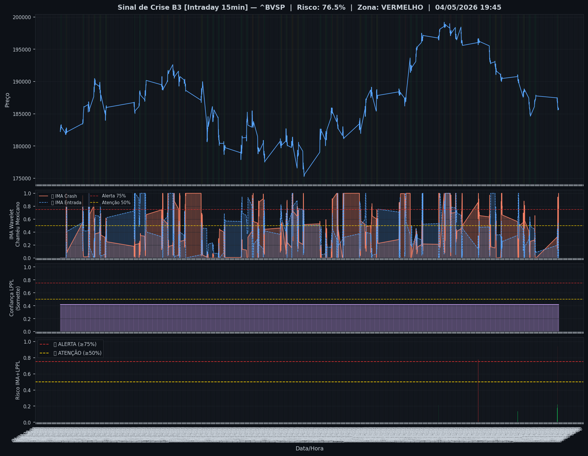
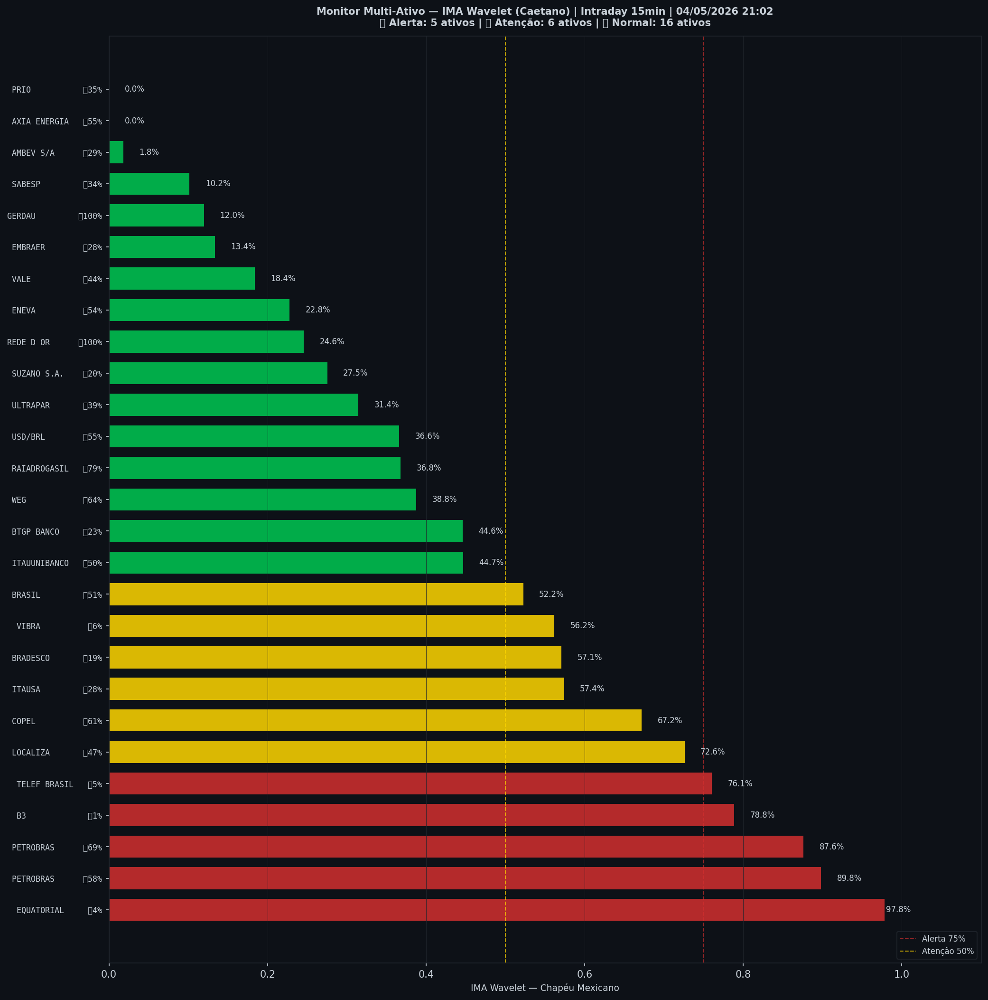

# 🔴 Intraday — 04/05/2026 21:10

| Indicador | Valor |
|---|---|
| **Zona** | 🔴 **VERMELHO** |
| **Risco IMA** | **76.5%** |
| 🔴 IMA Crash 15min | 76.5% |
| 💵 USD/BRL IMA Crash | 36.6% 🟢 |
| 💵 USD/BRL IMA Entrada | 54.5% |
| Ativos em tensão | 41% (5🔴 6🟡) |

> *Atualizado às 21:10 BRT — Método IMA Wavelet Chapéu Mexicano (Caetano/ITA)*
