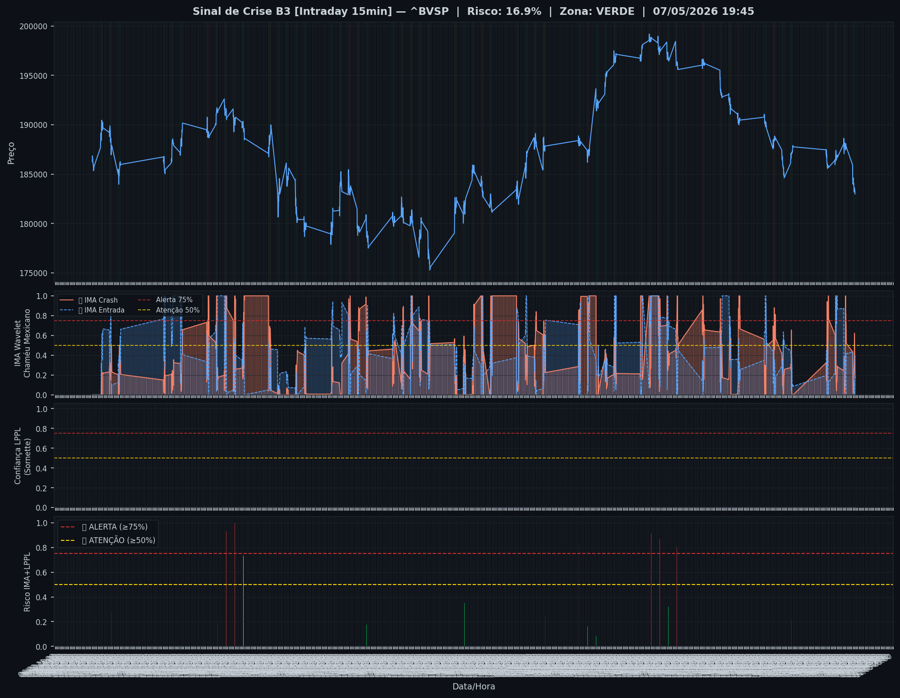
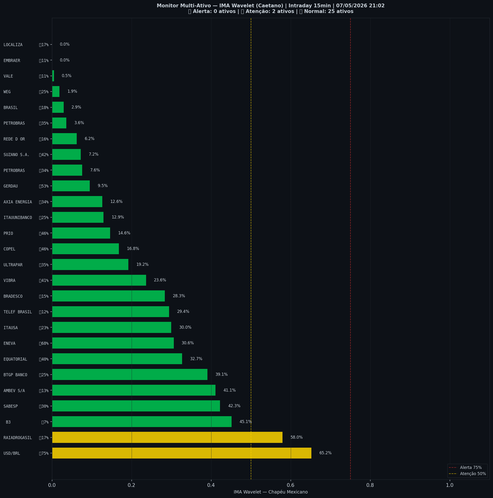

# 🟢 Intraday — 07/05/2026 21:10

| Indicador | Valor |
|---|---|
| **Zona** | 🟢 **VERDE** |
| **Risco IMA** | **16.9%** |
| 🔴 IMA Crash 15min | 16.9% |
| 💵 USD/BRL IMA Crash | 65.2% 🟡 |
| 💵 USD/BRL IMA Entrada | 75.2% |
| Ativos em tensão | 7% (0🔴 2🟡) |

> *Atualizado às 21:10 BRT — Método IMA Wavelet Chapéu Mexicano (Caetano/ITA)*
