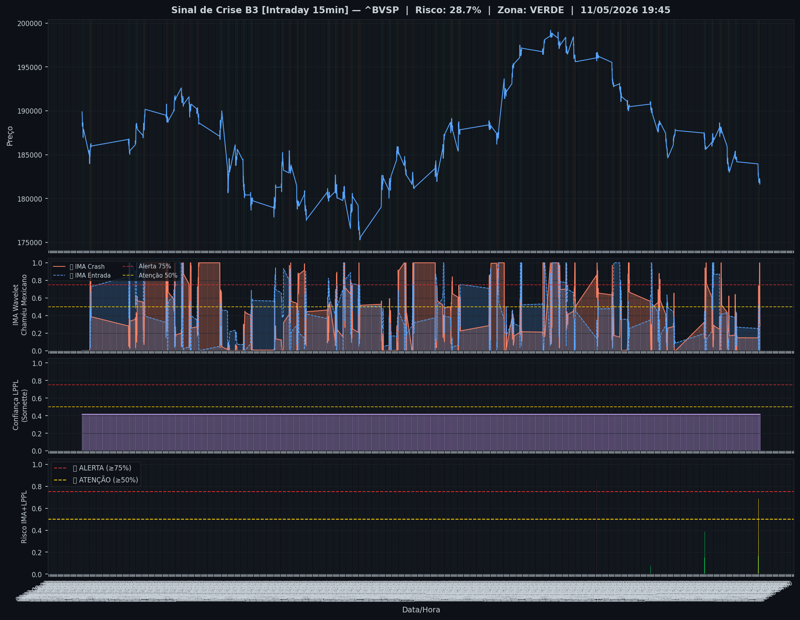
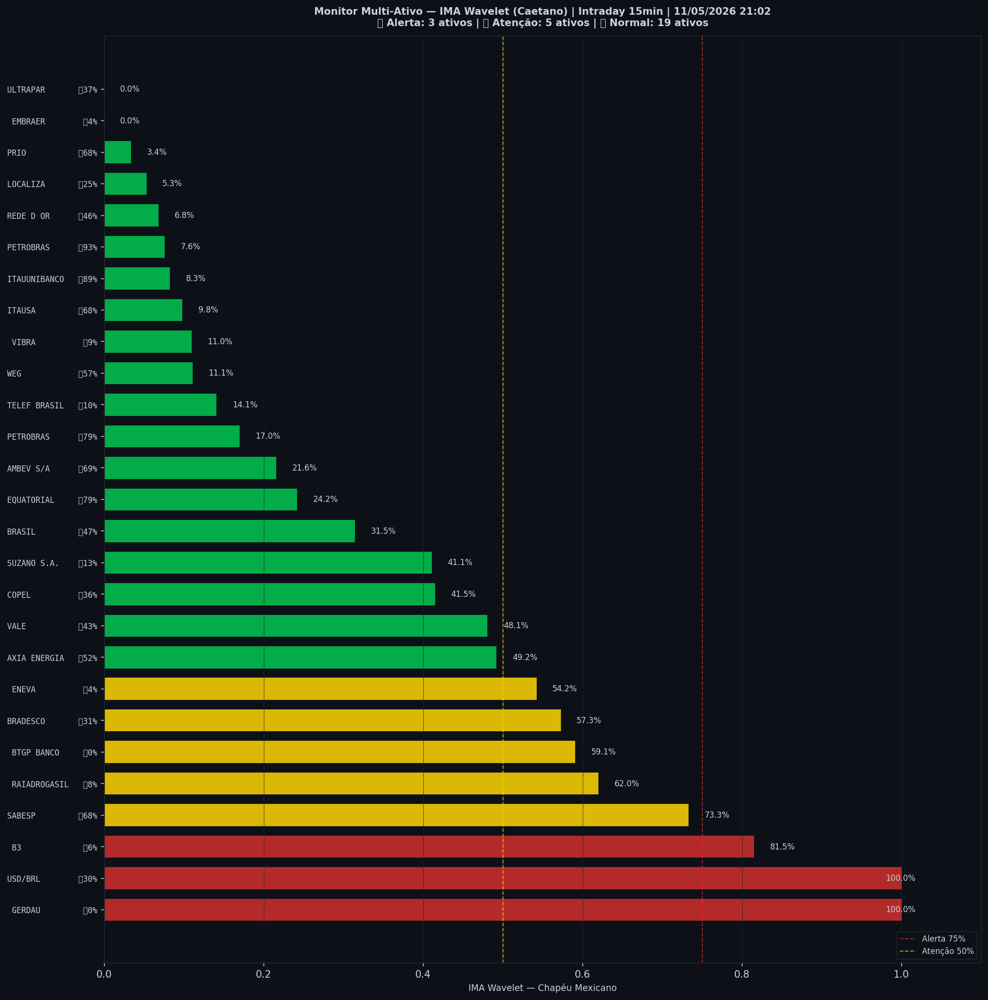

# 🟢 Intraday — 11/05/2026 21:10

| Indicador | Valor |
|---|---|
| **Zona** | 🟢 **VERDE** |
| **Risco IMA** | **28.7%** |
| 🔴 IMA Crash 15min | 28.7% |
| 💵 USD/BRL IMA Crash | 100.0% 🔴 |
| 💵 USD/BRL IMA Entrada | 29.6% |
| Ativos em tensão | 30% (3🔴 5🟡) |

> *Atualizado às 21:10 BRT — Método IMA Wavelet Chapéu Mexicano (Caetano/ITA)*
