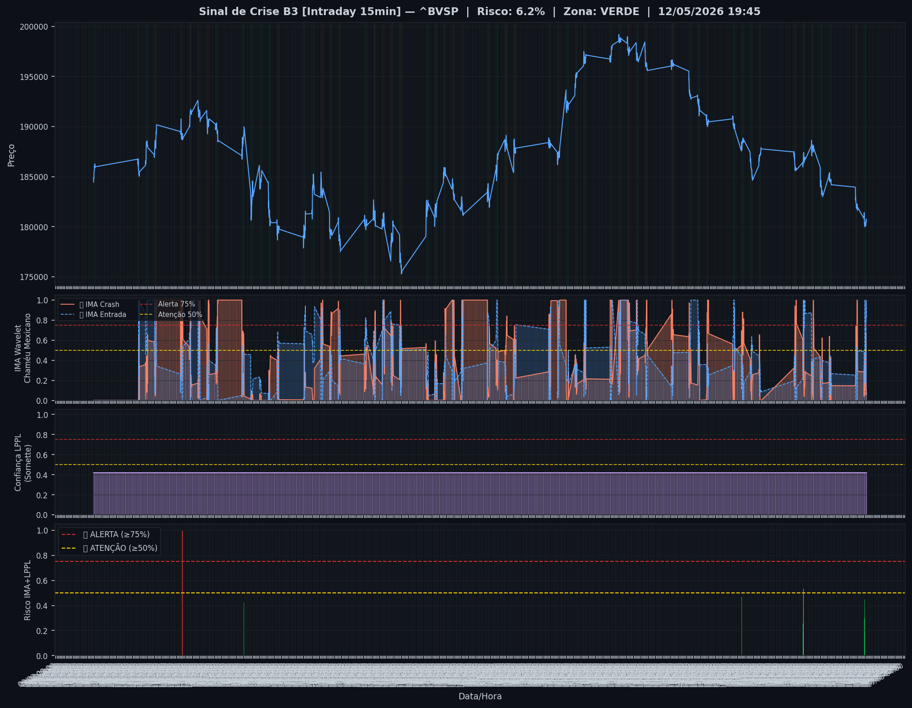
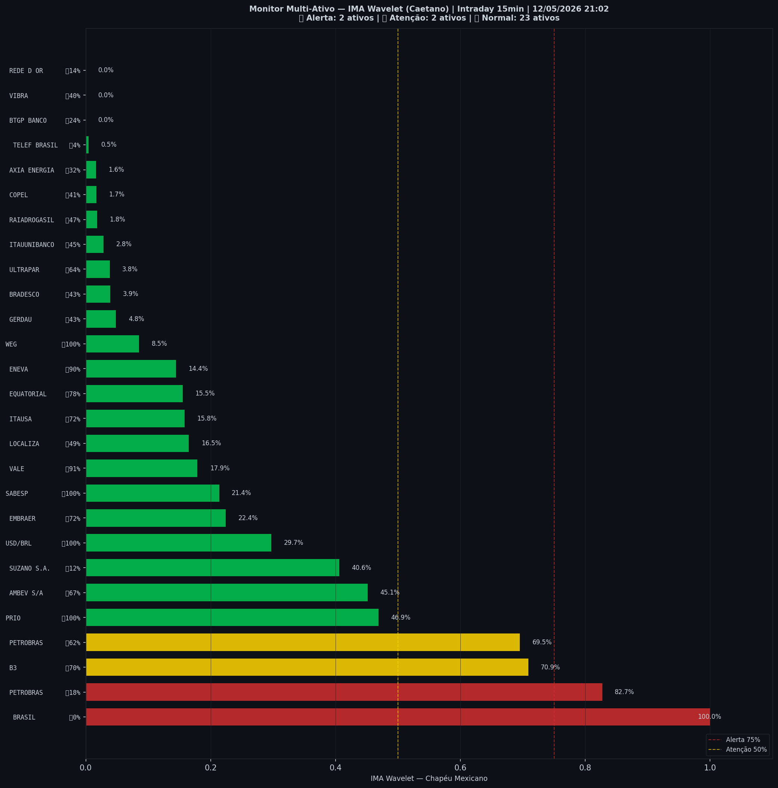

# 🟢 Intraday — 12/05/2026 21:10

| Indicador | Valor |
|---|---|
| **Zona** | 🟢 **VERDE** |
| **Risco IMA** | **6.2%** |
| 🔴 IMA Crash 15min | 6.2% |
| 💵 USD/BRL IMA Crash | 29.7% 🟢 |
| 💵 USD/BRL IMA Entrada | 100.0% |
| Ativos em tensão | 15% (2🔴 2🟡) |

> *Atualizado às 21:10 BRT — Método IMA Wavelet Chapéu Mexicano (Caetano/ITA)*
