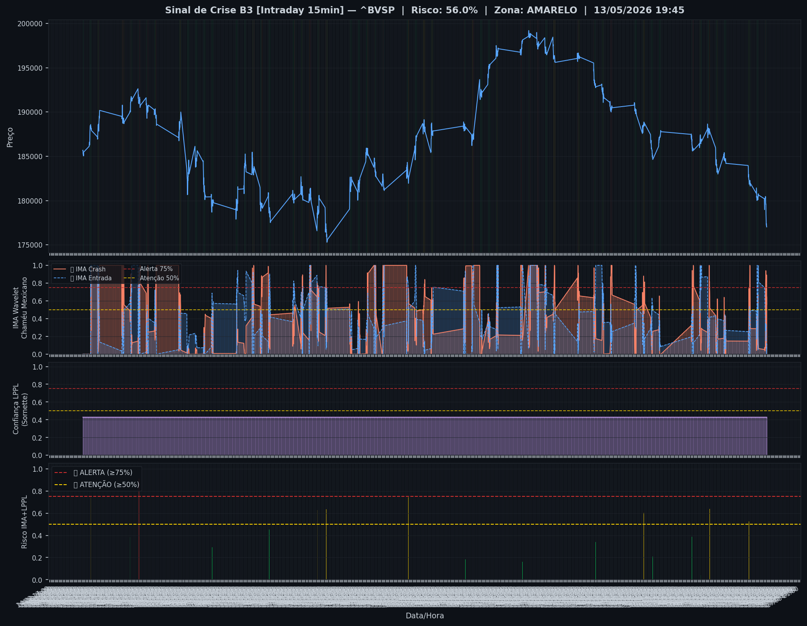
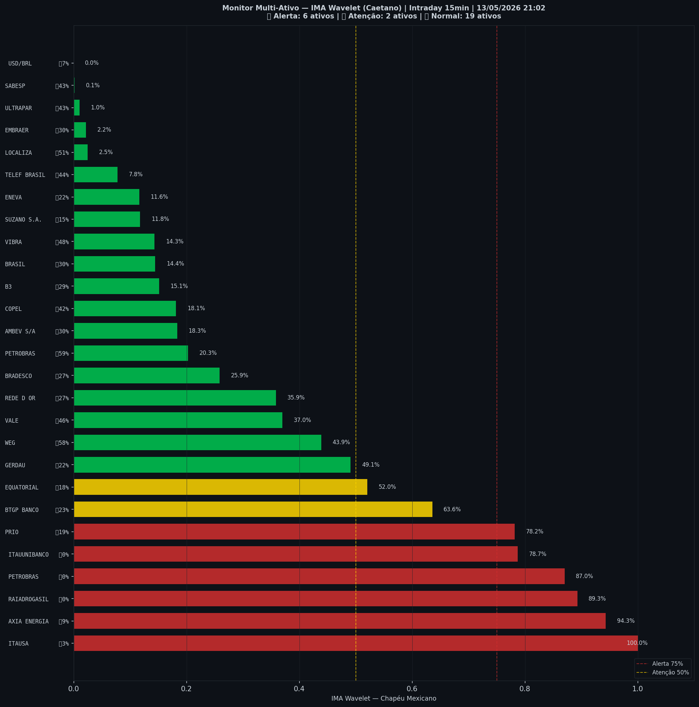

# 🟡 Intraday — 13/05/2026 21:10

| Indicador | Valor |
|---|---|
| **Zona** | 🟡 **AMARELO** |
| **Risco IMA** | **56.0%** |
| 🔴 IMA Crash 15min | 56.0% |
| 💵 USD/BRL IMA Crash | 0.0% 🟢 |
| 💵 USD/BRL IMA Entrada | 7.0% |
| Ativos em tensão | 30% (6🔴 2🟡) |

> *Atualizado às 21:10 BRT — Método IMA Wavelet Chapéu Mexicano (Caetano/ITA)*
