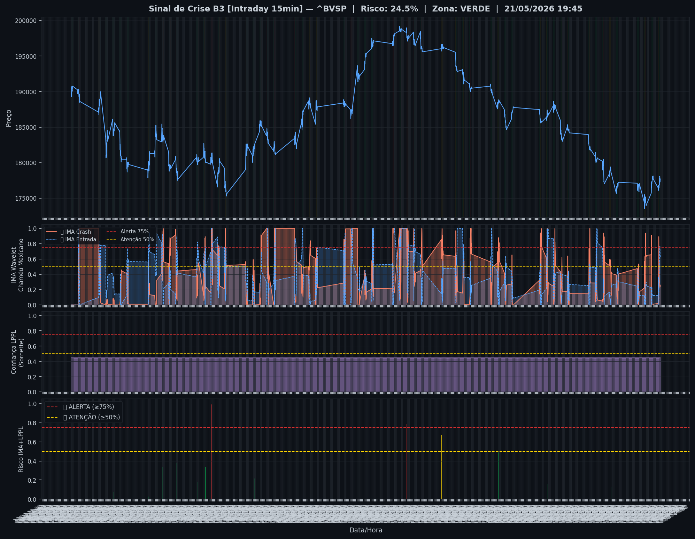
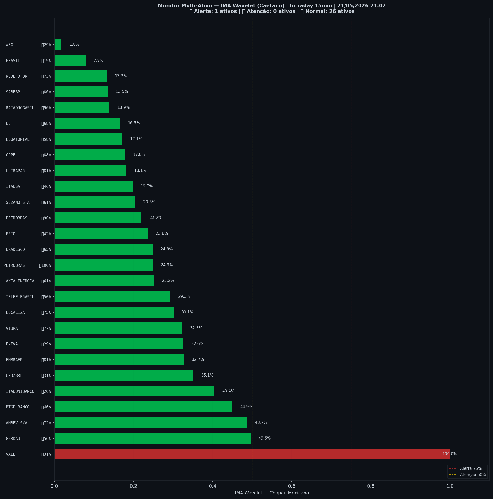

# 🟢 Intraday — 21/05/2026 21:10

| Indicador | Valor |
|---|---|
| **Zona** | 🟢 **VERDE** |
| **Risco IMA** | **24.6%** |
| 🔴 IMA Crash 15min | 24.6% |
| 💵 USD/BRL IMA Crash | 35.1% 🟢 |
| 💵 USD/BRL IMA Entrada | 31.0% |
| Ativos em tensão | 4% (1🔴 0🟡) |

> *Atualizado às 21:10 BRT — Método IMA Wavelet Chapéu Mexicano (Caetano/ITA)*
