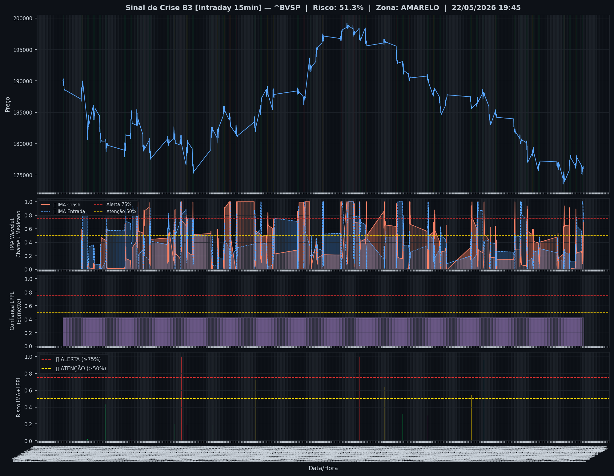
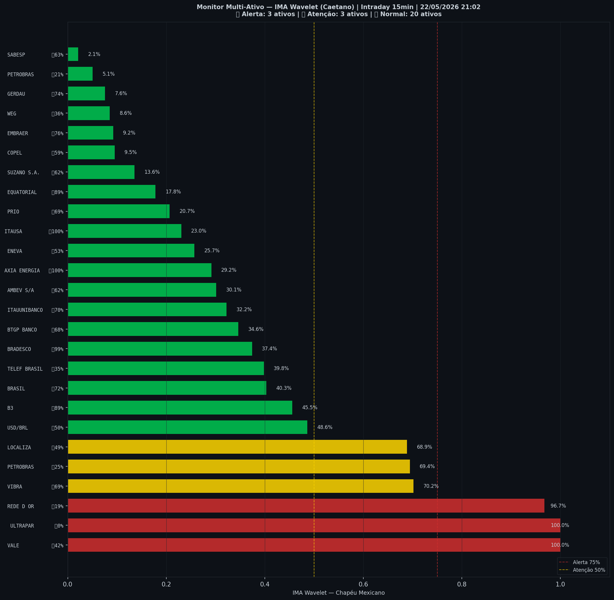

# 🟡 Intraday — 22/05/2026 21:10

| Indicador | Valor |
|---|---|
| **Zona** | 🟡 **AMARELO** |
| **Risco IMA** | **51.3%** |
| 🔴 IMA Crash 15min | 51.3% |
| 💵 USD/BRL IMA Crash | 48.6% 🟢 |
| 💵 USD/BRL IMA Entrada | 50.1% |
| Ativos em tensão | 23% (3🔴 3🟡) |

> *Atualizado às 21:10 BRT — Método IMA Wavelet Chapéu Mexicano (Caetano/ITA)*
