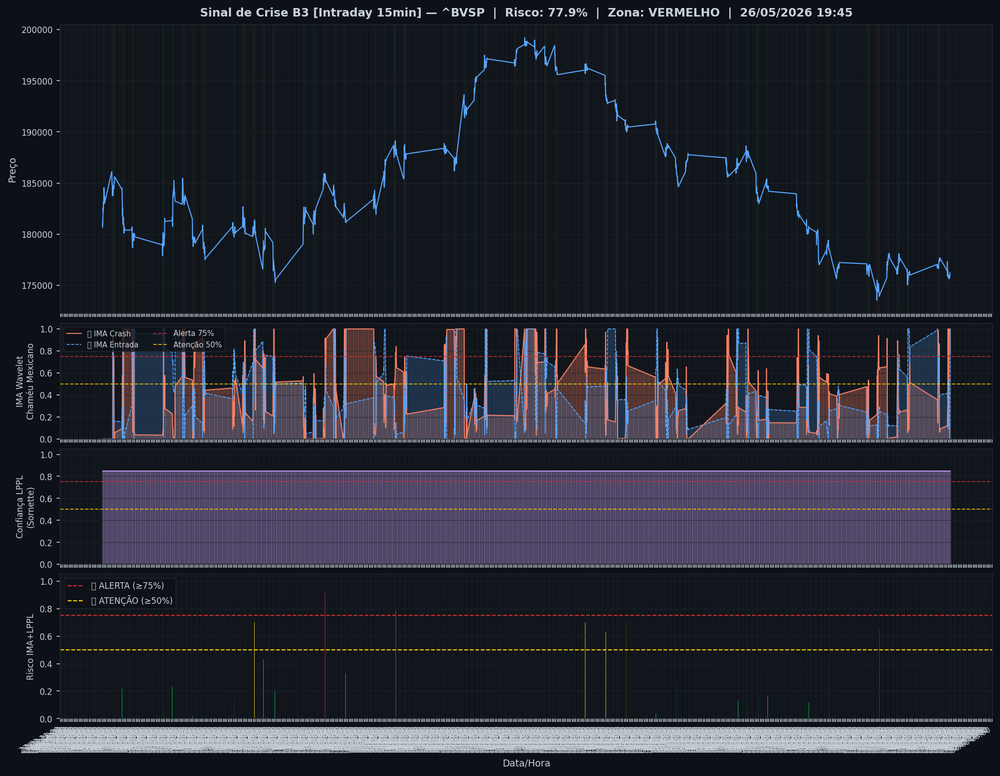
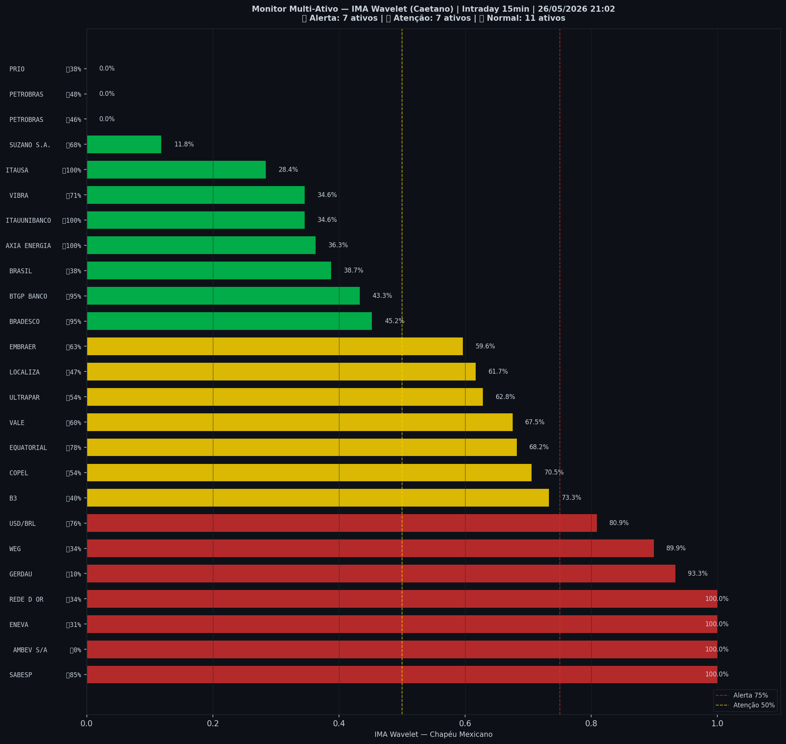

# 🔴 Intraday — 26/05/2026 21:10

| Indicador | Valor |
|---|---|
| **Zona** | 🔴 **VERMELHO** |
| **Risco IMA** | **77.9%** |
| 🔴 IMA Crash 15min | 77.9% |
| 💵 USD/BRL IMA Crash | 80.9% 🔴 |
| 💵 USD/BRL IMA Entrada | 75.6% |
| Ativos em tensão | 56% (7🔴 7🟡) |

> *Atualizado às 21:10 BRT — Método IMA Wavelet Chapéu Mexicano (Caetano/ITA)*
