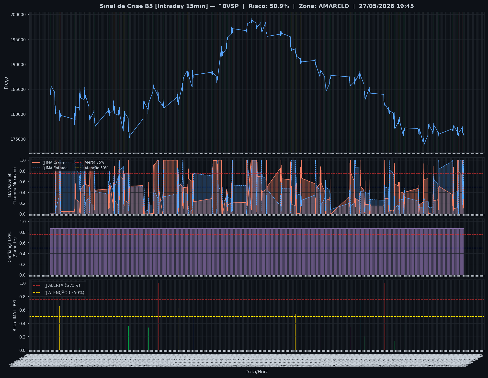
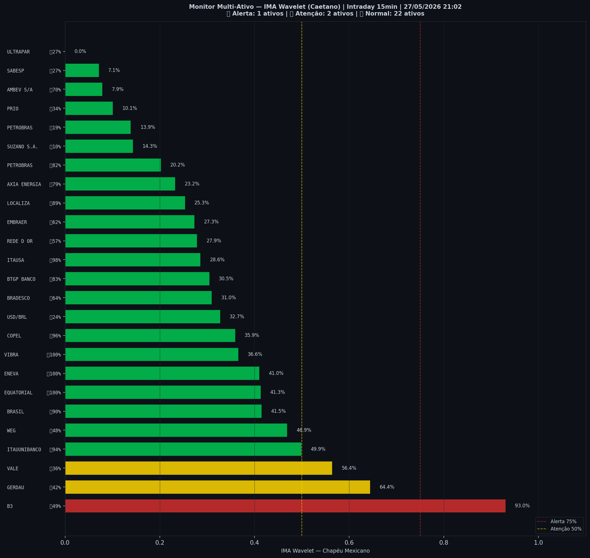

# 🟡 Intraday — 27/05/2026 21:10

| Indicador | Valor |
|---|---|
| **Zona** | 🟡 **AMARELO** |
| **Risco IMA** | **50.9%** |
| 🔴 IMA Crash 15min | 50.9% |
| 💵 USD/BRL IMA Crash | 32.7% 🟢 |
| 💵 USD/BRL IMA Entrada | 24.2% |
| Ativos em tensão | 12% (1🔴 2🟡) |

> *Atualizado às 21:10 BRT — Método IMA Wavelet Chapéu Mexicano (Caetano/ITA)*
