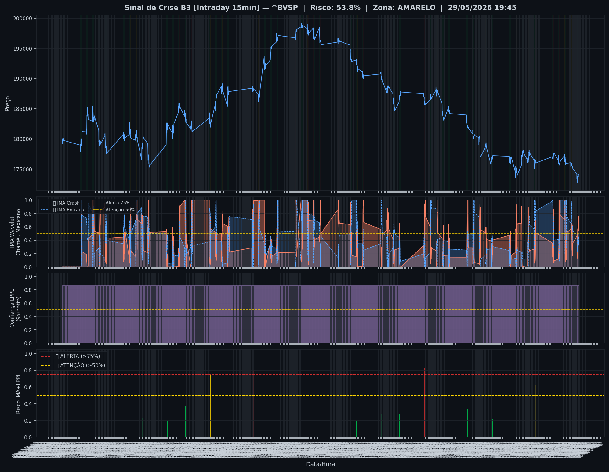
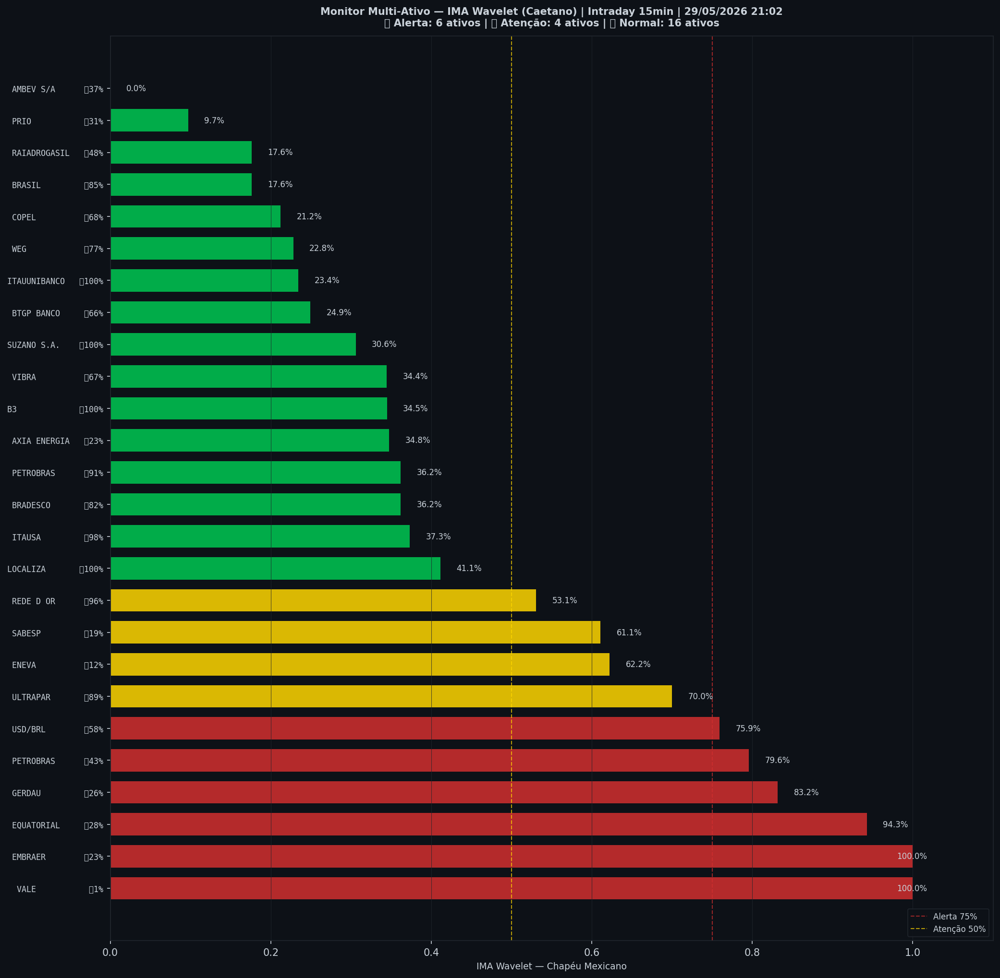

# 🟡 Intraday — 29/05/2026 21:10

| Indicador | Valor |
|---|---|
| **Zona** | 🟡 **AMARELO** |
| **Risco IMA** | **53.8%** |
| 🔴 IMA Crash 15min | 53.8% |
| 💵 USD/BRL IMA Crash | 75.9% 🔴 |
| 💵 USD/BRL IMA Entrada | 57.6% |
| Ativos em tensão | 38% (6🔴 4🟡) |

> *Atualizado às 21:10 BRT — Método IMA Wavelet Chapéu Mexicano (Caetano/ITA)*
