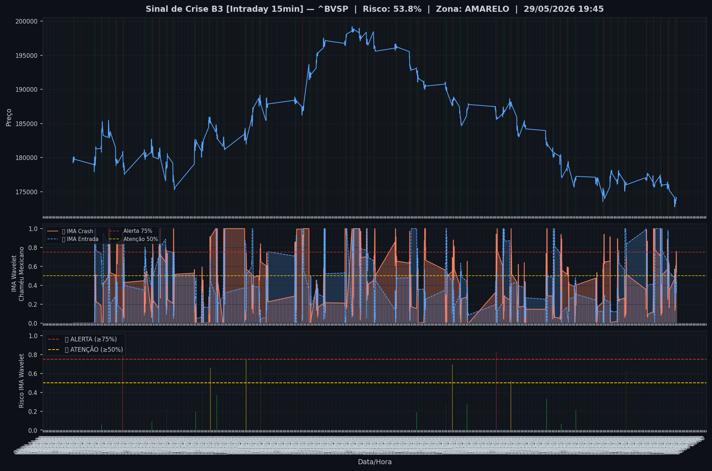

# 🟢 Intraday — 31/05/2026 08:16

| Indicador | Valor |
|---|---|
| **Zona** | 🟢 **VERDE** |
| **Risco IMA** | **0.0%** |
| 🔴 IMA Crash 15min | 0.0% |
| 💵 USD/BRL IMA Crash | 75.9% 🔴 |
| 💵 USD/BRL IMA Entrada | 57.6% |
| Ativos em tensão | 38% (6🔴 4🟡) |

> *Atualizado às 08:16 BRT — Método IMA Wavelet Chapéu Mexicano (Caetano/ITA)*
