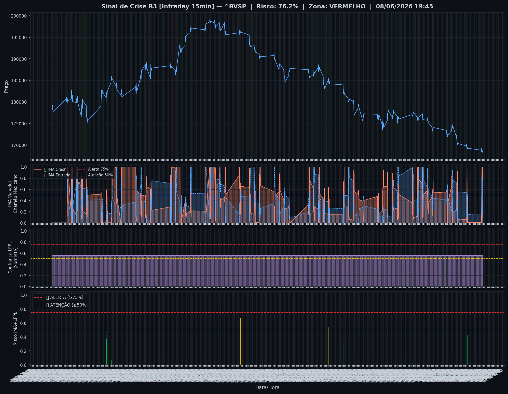
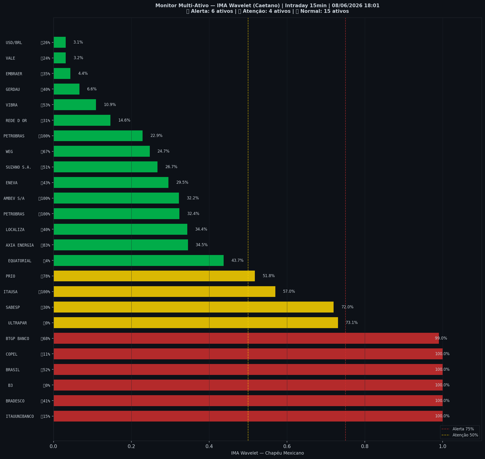

# 🔴 Intraday — 08/06/2026 18:03

| Indicador | Valor |
|---|---|
| **Zona** | 🔴 **VERMELHO** |
| **Risco IMA** | **76.2%** |
| 🔴 IMA Crash 15min | 76.2% |
| 💵 USD/BRL IMA Crash | 3.1% 🟢 |
| 💵 USD/BRL IMA Entrada | 25.9% |
| Ativos em tensão | 40% (6🔴 4🟡) |

> *Atualizado às 18:03 BRT — Método IMA Wavelet Chapéu Mexicano (Caetano/ITA)*
