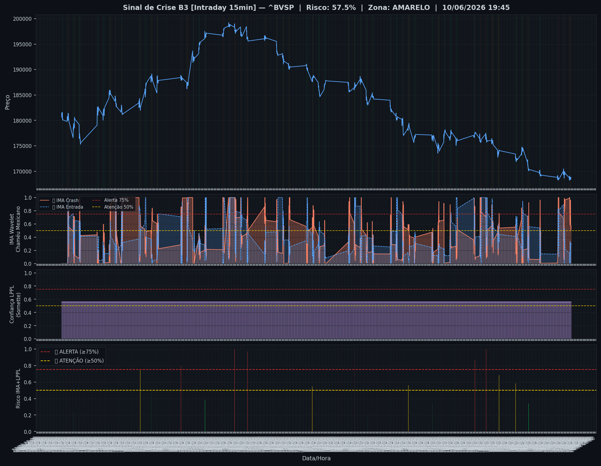
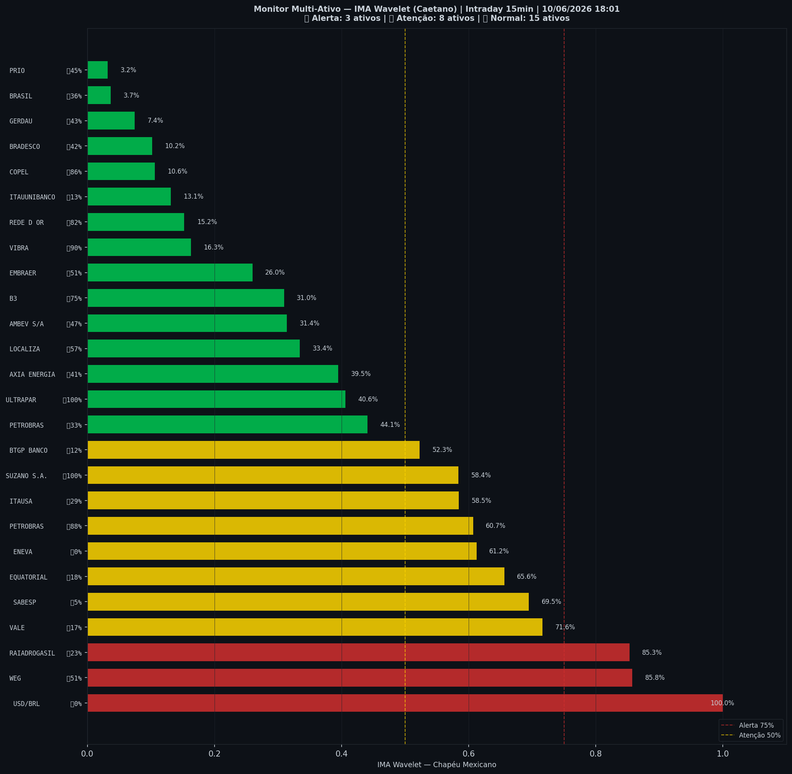

# 🟡 Intraday — 10/06/2026 18:03

| Indicador | Valor |
|---|---|
| **Zona** | 🟡 **AMARELO** |
| **Risco IMA** | **57.5%** |
| 🔴 IMA Crash 15min | 57.5% |
| 💵 USD/BRL IMA Crash | 100.0% 🔴 |
| 💵 USD/BRL IMA Entrada | 0.0% |
| Ativos em tensão | 42% (3🔴 8🟡) |

> *Atualizado às 18:03 BRT — Método IMA Wavelet Chapéu Mexicano (Caetano/ITA)*
