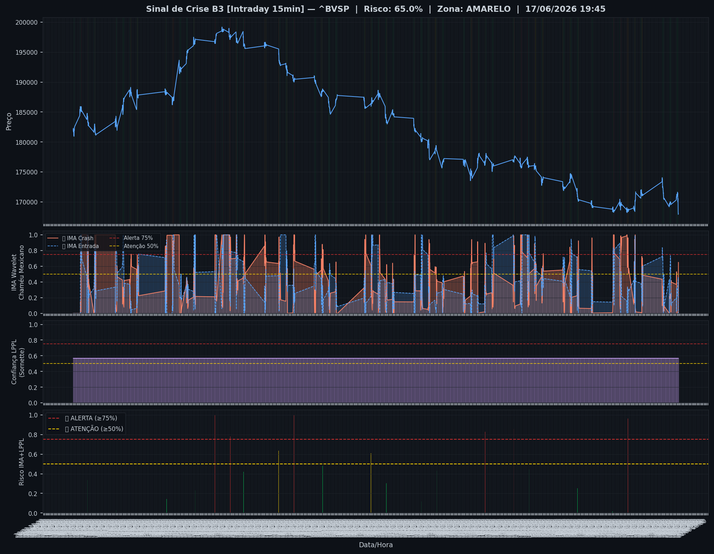
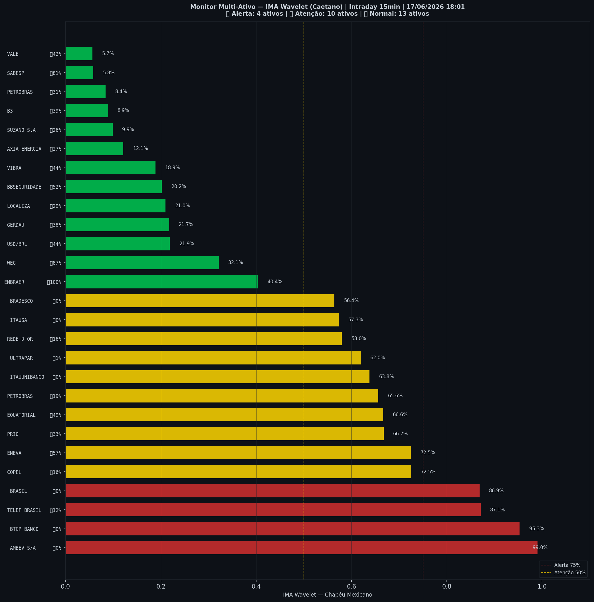

# 🟡 Intraday — 17/06/2026 18:03

| Indicador | Valor |
|---|---|
| **Zona** | 🟡 **AMARELO** |
| **Risco IMA** | **65.0%** |
| 🔴 IMA Crash 15min | 65.0% |
| 💵 USD/BRL IMA Crash | 21.9% 🟢 |
| 💵 USD/BRL IMA Entrada | 43.6% |
| Ativos em tensão | 52% (4🔴 10🟡) |

> *Atualizado às 18:03 BRT — Método IMA Wavelet Chapéu Mexicano (Caetano/ITA)*
